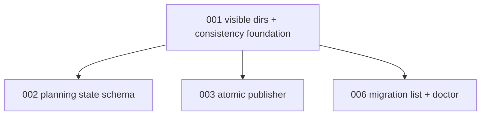

# 001 - Visible Migration Dirs And Consistency Foundation

## Goal

Create the shared foundation every later planning-resume change can stand on:

- one definition of a visible migration directory,
- one structural consistency validator API,
- no accidental scheduling of hidden, dotted, or transaction directories,
- early consistency findings that can later gate `ready` and power `migration doctor`.

This is the first stacked PR because the transaction publisher and CLI both need the same directory scan and validation vocabulary.

## Non-goals

- Do not change planning execution or resume behavior yet.
- Do not add `.planning/state.json` yet.
- Do not add the new `migration` CLI yet.
- Do not make `status: planning` executable.
- Do not repair invalid migrations; this plan only reports structured findings.

## Current behavior and evidence

- `migration_tick.enumerate_eligible_manifests()` scans direct children under the live migrations dir, skips names beginning with `__`, and loads `manifest.json` for eligible `ready` / `in-progress` manifests.
- `review_cli.review list` performs its own child scan and also skips only `__*` directories.
- The manifest codec validates JSON shape, duplicate phase names, and cursor references, but no shared validator checks whether `manifest.json`, `plan.md`, phase docs, and future planning state agree.
- Phase execution trusts manifest metadata after ready-check. There is no pre-ready structural gate for stale phase docs or missing plan files.
- Existing tests cover codec validation, tick eligibility, and review CLI filtering, but not a common "visible migration dir" helper or doctor-style consistency results.

## Proposed design

Add a small internal consistency module or clearly named helpers in `migrations.py`; final placement should follow the code shape discovered during implementation.

Core concepts:

- `iter_visible_migration_dirs(live_dir) -> list[Path]`
  - includes only direct child directories,
  - skips `__*`,
  - skips `.*`,
  - skips known transaction roots such as `__transactions__`,
  - returns deterministic ordering suitable for later sorting by manifest metadata.
- `MigrationConsistencyFinding`
  - frozen dataclass,
  - fields such as `severity`, `mode`, `code`, `path`, `message`,
  - structured enough for tests, CLI output, and failure records.
- `check_migration_consistency(migration_dir, mode)`
  - `mode="planning-snapshot"` validates a visible planning snapshot without requiring terminal readiness,
  - `mode="ready-publish"` validates a staged candidate before it can publish `status: ready`,
  - `mode="execution-gate"` validates an already visible ready/in-progress migration before phase ready-check,
  - `mode="doctor"` reports every finding without caller-specific filtering,
  - this PR implements the foundation checks only.

Severity vocabulary:

- `info`: useful operator context; never blocks.
- `warning`: suspicious but not unsafe; doctor reports it but exits zero unless paired with errors.
- `error`: inconsistent or unsafe state; blocks ready publish, phase execution, and planning resume; makes `migration doctor` exit nonzero.

Do not invent caller-local interpretations of findings. Later scheduler, publisher, and CLI work should ask the validator for findings, then apply the same severity contract.

Initial checks:

- `manifest.json` exists and loads through the existing manifest boundary.
- `manifest.name` matches the directory slug.
- phase docs matching `phase-<n>-<name>.md` have unique indexes and names.
- manifest phase file paths are repo-relative and stay inside the migration directory.
- manifest phase files are regular files, not symlink escapes.
- manifest phase files exist when the manifest claims non-empty phases.
- `plan.md` is required for `ready` / `in-progress`, but not for a newly seeded planning snapshot.
- transaction internals are never treated as candidate migrations.

Do not raise exceptions for normal validation failures. Return findings. Reserve `ContinuousRefactorError` for boundary failures that prevent validation itself.

## Files/modules likely touched

- `src/continuous_refactoring/migrations.py`
- `src/continuous_refactoring/migration_manifest_codec.py`
- `src/continuous_refactoring/migration_tick.py`
- `src/continuous_refactoring/review_cli.py`
- `src/continuous_refactoring/cli.py` only if command discovery needs the helper
- `tests/test_migrations.py`
- `tests/test_loop_migration_tick.py`
- `tests/test_cli_review.py`
- new `tests/test_migration_consistency.py`

## Test strategy

- Add focused unit tests for `iter_visible_migration_dirs()`.
- Add consistency tests for missing manifest, slug mismatch, duplicate phase docs, missing phase doc, and transaction directory exclusion.
- Update tick and review CLI tests so both use the shared visibility rule.
- Keep validation command: `uv run pytest tests/test_migration_consistency.py tests/test_migrations.py tests/test_loop_migration_tick.py tests/test_cli_review.py`, then `uv run pytest`.

Exact regression tests to add:

- `tests/test_migration_consistency.py::test_visible_migration_dirs_skip_hidden_dotted_and_transaction_dirs`
- `tests/test_migration_consistency.py::test_consistency_reports_missing_manifest`
- `tests/test_migration_consistency.py::test_consistency_rejects_manifest_slug_mismatch`
- `tests/test_migration_consistency.py::test_consistency_rejects_manifest_phase_symlink_escape`
- `tests/test_migration_consistency.py::test_consistency_reports_duplicate_phase_doc_indexes`
- `tests/test_migration_consistency.py::test_consistency_reports_manifest_phase_missing_doc`
- `tests/test_migration_consistency.py::test_consistency_modes_share_severity_blocking_contract`
- `tests/test_loop_migration_tick.py::test_enumeration_uses_visible_migration_dirs`
- `tests/test_cli_review.py::test_review_list_ignores_hidden_and_transaction_dirs`

## Numbered task breakdown with agent assignments

1. `[Scout]` Confirm every migration-dir enumeration site and list which must switch to the shared helper.
2. `[Architect]` Finalize the validator result shape and severity vocabulary.
3. `[Artisan]` Implement visible-dir iteration and the initial consistency validator.
4. `[Test Maven]` Add the regression tests listed above and verify they fail before implementation.
5. `[Critic]` Review for accidental behavior changes in scheduling and review listing.
6. `[Artisan]` Apply Critic fixes without expanding scope into planning state or CLI work.

## Blocking dependencies

- No earlier plan dependencies.
- Blocks:
  - [002-planning-state-schema-and-durable-stage-outputs.md](002-planning-state-schema-and-durable-stage-outputs.md)
  - [003-atomic-planning-workspace-publisher.md](003-atomic-planning-workspace-publisher.md)
  - [006-migration-list-and-doctor.md](006-migration-list-and-doctor.md)

## Mermaid dependency visualization

## Acceptance criteria

- All migration directory scans that should ignore hidden/transaction dirs use the shared helper.
- Consistency findings are structured and testable without parsing human prose.
- Validator modes and severities are defined once and are reusable by publisher, scheduler, and CLI callers.
- Existing ready/in-progress phase scheduling behavior is unchanged for normal migration dirs.
- Hidden, dotted, and transaction dirs cannot appear in tick or review candidates.
- No runtime dependency is added.
- `uv run pytest` passes.

## Risks and rollback

- Risk: a hidden directory someone currently expects to be listed becomes invisible. Roll back by narrowing hidden-dir skipping to only known transaction roots, but keep the helper.
- Risk: validation findings become too broad and block future work. Roll back severity use, not the helper API.
- Risk: duplicate visibility logic survives in one caller. Mitigate with tests that seed hidden dirs in tick and review paths.

## Open questions

- Should dotted migration dirs be ignored everywhere or only in automated scheduling? Recommendation: ignore everywhere; hidden should mean hidden.
- Should consistency findings include stable machine codes from the start? Recommendation: yes, because CLI and tests should not parse prose.
- Should symlinked phase docs be allowed? Recommendation: no; migration docs should be regular files inside the migration directory.

## How later plans may need to adapt if this plan changes

- If the helper lives outside `migrations.py`, later plans should import that module rather than reintroduce local scans.
- If finding severity names change, plans 004 through 008 must use the final names for ready-gating, doctor output, review, and refine.
- If dotted dirs stay visible, plan 003 must choose transaction directory names that still cannot be scheduled.
