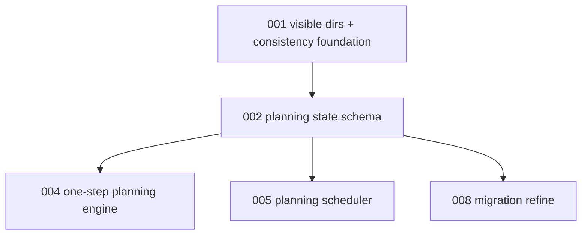

# 002 - Planning State Schema And Durable Stage Outputs

## Goal

Persist planning progress inside each migration directory so a partially planned migration can resume from the last transactionally published snapshot.

The migration directory becomes the durable source of truth for:

- current planning step,
- completed planning steps,
- accepted stage outputs needed by later prompts,
- review findings and final decision metadata.

## Non-goals

- Do not change the scheduler yet.
- Do not introduce XDG work dirs or transaction publishing yet.
- Do not run planning agents one step at a time yet.
- Do not add the `migration` CLI yet.
- Do not preserve failed current-step output.

## Current behavior and evidence

- `planning.run_planning()` creates a fresh `manifest.json` with `status: planning`, runs all stages in one call, then flips the manifest to `ready`, `ready` plus human review, or `skipped`.
- Planning stage artifacts live under the ephemeral run artifacts directory, not inside `migrations/<slug>`.
- Later planning prompts read transient outputs from the current run, such as approach docs and previous stdout, rather than a durable planning-state model.
- There is no resume function. A migration left in `status: planning` has no durable cursor that tells the next run which stage to continue.
- Tests cover stage ordering and final decisions, but not durable restart after process death.

## Proposed design

Add a planning-state model stored under the visible migration snapshot:

```text
migrations/<slug>/
  manifest.json
  .planning/
    state.json
    stages/
      approaches.stdout.md
      pick-best.stdout.md
      review.stdout.md
      review-2.stdout.md
      final-review.stdout.md
```

Recommended model:

- `PlanningState`
  - `schema_version`
  - `target`
  - `next_step`
  - `completed_steps`
  - `started_at`
  - `updated_at`
  - `feedback`
  - `review_findings`
  - `final_decision`
  - `final_reason`
- `CompletedPlanningStep`
  - `name`
  - `completed_at`
  - `outputs`
  - optional `agent`, `model`, `effort`

Step vocabulary:

```text
approaches -> pick-best -> expand -> review
review(no findings) -> final-review
review(findings) -> revise -> review-2 -> final-review
final-review(approve-auto) -> terminal-ready
final-review(approve-needs-human) -> terminal-ready-awaiting-human
final-review(reject) -> terminal-skipped
```

Rules:

- Store accepted output text needed by later prompts in `.planning/stages/`.
- Store only repo-relative paths in state.
- Store ordered completed-step history with each step's transition outcome.
- Validate history by replaying the planning transition graph, not by simple linear index comparison.
- Reject unknown steps, impossible branches, and cursors that skip required review/revise work at the codec boundary.
- Reject completed steps whose referenced stage output files are missing.
- Permit absent `.planning/state.json` only for legacy ready/done/skipped migrations and newly seeded planning dirs before the first publish.
- Do not store paths to `$TMPDIR` artifacts as resume inputs.

## Files/modules likely touched

- new internal module such as `src/continuous_refactoring/planning_state.py`
- `src/continuous_refactoring/planning.py`
- `src/continuous_refactoring/prompts.py`
- `src/continuous_refactoring/migrations.py`
- `src/continuous_refactoring/migration_manifest_codec.py` only if manifest validation references planning terminal state
- new `tests/test_planning_state.py`
- `tests/test_planning.py`
- `tests/test_prompts.py`

## Test strategy

Use stdlib-only pytest tests. No new dependencies.

Exact regression tests to add:

- `tests/test_planning_state.py::test_planning_state_roundtrip_preserves_completed_steps_and_current_step`
- `tests/test_planning_state.py::test_planning_state_defaults_new_plan_to_first_step`
- `tests/test_planning_state.py::test_planning_state_rejects_unknown_current_step`
- `tests/test_planning_state.py::test_planning_state_rejects_completed_step_after_current_step`
- `tests/test_planning_state.py::test_planning_state_rejects_review_to_final_review_when_findings_required_revise`
- `tests/test_planning_state.py::test_planning_state_rejects_revise_without_prior_review_findings`
- `tests/test_planning_state.py::test_planning_state_replays_branching_transition_history`
- `tests/test_planning_state.py::test_planning_state_rejects_missing_artifact_for_completed_step`
- `tests/test_planning_state.py::test_planning_state_atomic_save_preserves_existing_file_on_replace_failure`
- `tests/test_planning_state.py::test_planning_state_snapshot_paths_are_repo_relative`
- `tests/test_planning.py::test_planning_context_reconstructs_from_durable_stage_outputs`
- `tests/test_prompts.py::test_planning_resume_prompt_uses_durable_state_and_keeps_taste`

Validation command:

- `uv run pytest tests/test_planning_state.py tests/test_planning.py tests/test_prompts.py`
- then `uv run pytest`

## Numbered task breakdown with agent assignments

1. `[Scout]` Confirm current planning prompt inputs and which transient outputs must become durable.
2. `[Architect]` Finalize the state schema and transition table.
3. `[Artisan]` Implement the frozen dataclasses, codec, atomic state save, and durable stage-output helpers.
4. `[Test Maven]` Add codec, transition, and restart-context tests.
5. `[Critic]` Review the schema for overfitting to current stage names and for accidental `$TMPDIR` coupling.
6. `[Artisan]` Apply review fixes and update prompt context builders only as needed.

## Blocking dependencies

- Depends on [001-visible-migration-dirs-and-consistency-foundation.md](001-visible-migration-dirs-and-consistency-foundation.md) for validation vocabulary and visible directory conventions.
- Blocks:
  - [004-resumable-one-step-planning-engine.md](004-resumable-one-step-planning-engine.md)
  - [005-planning-before-phase-execution-scheduling.md](005-planning-before-phase-execution-scheduling.md)
  - [008-migration-refine.md](008-migration-refine.md)

## Mermaid dependency visualization



## Acceptance criteria

- A migration in `status: planning` can describe its next planning step from `.planning/state.json`.
- Accepted stage outputs needed by later prompts live inside the migration directory.
- State codec rejects impossible or inconsistent planning progress.
- State codec validates branching history by replaying the transition graph.
- Durable prompt context can be rebuilt after deleting run artifacts.
- Failed current-step output has no field in the durable schema.
- `## Taste` remains present in affected planning prompts.
- `uv run pytest` passes.

## Risks and rollback

- Risk: schema tries to encode too much agent-specific detail. Roll back to step names, accepted output paths, and final decisions only.
- Risk: keeping `.planning/` forever feels noisy. Do not remove it in this PR; later docs/CLI can decide presentation.
- Risk: state validation duplicates manifest codec work. Keep planning-state validation local and use manifest validation only for manifest-owned fields.

## Open questions

- Should `.planning/` remain after a migration is `done`? Recommendation: yes; it is audit data and future doctor context.
- Should final-review stdout always be stored even for reject? Recommendation: yes, if it is the accepted terminal decision.
- Should state live inside `manifest.json` instead? Recommendation: no; a separate `.planning/state.json` avoids bloating the manifest and keeps planning internals out of phase execution.

## How later plans may need to adapt if this plan changes

- If state is embedded in `manifest.json`, plans 004 through 008 must use manifest saves as their state boundary.
- If stage output file names differ, plan 004 prompt reconstruction and plan 006 list display must follow the final helper API.
- If terminal planning state is removed after ready, plans 007 and 008 must reconstruct review/refine context from docs alone.
