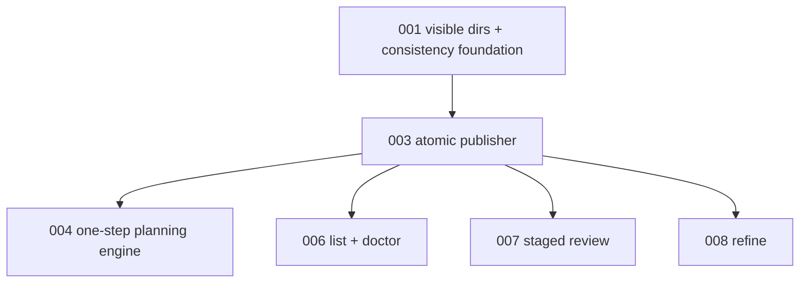

# 003 - Atomic Planning Workspace Publisher

## Goal

Add the workspace and publish layer that lets planning agents work off to the side, then publishes a coherent `migrations/<slug>` snapshot only after a planning step completes.

This is the mechanical safety layer for the product requirement: agents and humans should see migration docs plus planning state in sync. The guarantee is transactional best-effort replacement with rollback, not a portable atomic swap of two non-empty directories.

## Non-goals

- Do not change planning stage logic yet.
- Do not add scheduler behavior yet.
- Do not add the new CLI yet.
- Do not claim a true portable atomic swap of two non-empty directories; stdlib/APFS experiments show that is not available.
- Do not publish failed current-step output.

## Current behavior and evidence

- Current planning writes directly under the live migration directory.
- `save_manifest()` atomically replaces one JSON file, but docs, approach files, and future `.planning/` state are multi-file directory state.
- Experimenter validated that `os.replace(src_dir, non_empty_dst_dir)` fails on APFS with `ENOTEMPTY`.
- Experimenter validated that cross-device replacement fails with `EXDEV`.
- A safe same-filesystem publish requires moving the existing live dir aside, moving staged into place, validating, then deleting rollback.
- Git sees replacement as normal modifications/deletions/untracked files, and rollback works while the backup directory remains.

## Proposed design

Introduce a planning workspace and publish transaction.

Workspace:

```text
<xdg-project-state>/planning/<slug>/<run-id>/work/
```

Transaction under the repo live migrations filesystem:

```text
migrations/__transactions__/<token>/
  staged/
  rollback/
  failed/
```

Publish choreography:

1. Acquire a mutation lock for the live migrations dir.
2. Capture `base_snapshot_id`, a deterministic digest of the live migration tree excluding transaction internals.
3. Build or copy the complete candidate snapshot in the XDG work dir.
4. Validate the candidate in the work dir for the caller's intended mode.
5. Copy the complete candidate to `migrations/__transactions__/<token>/staged`.
6. Validate the staged snapshot again before touching live state.
7. Verify staged and live dir are on the same device.
8. Under the lock, recompute the current live digest and compare it with `base_snapshot_id`.
9. If the digest differs, block publish, keep staged diagnostics, and do not move the live dir.
10. If `migrations/<slug>` exists, move it to `rollback`.
11. Move `staged` to `migrations/<slug>`.
12. Validate the newly visible live snapshot as a sanity check.
13. Delete `rollback` only after validation passes.
14. If any step after rollback move fails, restore rollback to live and preserve diagnostic paths if restoration fails.

Locking:

- Use a simple lock file or directory under the live migrations dir or project state.
- Hold the lock for publish operations and later for review/refine mutations.
- Surface the lock path, owner pid when available, created timestamp, and operation name in errors.
- Do not silently break locks in this PR.

Dirty worktree policy:

- Before copying live into a work dir, check `git status --porcelain -- migrations/<slug>` and refuse if tracked or untracked user changes exist under the target migration dir.
- Ignore known transaction roots when checking the live migration target.
- Under the publish lock, rely on `base_snapshot_id` to catch committed or separately published changes that happened after the work dir was copied.
- Return a blocked result that names the dirty paths and tells the operator to commit, discard, or inspect with `migration doctor`.

## Files/modules likely touched

- new internal module such as `src/continuous_refactoring/planning_publish.py`
- `src/continuous_refactoring/config.py` for XDG project planning work path helpers
- `src/continuous_refactoring/migrations.py`
- `src/continuous_refactoring/git.py` if dirty checks need shared helpers
- `src/continuous_refactoring/artifacts.py` if publish paths are logged
- new `tests/test_planning_publish.py`
- `tests/test_planning.py`
- `tests/test_git.py` only if dirty-check helpers are added there

## Test strategy

Exact regression tests to add:

- `tests/test_planning_publish.py::test_publish_creates_new_live_migration_from_staged_snapshot`
- `tests/test_planning_publish.py::test_publish_replaces_existing_non_empty_live_dir_with_backup_transaction`
- `tests/test_planning_publish.py::test_publish_requires_same_device_final_staging`
- `tests/test_planning_publish.py::test_staged_validation_failure_leaves_live_snapshot_unchanged`
- `tests/test_planning_publish.py::test_publish_rejects_stale_base_snapshot`
- `tests/test_planning_publish.py::test_publish_cleans_backup_after_success`
- `tests/test_planning_publish.py::test_publish_restores_rollback_when_live_replace_fails`
- `tests/test_planning_publish.py::test_publish_reports_live_rollback_staged_and_failed_paths_when_rollback_fails`
- `tests/test_planning_publish.py::test_publish_refuses_dirty_live_migration_dir`
- `tests/test_planning_publish.py::test_lock_rejects_concurrent_mutation_and_reports_lock_path`
- `tests/test_planning_publish.py::test_transaction_dirs_are_left_for_doctor_when_cleanup_fails`

Use temp git repos for dirty-worktree behavior. Inject failures with monkeypatch around copy/replace/remove helpers rather than relying on OS accidents.

Validation command:

- `uv run pytest tests/test_planning_publish.py tests/test_migration_consistency.py tests/test_git.py`
- then `uv run pytest`

## Numbered task breakdown with agent assignments

1. `[Experimenter]` Reconfirm the desired transaction choreography against the target OS using temp dirs only.
2. `[Architect]` Define the publisher API: inputs, result type, failure type, and lock behavior.
3. `[Artisan]` Implement XDG work path helpers, same-device staged copy, publish, rollback, cleanup, and lock.
4. `[Test Maven]` Add failure-injection tests for every publish boundary.
5. `[Critic]` Review for user-data overwrite risk and stale-lock failure modes.
6. `[Artisan]` Apply fixes without coupling the publisher to planning stage semantics.

## Blocking dependencies

- Depends on [001-visible-migration-dirs-and-consistency-foundation.md](001-visible-migration-dirs-and-consistency-foundation.md) for transaction directory invisibility.
- Blocks:
  - [004-resumable-one-step-planning-engine.md](004-resumable-one-step-planning-engine.md)
  - [006-migration-list-and-doctor.md](006-migration-list-and-doctor.md)
  - [007-migration-review-staged-publish.md](007-migration-review-staged-publish.md)
  - [008-migration-refine.md](008-migration-refine.md)

## Mermaid dependency visualization



## Acceptance criteria

- Planning candidates can be built outside the live migration directory.
- Final publish source is copied under the live migrations dir before rename.
- Replacing a non-empty migration dir works through backup/rollback choreography.
- Staged validation succeeds before the live path is moved.
- A stale base snapshot blocks publish before the live path is moved.
- Failed publish restores the previous live snapshot whenever rollback is possible.
- Transaction internals remain invisible to migration enumeration.
- Concurrent mutation attempts fail clearly.
- User edits in a live migration dir are not overwritten silently.
- `uv run pytest` passes.

## Risks and rollback

- Risk: brief missing-path window between moving live to rollback and staged to live. Mitigate with pre-validation, CAS, lock, and immediate rollback; call this out in implementation docs.
- Risk: stale locks block automation. Roll back by making lock errors actionable; do not auto-break locks until doctor repair is designed.
- Risk: dirty-worktree detection is too conservative. Roll back to a clear blocked result rather than overwrite.
- Risk: cleanup failure leaves `__transactions__`. Plan 006 doctor reports these paths.

## Open questions

- Should lock files live under XDG state or under `migrations/__transactions__`? Recommendation: under the live migrations dir so the lock is on the same filesystem and easy for doctor to report.
- Should `migration doctor` later repair stale locks? Recommendation: yes, but only with explicit repair design; plan 006 reports lock presence/age first.
- Should publish fsync directories? Recommendation: consider it during implementation, but keep the public API independent of platform quirks.

## How later plans may need to adapt if this plan changes

- If the publisher API returns exceptions instead of structured results, plans 004 and 006 must translate those into route/failure records.
- If dirty checks are deferred, plan 004 must add a blocked outcome before running resume against a user-edited migration.
- If transaction paths differ, plan 006 doctor must inspect the final path convention.
- If `base_snapshot_id` changes shape, plans 004, 007, and 008 must pass the final token through review/refine/planning publish calls.
