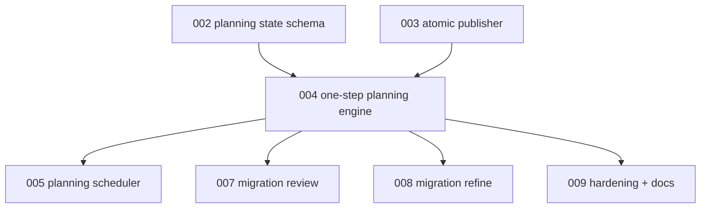

# 004 - Resumable One-Step Planning Engine

## Goal

Refactor planning so each automation iteration can complete exactly one accepted planning step, publish a coherent snapshot, and resume later from the durable state.

This closes the core product gap: migrations left in `status: planning` can continue planning instead of being stranded.

## Non-goals

- Do not wire planning into the run scheduler yet.
- Do not add the new `migration` CLI yet.
- Do not change phase execution semantics.
- Do not replay partial failed step output.
- Do not collapse source-target planning into a terminal planning loop.

## Current behavior and evidence

- `planning.run_planning()` initializes a new planning manifest and runs `approaches`, `pick-best`, `expand`, `review`, optional `revise` / `review-2`, and final review in one call.
- Stage outputs are passed through the same process and artifact tree. They are not a durable resume contract.
- If `review-2` still has findings, planning raises without a durable cursor for the next run.
- If the process dies after writing some docs but before final decision, the live migration dir can contain partial output with no reliable current-step state.
- Existing tests assert stage order, revise behavior, final-decision parsing, and phase discovery refresh timing.

## Proposed design

Split planning into a step engine:

- `start_or_resume_planning(migration_dir | seed_context) -> PlanningSnapshot`
- `run_next_planning_step(snapshot, agent_settings, artifacts) -> PlanningStepResult`
- `publish_planning_step(result) -> RouteRecord-like outcome`

Each invocation:

1. Reads the published live snapshot.
2. Copies it to the XDG work dir through the publisher/workspace helpers.
3. Runs exactly `PlanningState.next_step` against the work dir.
4. Stores accepted stage output in `.planning/stages/`.
5. Advances `.planning/state.json`.
6. Runs consistency validation for the new mode.
7. Publishes the whole migration directory through plan 003's publisher.

First source-target behavior:

- `routing_pipeline` should seed a new planning snapshot and run exactly one planning step as the action.
- The first action should not run all planning stages to terminal through a compatibility wrapper.
- Any terminal-loop helper kept for transitional unit tests must not be used by `run`, `run-once`, or source-target routing.

Step behavior:

- `approaches`: writes approach docs and stores accepted stdout.
- `pick-best`: stores selected approach output.
- `expand`: writes `plan.md` and `phase-*.md`, then refreshes manifest phase metadata.
- `review`: stores findings; no findings advances to `final-review`; findings advances to `revise`.
- `revise`: updates docs and stores accepted stdout.
- `review-2`: findings fail without publish; no findings advances to `final-review`.
- `final-review`: parses `final-decision: approve-auto|approve-needs-human|reject - reason`.

Terminal mapping:

- `approve-auto`: publish `status: ready`, `awaiting_human_review: false`.
- `approve-needs-human`: publish `status: ready`, `awaiting_human_review: true`, and `human_review_reason`.
- `reject`: publish `status: skipped` and the intentional-skip doc.

Ready transition gate:

- Before publishing `status: ready`, run the consistency validator in `ready-publish` mode.
- Reject missing `plan.md`, missing phase docs, stale manifest phase metadata, invalid current phase, missing `## Precondition`, or missing `## Definition of Done`.
- Do not require fresh test validation here; host-side validation remains in phase execution.

Compatibility:

- Existing tests may keep a private helper that loops steps until terminal while they are ported.
- Product entry points use the one-step engine immediately.
- Plan 009 removes or narrows any leftover wrapper after scheduler and CLI integration.

## Files/modules likely touched

- `src/continuous_refactoring/planning.py`
- `src/continuous_refactoring/planning_state.py`
- `src/continuous_refactoring/planning_publish.py`
- `src/continuous_refactoring/prompts.py`
- `src/continuous_refactoring/routing_pipeline.py`
- `src/continuous_refactoring/migrations.py`
- `src/continuous_refactoring/failure_report.py` if new call roles are introduced
- `tests/test_planning.py`
- `tests/test_planning_state.py`
- `tests/test_planning_publish.py`
- `tests/test_prompts.py`
- `tests/test_run.py`

## Test strategy

Exact regression tests to add or modify:

- `tests/test_planning.py::test_planning_publishes_initial_manifest_and_state_atomically`
- `tests/test_planning.py::test_successful_step_publishes_docs_and_state_together`
- `tests/test_planning.py::test_failed_step_does_not_publish_partial_docs_or_state`
- `tests/test_planning.py::test_resume_skips_completed_steps`
- `tests/test_planning.py::test_resume_reruns_failed_current_step_from_last_published_state`
- `tests/test_planning.py::test_resume_discards_failed_current_step_outputs_before_rerun`
- `tests/test_planning.py::test_resume_prompt_sees_published_docs_and_state_in_sync`
- `tests/test_run.py::test_source_target_planning_runs_only_one_step_as_first_action`
- `tests/test_planning.py::test_revise_path_records_review_findings_as_planning_state`
- `tests/test_planning.py::test_review_two_findings_fail_without_publish`
- `tests/test_planning.py::test_final_approval_clears_execution_blockers_but_keeps_planning_audit_state`
- `tests/test_planning.py::test_final_ready_rejects_inconsistent_manifest_docs_before_publish`

Validation command:

- `uv run pytest tests/test_planning.py tests/test_planning_state.py tests/test_planning_publish.py tests/test_prompts.py`
- then `uv run pytest`

## Numbered task breakdown with agent assignments

1. `[Scout]` Map the current `run_planning()` stages to the new step engine boundaries.
2. `[Architect]` Specify the one-step result type and compatibility wrapper rules.
3. `[Artisan]` Extract step execution without changing prompt contracts except durable work-dir paths.
4. `[Artisan]` Add resume behavior using `.planning/state.json` and durable stage outputs.
5. `[Test Maven]` Add no-publish-on-failure and resume-from-every-step tests.
6. `[Critic]` Review for hidden replay of failed output, mixed live/work-dir reads, and ready-gate gaps.
7. `[Artisan]` Apply fixes and remove transitional code only if nothing still depends on it.

## Blocking dependencies

- Depends on [002-planning-state-schema-and-durable-stage-outputs.md](002-planning-state-schema-and-durable-stage-outputs.md).
- Depends on [003-atomic-planning-workspace-publisher.md](003-atomic-planning-workspace-publisher.md).
- Blocks:
  - [005-planning-before-phase-execution-scheduling.md](005-planning-before-phase-execution-scheduling.md)
  - [007-migration-review-staged-publish.md](007-migration-review-staged-publish.md)
  - [008-migration-refine.md](008-migration-refine.md)
  - [009-hardening-compatibility-and-docs.md](009-hardening-compatibility-and-docs.md)

## Mermaid dependency visualization

## Acceptance criteria

- One call can run and publish exactly one accepted planning step.
- Source-target routing creates and publishes only the first accepted planning step.
- A crash or failure during a step leaves the live migration dir unchanged.
- The next run reruns the same failed step from the last published state.
- Completed accepted steps are not rerun.
- Agents read planning inputs from the staged work dir copied from the published snapshot.
- Final `ready` status cannot publish unless consistency validation passes.
- `status: planning` remains non-executable by phase logic.
- `uv run pytest` passes.

## Risks and rollback

- Risk: extraction changes prompt behavior. Preserve existing prompt tests and add staged-work-dir checks.
- Risk: compatibility wrapper hides the new one-step behavior. Keep wrappers out of product paths and schedule cleanup in plan 009.
- Risk: final-review rejection writes skip docs inconsistently. Publish skipped snapshots through the same transaction path.
- Risk: ready validation blocks valid legacy migrations. Only apply strict terminal planning checks to snapshots with `.planning/state.json`.

## Open questions

- Should normal source-target planning still run to terminal in one command? Recommendation: no; one step per action is easier to recover and review.
- Should every accepted planning step create a driver commit? Recommendation: yes once plan 005 wires scheduler action accounting.
- Should failed work dirs be retained for debugging? Recommendation: only as artifact evidence, never as resume input.

## How later plans may need to adapt if this plan changes

- If the engine keeps any terminal-loop helper, plan 005 must prove product paths still consume one accepted planning step per action.
- If ready validation remains partial, plan 005 must add a stronger pre-ready-check gate before phase execution.
- If review/refine need a different step API, plans 007 and 008 must use that API instead of bypassing it.
