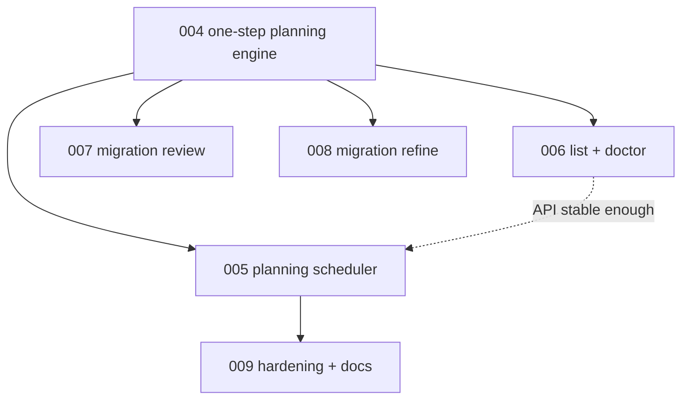

# 005 - Planning Before Phase Execution Scheduling

## Goal

Teach `run`, `run-once`, and `--focus-on-live-migrations` to spend iterations completing `status: planning` migrations before executing ready phases or selecting new source targets.

This makes mid-planning migrations recover naturally through normal automation.

## Non-goals

- Do not change the planning step engine.
- Do not add the new CLI.
- Do not make `status: planning` visible to phase-ready or phase-execute paths.
- Do not change host-side phase validation.
- Do not publish branch updates; the driver still creates local commits only.

## Current behavior and evidence

- `migration_tick.enumerate_eligible_manifests()` only considers `ready` and `in-progress` manifests.
- Automated ticks skip `awaiting_human_review` and defer no/over-budget phases, but there is no planning-resume tick.
- `run_loop()` probes migrations before source routing, but only for phase execution.
- Focused live migrations loop repeats migration ticks until no work remains, but planning manifests are invisible.
- `run-once` uses the same route path, so a stranded `status: planning` migration is not completed later.

## Proposed design

Add a dedicated planning tick that runs before the existing phase tick.

Ordering:

1. Baseline validation remains first.
2. `try_planning_tick()` runs.
3. If a planning step publishes a snapshot, commit it and consume the action/iteration.
4. If no planning migration is runnable, run existing `try_migration_tick()` for ready/in-progress phases.
5. If neither planning nor phase work is runnable, continue to source target selection.

Eligibility:

- visible migration dirs only,
- `manifest.status == "planning"`,
- not `awaiting_human_review`,
- not cooling down,
- sorted by `created_at` like current phase ticks.

Planning candidates and runnable planning are separate:

- Enumerate all visible `status: planning` manifests.
- Missing or invalid `.planning/state.json` is a blocked planning candidate, not invisible work.
- A blocked planning candidate returns `blocked`, writes the appropriate failure/transition record, and prevents source routing from proceeding as if nothing is wrong.
- Only valid planning state is runnable.

Results:

- accepted planning step -> `commit` with a planning-step label,
- blocked planning state -> `blocked` with validator findings and failure snapshot support,
- failed agent or invalid step -> `abandon` or existing retry semantics, using call role `planner` or a more specific planning role if introduced,
- no runnable planning -> `not-routed`.

Readiness gate before phase execution:

- Before a ready/in-progress migration reaches phase ready-check, run consistency validation in execution mode.
- If consistency fails, return `blocked` and do not call `check_phase_ready()`.

Action accounting:

- A published planning step counts as one action.
- A deferred or non-runnable planning migration should not consume source action budget.
- Existing phase tick behavior remains the fallback, not a sibling race.

## Files/modules likely touched

- `src/continuous_refactoring/migration_tick.py`
- `src/continuous_refactoring/loop.py`
- `src/continuous_refactoring/routing_pipeline.py`
- `src/continuous_refactoring/planning.py`
- `src/continuous_refactoring/failure_report.py`
- `src/continuous_refactoring/artifacts.py`
- `tests/test_loop_migration_tick.py`
- `tests/test_run.py`
- `tests/test_run_once.py`
- `tests/test_focus_on_live_migrations.py`
- `tests/test_failure_report.py`

## Test strategy

Exact regression tests to add or modify:

- `tests/test_loop_migration_tick.py::test_enumerate_eligible_planning_manifests_includes_planning_migrations`
- `tests/test_loop_migration_tick.py::test_missing_planning_state_blocks_before_ready_phase_or_source_routing`
- `tests/test_loop_migration_tick.py::test_invalid_planning_state_blocks_before_ready_phase_or_source_routing`
- `tests/test_loop_migration_tick.py::test_try_migration_tick_completes_planning_before_ready_phase`
- `tests/test_loop_migration_tick.py::test_try_migration_tick_does_not_call_ready_check_for_planning_status`
- `tests/test_loop_migration_tick.py::test_try_migration_tick_blocks_ready_phase_when_consistency_validation_fails`
- `tests/test_run.py::test_run_loop_resumes_planning_before_source_target`
- `tests/test_run.py::test_run_loop_counts_completed_planning_as_action`
- `tests/test_run.py::test_run_loop_persists_planning_resume_failure_snapshot`
- `tests/test_run_once.py::test_run_once_resumes_planning_before_classification`
- `tests/test_run_once.py::test_run_once_raises_when_planning_resume_blocks`
- `tests/test_focus_on_live_migrations.py::test_focused_loop_completes_mid_planning_before_ready_phase`
- `tests/test_focus_on_live_migrations.py::test_focused_loop_stops_when_only_blocked_planning_remains`

Validation command:

- `uv run pytest tests/test_loop_migration_tick.py tests/test_run.py tests/test_run_once.py tests/test_focus_on_live_migrations.py tests/test_failure_report.py`
- then `uv run pytest`

## Numbered task breakdown with agent assignments

1. `[Scout]` Map every migration tick call site and action-budget branch.
2. `[Architect]` Define planning tick result records and commit-message labels.
3. `[Artisan]` Implement planning eligibility and `try_planning_tick()`.
4. `[Artisan]` Wire ordering into `run`, `run-once`, and focused live migrations.
5. `[Test Maven]` Add traps proving planning runs before ready phase and source routing.
6. `[Critic]` Review for starvation, budget accounting errors, and human-review regressions.
7. `[Artisan]` Apply review fixes and keep phase execution untouched except the consistency gate.

## Blocking dependencies

- Depends on [004-resumable-one-step-planning-engine.md](004-resumable-one-step-planning-engine.md).
- Blocks [009-hardening-compatibility-and-docs.md](009-hardening-compatibility-and-docs.md).
- Runs in parallel with [006-migration-list-and-doctor.md](006-migration-list-and-doctor.md) and [007-migration-review-staged-publish.md](007-migration-review-staged-publish.md) only if all use stable APIs from plan 004.

## Mermaid dependency visualization

## Acceptance criteria

- `run` completes an eligible planning step before a ready phase.
- `run-once` completes an eligible planning step before classification/source routing.
- `--focus-on-live-migrations` completes planning steps before phase execution.
- `status: planning` never enters phase ready-check or phase execution.
- Ready/in-progress migrations fail closed when consistency validation fails.
- Missing or invalid planning state blocks automation instead of disappearing.
- Human-review gating remains intact.
- Action accounting matches existing run-loop semantics.
- `uv run pytest` passes.

## Risks and rollback

- Risk: planning migrations starve ready phases if many exist. Roll back by making one planning step consume one action, preserving operator control.
- Risk: focused loop never terminates on blocked planning. Mitigate with blocked/deferred result handling matching current phase behavior.
- Risk: failure snapshots mislabel planning failures. Add explicit call-role tests.
- Risk: ready consistency gate blocks legacy migrations. Gate legacy tolerance through the validator mode defined in plan 001/004.

## Open questions

- Should planning steps have effort metadata like phases? Recommendation: not initially; use the configured planning call effort and add effort metadata later if needed.
- Should a planning step commit message include the step name? Recommendation: yes for auditability.
- Should `run-once` execute more than one planning step if no source target work remains? Recommendation: no; one accepted step per action.

## How later plans may need to adapt if this plan changes

- If planning tick result types differ, plan 008 `refine` should reuse the final result shape for failures.
- If consistency validation lives entirely in phase tick, plan 009 docs must describe that ready status alone is not sufficient for execution.
- If one action can run multiple planning steps, plan 009 must update docs and failure snapshot expectations.
