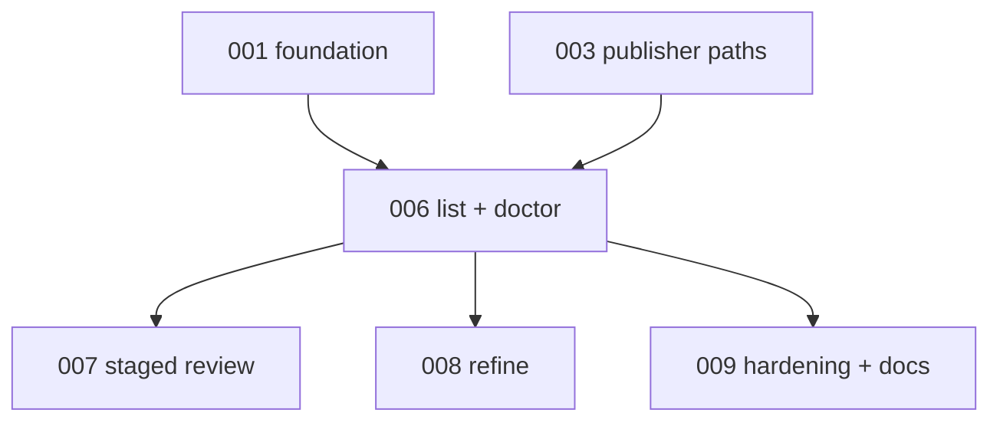

# 006 - Migration List And Doctor

## Goal

Add the read-only migration CLI foundation:

```text
continuous-refactoring migration list
continuous-refactoring migration doctor <slug-or-path>
continuous-refactoring migration doctor --all
```

This gives operators visibility into planning state, ready state, and consistency drift before mutating review/refine commands land.

## Non-goals

- Do not add `migration review` yet.
- Do not add `migration refine` yet.
- Do not remove the existing top-level `review` command.
- Do not repair transaction directories or locks; report them first.
- Do not let path arguments resolve outside the configured live migrations root.

## Current behavior and evidence

- Current CLI has top-level `review list` and `review perform`, not the requested `migration ...` namespace.
- There is no CLI to list all migrations across statuses.
- There is no CLI to validate one migration or all migrations for doc/manifest/state drift.
- Visible-dir iteration intentionally skips transaction roots, so doctor needs an explicit scan for transaction and lock artifacts.

## Proposed design

Parser shape:

```text
continuous-refactoring migration list [--status planning|ready|in-progress|skipped|done] [--awaiting-review]
continuous-refactoring migration doctor <slug-or-path>
continuous-refactoring migration doctor --all
```

Slug/path resolver:

- Accept a slug under the configured live migrations dir.
- Accept a path only if its resolved real path is inside the configured live migrations root.
- Reject symlink escapes, parent traversal, outside directories, and ambiguous slug/path collisions.
- Use one resolver for all future migration subcommands.

`migration list`:

- Shows slug, status, planning next step or current phase, awaiting-review flag, last touch, cooldown, and reason when present.
- Includes planning, ready, in-progress, skipped, and done by default.
- Uses the shared visible-dir iterator.
- Marks missing/invalid planning state as blocked in display instead of hiding it.

`migration doctor`:

- Runs the shared consistency validator against one migration or all visible migrations.
- Scans the transaction root and lock path explicitly in addition to visible migrations.
- Reports transaction leftovers, lock presence/age, missing docs, stale manifest phase metadata, incomplete planning state, and ready-gate failures.
- Exits nonzero if any `error` severity finding exists.
- Does not repair anything in this plan.

## Files/modules likely touched

- `src/continuous_refactoring/cli.py`
- new internal module such as `src/continuous_refactoring/migration_cli.py`
- `src/continuous_refactoring/review_cli.py` only for shared context/resolver reuse
- `src/continuous_refactoring/migrations.py`
- `src/continuous_refactoring/planning_publish.py`
- `tests/test_cli_migrations.py`
- `tests/test_cli_review.py`
- `tests/test_migration_consistency.py`

## Test strategy

Exact regression tests to add:

- `tests/test_cli_migrations.py::test_migration_parser_accepts_list_and_doctor`
- `tests/test_cli_migrations.py::test_migration_parser_accepts_doctor_all`
- `tests/test_cli_migrations.py::test_migration_list_includes_planning_ready_review_and_done_statuses`
- `tests/test_cli_migrations.py::test_migration_list_marks_mid_planning_current_step`
- `tests/test_cli_migrations.py::test_migration_list_marks_invalid_planning_state_as_blocked`
- `tests/test_cli_migrations.py::test_migration_resolver_accepts_slug_or_path_inside_live_root`
- `tests/test_cli_migrations.py::test_migration_resolver_rejects_outside_path_and_symlink_escape`
- `tests/test_cli_migrations.py::test_migration_doctor_checks_one_migration_by_name`
- `tests/test_cli_migrations.py::test_migration_doctor_all_checks_every_live_migration`
- `tests/test_cli_migrations.py::test_migration_doctor_reports_transaction_root_and_lock_presence`
- `tests/test_cli_migrations.py::test_migration_doctor_exits_nonzero_on_error_findings`

Validation command:

- `uv run pytest tests/test_cli_migrations.py tests/test_migration_consistency.py tests/test_cli_review.py`
- then `uv run pytest`

## Numbered task breakdown with agent assignments

1. `[Scout]` Map current parser wiring and review CLI context helpers that can be reused.
2. `[Architect]` Finalize slug/path resolution, output columns, and exit-code behavior.
3. `[Artisan]` Add the `migration` parser, shared resolver, `list`, and read-only `doctor`.
4. `[Test Maven]` Add parser, resolver, list, and doctor tests.
5. `[Critic]` Review path containment and whether doctor can actually see hidden transaction/lock roots.
6. `[Artisan]` Apply review fixes without adding repair or mutation behavior.

## Blocking dependencies

- Depends on [001-visible-migration-dirs-and-consistency-foundation.md](001-visible-migration-dirs-and-consistency-foundation.md).
- Depends on [003-atomic-planning-workspace-publisher.md](003-atomic-planning-workspace-publisher.md) for transaction/lock path conventions.
- Blocks:
  - [007-migration-review-staged-publish.md](007-migration-review-staged-publish.md)
  - [008-migration-refine.md](008-migration-refine.md)
  - [009-hardening-compatibility-and-docs.md](009-hardening-compatibility-and-docs.md)

## Mermaid dependency visualization



## Acceptance criteria

- `continuous-refactoring migration list` parses and displays all visible migration statuses.
- `continuous-refactoring migration doctor <slug-or-path>` validates one contained migration.
- `continuous-refactoring migration doctor --all` validates all visible migrations and reports transaction/lock roots.
- Resolver rejects outside paths, symlink escapes, and ambiguous targets.
- Doctor uses stable finding codes and severity semantics from plan 001.
- No migration mutation happens in this plan.
- `uv run pytest` passes.

## Risks and rollback

- Risk: doctor output becomes too verbose. Keep machine codes and concise messages; leave formatting polish for docs.
- Risk: path containment blocks a useful external inspection case. Keep mutation safety first; external inspection can be a future explicit flag.
- Risk: transaction roots move in plan 003. Use path helpers from the publisher module rather than hard-coded strings where possible.

## Open questions

- Should doctor have JSON output? Recommendation: not in this first PR unless tests need it; stable codes are enough.
- Should lock age be called stale? Recommendation: report age only; repair/staleness policy belongs in a later repair plan.
- Should `migration list` include hidden transaction counts? Recommendation: no; doctor owns diagnostics.

## How later plans may need to adapt if this plan changes

- If resolver semantics change, plans 007 and 008 must use the final resolver without bypasses.
- If doctor does not report lock/transaction roots, plan 009 must avoid documenting that capability.
- If `migration list` output changes, README examples in plan 009 must follow the tested output.
