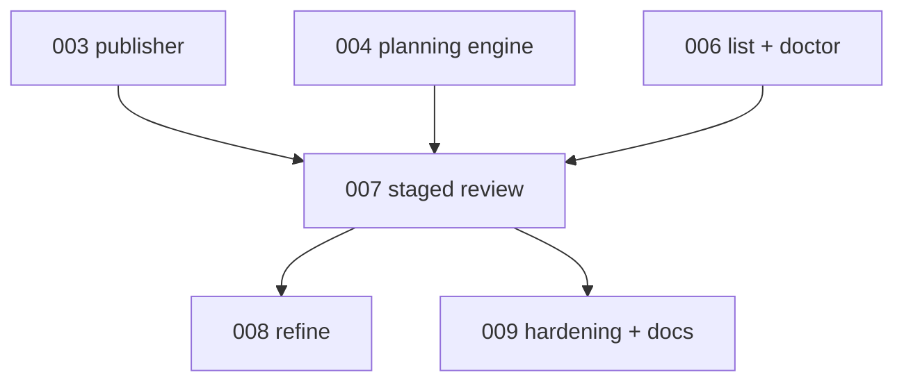

# 007 - Migration Review With Staged Publish

## Goal

Move human-review mutation under the new migration namespace and through the staged workspace publisher:

```text
continuous-refactoring migration review <slug-or-path>
```

The old top-level `review` command should remain as a compatibility wrapper unless explicitly removed in a later cleanup.

## Non-goals

- Do not add `migration refine` yet.
- Do not add doctor repair behavior.
- Do not let review agents mutate the live migration directory directly.
- Do not review migrations outside the configured live migrations root.
- Do not change phase execution semantics.

## Current behavior and evidence

- `review_cli.review perform` currently asks an interactive agent to update the live migration directory, then reloads the manifest to check whether `awaiting_human_review` was cleared.
- That direct live mutation violates the desired docs/state sync guarantee and bypasses the transaction publisher.
- Current review tests monkeypatch agent behavior and assert flag clearing, missing migration errors, and still-flagged failures.

## Proposed design

Parser shape:

```text
continuous-refactoring migration review <slug-or-path> --with codex|claude --model <model> --effort <tier>
```

Behavior:

- Resolve `<slug-or-path>` through the contained resolver from plan 006.
- Require `awaiting_human_review=true`.
- Capture the live snapshot digest before copying to work.
- Copy the live snapshot to an XDG work dir.
- Run the review prompt against the work dir only.
- Validate the candidate with the consistency validator.
- Refuse to publish if `awaiting_human_review` remains true or `human_review_reason` is still set.
- Publish through the plan 003 publisher with `base_snapshot_id` compare-before-publish.
- Preserve existing top-level `review perform` as a compatibility wrapper to this implementation.

Prompt contract:

- Present the human-review reason verbatim.
- Tell the agent that the work dir is the only writable target.
- Tell the agent not to mutate `migrations/<slug>` directly.
- Keep `## Taste` injection.

## Files/modules likely touched

- `src/continuous_refactoring/cli.py`
- `src/continuous_refactoring/review_cli.py`
- `src/continuous_refactoring/migration_cli.py`
- `src/continuous_refactoring/prompts.py`
- `src/continuous_refactoring/planning_publish.py`
- `tests/test_cli_migrations.py`
- `tests/test_cli_review.py`
- `tests/test_prompts.py`

## Test strategy

Exact regression tests to add or modify:

- `tests/test_cli_migrations.py::test_migration_review_accepts_slug_or_path_inside_live_root`
- `tests/test_cli_migrations.py::test_migration_review_rejects_outside_path_and_symlink_escape`
- `tests/test_cli_migrations.py::test_migration_review_rejects_missing_or_not_flagged_migration`
- `tests/test_cli_migrations.py::test_migration_review_runs_agent_against_work_dir`
- `tests/test_cli_migrations.py::test_migration_review_failure_leaves_live_snapshot_unchanged`
- `tests/test_cli_migrations.py::test_migration_review_rejects_stale_base_snapshot`
- `tests/test_cli_migrations.py::test_migration_review_refuses_publish_when_review_flag_remains`
- `tests/test_cli_review.py::test_top_level_review_perform_routes_to_migration_review_compatibility_path`
- `tests/test_prompts.py::test_review_prompt_names_work_dir_and_forbids_live_dir_mutation`

Validation command:

- `uv run pytest tests/test_cli_migrations.py tests/test_cli_review.py tests/test_prompts.py`
- then `uv run pytest`

## Numbered task breakdown with agent assignments

1. `[Scout]` Map old review CLI behavior and tests that must remain compatible.
2. `[Architect]` Define review result handling and compatibility wrapper behavior.
3. `[Artisan]` Add `migration review` parser and staged review implementation.
4. `[Artisan]` Route top-level `review perform` through the new staged implementation.
5. `[Test Maven]` Add no-live-change, stale-base, and compatibility tests.
6. `[Critic]` Review for direct live mutation escape hatches and path containment.
7. `[Artisan]` Apply review fixes.

## Blocking dependencies

- Depends on [003-atomic-planning-workspace-publisher.md](003-atomic-planning-workspace-publisher.md).
- Depends on [004-resumable-one-step-planning-engine.md](004-resumable-one-step-planning-engine.md) for validation/state expectations.
- Depends on [006-migration-list-and-doctor.md](006-migration-list-and-doctor.md) for parser namespace and resolver.
- Blocks:
  - [008-migration-refine.md](008-migration-refine.md)
  - [009-hardening-compatibility-and-docs.md](009-hardening-compatibility-and-docs.md)

## Mermaid dependency visualization



## Acceptance criteria

- `migration review <slug-or-path>` parses and dispatches.
- Review agents write only to a staged work dir.
- Failed review leaves the live migration snapshot unchanged.
- Stale base snapshots block publish.
- Review cannot target paths outside the configured live migrations root.
- The compatibility top-level `review perform` path still works or fails with an intentional compatibility message.
- `uv run pytest` passes.

## Risks and rollback

- Risk: compatibility wrapper diverges from the canonical command. Mitigate by routing to one implementation.
- Risk: review prompt still implies live mutation. Add prompt tests.
- Risk: stale-base rejection surprises users. Error should point to `migration doctor` and suggest rerunning review.

## Open questions

- Should `migration review` support read-only preview? Recommendation: not in this PR.
- Should top-level `review list` be aliased to `migration list --awaiting-review`? Recommendation: optional; keep behavior stable unless tests make it easy.
- Should review clear stale transaction directories? Recommendation: no; doctor reports, future repair handles.

## How later plans may need to adapt if this plan changes

- If compatibility aliasing is deferred, plan 009 must document the old and new commands honestly.
- If review result handling changes, plan 008 refine should reuse the final mutation result shape.
- If prompt wording changes, plan 009 prompt audits must check the final contract.
