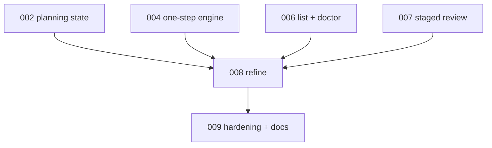

# 008 - Migration Refine

## Goal

Add a controlled refinement command for planning feedback:

```text
continuous-refactoring migration refine <slug-or-path>
```

Refine should reopen or continue planning through the same durable planning state and staged publish pipeline, without rewriting migrations that have already executed work.

## Non-goals

- Do not support refining migrations with completed phases.
- Do not support arbitrary external migration paths.
- Do not bypass the one-step planning engine.
- Do not add transaction or lock repair behavior.
- Do not make `refine` a substitute for `review`; human-review clearing stays in plan 007.

## Current behavior and evidence

- There is no migration refinement CLI.
- Current planning has a revise stage driven by automated review findings, but no user-feedback entry point.
- Ready migrations can be awaiting human review, but current review flow is about clearing review gates, not changing the plan with explicit feedback.

## Proposed design

Parser shape:

```text
continuous-refactoring migration refine <slug-or-path> (--message <text>|--file <path>) --with codex|claude --model <model> --effort <tier>
```

Eligibility:

- Allowed for `status: planning`.
- Allowed for `status: ready` only when no phase has `done=true` and `current_phase` points to the first phase.
- Refuse `in-progress`, `done`, `skipped`, or any migration with completed phases.
- Target must resolve inside the configured live migrations root through plan 006's resolver.

State transition:

- Append user feedback to planning state.
- For `status: planning`, keep the current planning cursor unless the state machine defines a refinement branch.
- For unexecuted `status: ready`, move back to `status: planning`, set `next_step` to a refinement/revise step, and preserve prior final-review output as audit history.
- Run exactly one planning/refinement step through the plan 004 engine.
- Publish through the plan 003 publisher with `base_snapshot_id` protection.

The exact step name can be `refine` or reuse `revise`; choose during implementation based on the final state-machine vocabulary from plan 002. Do not invent a second feedback mechanism outside planning state.

## Files/modules likely touched

- `src/continuous_refactoring/cli.py`
- `src/continuous_refactoring/migration_cli.py`
- `src/continuous_refactoring/planning.py`
- `src/continuous_refactoring/planning_state.py`
- `src/continuous_refactoring/prompts.py`
- `src/continuous_refactoring/planning_publish.py`
- `tests/test_cli_migrations.py`
- `tests/test_planning.py`
- `tests/test_planning_state.py`
- `tests/test_prompts.py`

## Test strategy

Exact regression tests to add:

- `tests/test_cli_migrations.py::test_migration_refine_requires_message_or_file`
- `tests/test_cli_migrations.py::test_migration_refine_rejects_outside_path_and_symlink_escape`
- `tests/test_cli_migrations.py::test_migration_refine_resumes_from_current_planning_state`
- `tests/test_cli_migrations.py::test_migration_refine_reopens_unexecuted_ready_migration_to_planning`
- `tests/test_cli_migrations.py::test_migration_refine_refuses_migration_with_completed_phase`
- `tests/test_cli_migrations.py::test_migration_refine_failure_leaves_live_snapshot_unchanged`
- `tests/test_cli_migrations.py::test_migration_refine_rejects_stale_base_snapshot`
- `tests/test_planning_state.py::test_planning_state_records_user_refinement_feedback`
- `tests/test_prompts.py::test_refine_prompt_names_work_dir_and_keeps_taste`

Validation command:

- `uv run pytest tests/test_cli_migrations.py tests/test_planning.py tests/test_planning_state.py tests/test_prompts.py`
- then `uv run pytest`

## Numbered task breakdown with agent assignments

1. `[Architect]` Decide whether refinement is a new step or a reuse of `revise`, based on the final transition graph.
2. `[Scout]` Identify ready/in-progress predicates and phase-completion helpers to avoid rewriting executed migrations.
3. `[Artisan]` Add parser behavior, feedback persistence, and refine eligibility checks.
4. `[Artisan]` Route refine through the one-step engine and staged publisher.
5. `[Test Maven]` Add eligibility, stale-base, and no-live-change tests.
6. `[Critic]` Review for unsafe rewrites of executed migrations and confusing UX.
7. `[Artisan]` Apply review fixes.

## Blocking dependencies

- Depends on [002-planning-state-schema-and-durable-stage-outputs.md](002-planning-state-schema-and-durable-stage-outputs.md).
- Depends on [004-resumable-one-step-planning-engine.md](004-resumable-one-step-planning-engine.md).
- Depends on [006-migration-list-and-doctor.md](006-migration-list-and-doctor.md).
- Depends on [007-migration-review-staged-publish.md](007-migration-review-staged-publish.md) for shared mutation UX and compatibility behavior.
- Blocks [009-hardening-compatibility-and-docs.md](009-hardening-compatibility-and-docs.md).

## Mermaid dependency visualization



## Acceptance criteria

- `migration refine <slug-or-path>` parses and dispatches.
- Refine records user feedback in planning state.
- Refine runs through the one-step engine and staged publisher.
- Refine refuses any migration with completed phase work.
- Failed refine leaves the live migration snapshot unchanged.
- Stale base snapshots block publish.
- `uv run pytest` passes.

## Risks and rollback

- Risk: ready-to-planning reopen semantics are confusing. Keep eligibility narrow and output explicit.
- Risk: refine duplicates review behavior. Keep review for gate clearing, refine for user feedback.
- Risk: phase completion predicate is wrong. Reuse existing manifest phase state instead of local string checks.

## Open questions

- Should refine use a distinct `refine` step or reuse `revise`? Recommendation: decide from the final state-machine API; prefer fewer step names if readable.
- Should refine be allowed for `ready` awaiting human review? Recommendation: yes only if no phase has executed; it should return to `planning`.
- Should refine auto-run final review? Recommendation: no; one accepted step per action remains the rule.

## How later plans may need to adapt if this plan changes

- If refine is deferred, plan 009 docs must omit it or mark it as future work.
- If refine cannot reopen ready migrations, plan 009 should document planning-only refine.
- If refinement step naming changes, AGENTS.md should record the final vocabulary.
