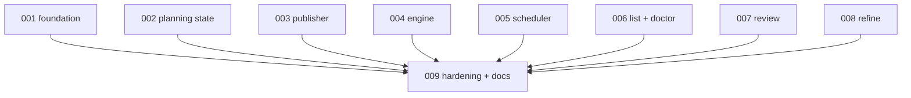

# 009 - Hardening, Compatibility Cleanup, And Docs

## Goal

Finish the stack by removing transitional seams, documenting the new planning-resume model, and proving the whole flow works end to end.

This plan should land after the product behavior exists.

## Non-goals

- Do not introduce new migration semantics.
- Do not add broad `doctor --repair` behavior unless a separate plan approves it.
- Do not structurally refactor `loop.py` beyond cleanup made safe by earlier plans.
- Do not change release versions or changelog entries manually.
- Do not remove compatibility commands without clear tests and docs.

## Current behavior and evidence

- README currently documents the existing migration flow, not resumable planning snapshots.
- AGENTS.md currently describes `status: planning` and human-review gating, but not `.planning/state.json`, transaction directories, base snapshot checks, or the new `migration` CLI.
- Prompt tests enforce `## Taste` injection across prompt templates.
- There may be transitional wrappers after plan 004 and compatibility aliases after plan 007.
- Failure snapshots know call roles like classifier/planner/editor/reviewer, but planning-step failure wording may need tightening.

## Proposed design

Clean up after the stack:

- Remove or narrow transitional planning wrappers kept only for staged rollout.
- Audit all planning, review, and refine prompts:
  - name the staged work dir,
  - forbid direct live-dir mutation,
  - preserve `## Taste`,
  - explain that failed current-step output is not resume input.
- Update README CLI docs:
  - `migration list`,
  - `migration review <slug-or-path>`,
  - `migration refine <slug-or-path>`,
  - `migration doctor <slug-or-path>`,
  - `migration doctor --all`.
- Update AGENTS.md invariants:
  - `.planning/state.json` is durable planning state,
  - `.planning/stages/` stores accepted step outputs,
  - planning publishes use base snapshot comparison before replacing live dirs,
  - `migrations/__transactions__/` is internal and invisible to scheduling but visible to doctor,
  - `status: planning` is eligible only for planning ticks, never phase execution,
  - invalid planning state blocks automation,
  - ready migrations must pass consistency validation before phase execution.
- Update failure snapshot wording and event labels for planning-step failures.
- Add focused end-to-end tests that cover source-target one-step creation, focused planning completion, and phase execution after `ready`.
- Re-check assumptions from plans 001 through 008 before editing README or AGENTS.md.

## Files/modules likely touched

- `README.md`
- `AGENTS.md`
- `src/continuous_refactoring/prompts.py`
- `src/continuous_refactoring/planning.py`
- `src/continuous_refactoring/cli.py`
- `src/continuous_refactoring/review_cli.py`
- `src/continuous_refactoring/failure_report.py`
- `tests/test_prompts.py`
- `tests/test_run.py`
- `tests/test_focus_on_live_migrations.py`
- `tests/test_failure_report.py`
- `tests/test_cli_migrations.py`

## Test strategy

Exact regression tests to add or modify:

- `tests/test_prompts.py::test_planning_prompts_name_staged_work_dir_and_keep_taste`
- `tests/test_prompts.py::test_review_and_refine_prompts_forbid_live_dir_mutation`
- `tests/test_failure_report.py::test_planning_step_failure_snapshot_names_step_and_resume_behavior`
- `tests/test_run.py::test_e2e_source_target_creates_only_first_planning_step`
- `tests/test_run.py::test_e2e_source_target_then_focused_run_resumes_planning_to_ready`
- `tests/test_focus_on_live_migrations.py::test_e2e_focused_run_completes_planning_before_phase_execution`
- `tests/test_cli_migrations.py::test_documented_migration_commands_match_parser`

Validation command:

- targeted prompt/CLI/failure/run tests,
- then full `uv run pytest`.

## Numbered task breakdown with agent assignments

1. `[Scout]` Identify transitional wrappers, compatibility paths, and docs that now disagree with behavior.
2. `[Architect]` Decide which compatibility paths stay and which can be removed safely.
3. `[Artisan]` Update README, AGENTS.md, prompts, and failure wording.
4. `[Artisan]` Remove obsolete wrappers or mark compatibility aliases intentionally.
5. `[Test Maven]` Add end-to-end and prompt contract tests.
6. `[Critic]` Review docs for stale invariants, unsafe operator advice, and CLI mismatch.
7. `[Artisan]` Apply review fixes.

## Blocking dependencies

- Depends on [005-planning-before-phase-execution-scheduling.md](005-planning-before-phase-execution-scheduling.md).
- Depends on [006-migration-list-and-doctor.md](006-migration-list-and-doctor.md).
- Depends on [007-migration-review-staged-publish.md](007-migration-review-staged-publish.md).
- Depends on [008-migration-refine.md](008-migration-refine.md).
- Should also re-check assumptions from plans 001 through 008 before editing AGENTS.md.

## Mermaid dependency visualization

## Acceptance criteria

- README documents the new migration planning workflow and CLI accurately.
- AGENTS.md contains the new load-bearing invariants and removes stale ones.
- Prompt tests prove `## Taste` remains injected.
- Review/refine prompts no longer imply live-dir mutation.
- Failure snapshots for planning-step failures explain that the current step will rerun from the last atomic state.
- Any transitional wrapper left in place is documented and tested as compatibility.
- Full `uv run pytest` passes.

## Risks and rollback

- Risk: docs overpromise behavior not delivered by earlier plans. Mitigate by checking parser/tests before writing docs.
- Risk: removing compatibility paths breaks users. Keep aliases unless there is a clear deprecation decision.
- Risk: AGENTS.md becomes too large. Add only load-bearing invariants and remove obsolete wording in the same PR.
- Risk: end-to-end tests become brittle. Use existing fake-agent idioms and avoid real agent integration.

## Open questions

- Should old top-level `review` be deprecated in README or just kept undocumented? Recommendation: document `migration review` as canonical and mention top-level `review` only as compatibility if still present.
- Should `.planning/` be user-facing in README? Recommendation: mention it as durable audit state, not as something users edit by hand.
- Should docs describe manual transaction recovery? Recommendation: only after `doctor --repair` exists; until then tell users to run `migration doctor`.

## How later plans may need to adapt if this plan changes

- If earlier plans defer `refine`, docs must omit it or mark it experimental instead of pretending it exists.
- If doctor remains read-only, later repair work should get its own numbered plan.
- If compatibility aliases stay long-term, future cleanup plans should treat them as supported surface, not dead code.
