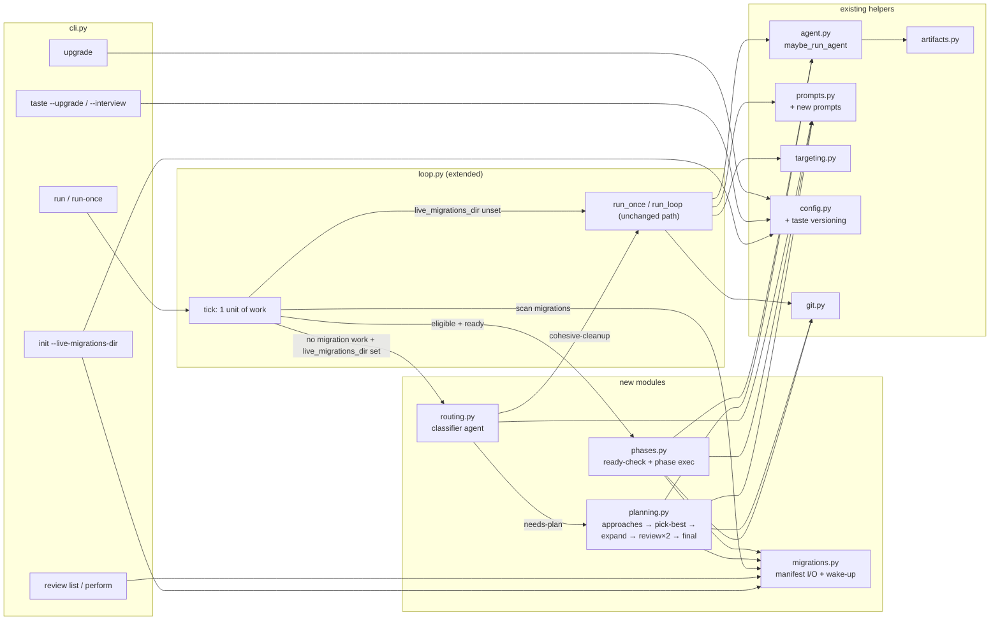

Status: todo

# Larger Refactorings Plan

## Problem statement

`continuous-refactoring` today runs single-session cleanup refactorings gated by a validation command. We need two new task classes: **multi-agent complex refactorings** that need a planning phase before they can be worked, and **phased-rollout refactorings** that ship in signal-gated increments. The existing one-shot path must remain byte-identical when no live-migrations directory is configured. Per-user taste grows two dimensions (large-scope decisions, rollout style) behind a `taste-scoping-version` header whose mismatch warns (does not block) when existing tastes are at an older version on any subcommand, and is upgraded on demand via `taste --upgrade`. A per-project `live-migrations-dir` (path stored in the XDG project registry — **no project config file**) holds each migration's `manifest.json`, `plan.md`, `approaches/`, `phase-N-<name>.md`, plus a shared `__intentional_skips__/` directory. Wake-up mechanics gate phase progression (≥6h since last touch AND (wake_up_on elapsed OR ≥7d stale)); the 6h cooldown is a safety invariant the code enforces regardless of what agents write. New CLI surface: `init --live-migrations-dir`, `review list`, `review perform`, `upgrade`, `taste --upgrade`.

## Mermaid



## Task format

Each task below is a fenced JSON block introduced with the info-string `json task`. The orchestrator (`scripts/run_larger_refactorings_plan.py`) parses every such block by regex, updates `done` in-place after a task passes, and rewrites the top-level `Status:` line on plan-wide failure.

Required fields on every task:

- `id` — stable string (e.g. `"T3.2"`)
- `title` — short sentence
- `type` — one of `"code" | "config" | "docs" | "test"`
- `touches` — list of repo-relative paths or globs, optionally with `:LINE-LINE` suffixes
- `blocked_by` — list of task `id`s that must be `done` before this one may start
- `review_criteria` — list of strings, each mechanically verifiable by the review agent
- `done` — `false` initially; flipped to `true` by the orchestrator on success

The orchestrator treats these top-level `Status:` values:

- `Status: todo` — work pending
- `Status: awaiting <human|plan-slug|clarification>` — blocked; orchestrator prints the reason and exits 0
- `Status: failed -- <reason>` — orchestrator prints reason and exits 1

Batches are announced by `### Batch N: <name>` headings. Every batch leaves `main` shippable with the one-shot path working. Tasks inside a batch may run concurrently only if their `blocked_by` lists allow it; in practice the orchestrator works them sequentially.

## Tasks

### Batch 1 — Migrations foundations (infrastructure; no behavior change)

```json task
{
  "blocked_by": [],
  "done": true,
  "id": "T1.1",
  "review_criteria": [
    "file src/continuous_refactoring/migrations.py exists and exports MigrationManifest, PhaseSpec, load_manifest, save_manifest, migration_root, phase_path, approaches_dir, intentional_skips_dir via __all__",
    "MigrationManifest is a @dataclass with fields name:str, created_at:str, last_touch:str, wake_up_on:str|None, awaiting_human_review:bool, status:Literal['planning','ready','in-progress','skipped','done'], current_phase:int, phases:tuple[PhaseSpec,...]",
    "PhaseSpec is a @dataclass with fields name:str, file:str, done:bool, ready_when:str",
    "save_manifest uses stdlib json with indent=2 + sort_keys=True, writes via tmp-file rename (mirror config.save_manifest's atomic pattern)",
    "load_manifest(Path) returns a MigrationManifest; missing optional keys (wake_up_on, awaiting_human_review) default to None/False",
    "migration_root(live_dir, name) returns live_dir / name; phase_path(...), approaches_dir(...), intentional_skips_dir(...) return the paths documented in the plan header",
    "tests/test_migrations.py covers: manifest roundtrip (property-style, random phases), tmp-file-rename atomicity (e.g. assert no .tmp files left behind), unknown-status rejection, default values for optional fields",
    "uv run pytest passes"
  ],
  "title": "add src/continuous_refactoring/migrations.py with manifest dataclasses + I/O + path helpers",
  "touches": [
    "src/continuous_refactoring/migrations.py",
    "src/continuous_refactoring/__init__.py",
    "tests/test_migrations.py"
  ],
  "type": "code"
}
```

```json task
{
  "blocked_by": [],
  "done": true,
  "id": "T1.2",
  "review_criteria": [
    "ProjectEntry in src/continuous_refactoring/config.py gains an optional field live_migrations_dir:str|None (stored as a repo-relative string, resolved later)",
    "_entry_from_dict handles the new field as an optional key: existing manifests without the field still load correctly (value becomes None)",
    "save_manifest output for an entry with live_migrations_dir=None omits or nulls the field consistently (pick one; document choice in a short comment or leave obvious from dataclass)",
    "a new helper resolve_live_migrations_dir(project: ResolvedProject) -> Path | None returns None when unset, else project.path_root / live_migrations_dir resolved and asserted to be inside the repo",
    "tests/test_config.py gains cases: entry roundtrip with live_migrations_dir set/unset, legacy manifest without the field still loads, resolve_live_migrations_dir rejects paths escaping the repo (e.g. '../elsewhere')",
    "uv run pytest passes"
  ],
  "title": "extend ProjectEntry with live_migrations_dir and add resolve_live_migrations_dir helper",
  "touches": [
    "src/continuous_refactoring/config.py:40-172",
    "tests/test_config.py"
  ],
  "type": "code"
}
```

```json task
{
  "blocked_by": ["T1.1", "T1.2"],
  "done": true,
  "id": "T1.3",
  "review_criteria": [
    "cli.py `init` subparser accepts an optional --live-migrations-dir PATH argument",
    "_handle_init resolves the given path relative to the project, creates the directory if missing, and writes the repo-relative string into ProjectEntry.live_migrations_dir via a new config.set_live_migrations_dir helper (or equivalent)",
    "running `init` twice with --live-migrations-dir is idempotent: second call overwrites the stored value and does not duplicate registry entries",
    "running `init --live-migrations-dir` where PATH is outside the repo exits 2 with a clear stderr message",
    "print output from `init` continues to include project uuid + data directory; new line prints the live-migrations dir when set",
    "tests/test_cli_init_taste.py gains 2 cases: happy path (flag creates + stores dir); failure (path outside repo rejected)",
    "uv run pytest passes"
  ],
  "title": "add `init --live-migrations-dir PATH` flag + handler wiring",
  "touches": [
    "src/continuous_refactoring/cli.py:75-95",
    "src/continuous_refactoring/cli.py:183-193",
    "src/continuous_refactoring/config.py:151-183",
    "tests/test_cli_init_taste.py"
  ],
  "type": "code"
}
```

### Batch 2 — Taste versioning (independent improvement)

```json task
{
  "blocked_by": [],
  "done": true,
  "id": "T2.1",
  "review_criteria": [
    "_DEFAULT_TASTE in src/continuous_refactoring/config.py begins with a frontmatter line 'taste-scoping-version: 1' followed by a blank line, then the existing bullets, then two new sections with bullet stubs: 'large-scope decisions' (when to split/unify/introduce interfaces) and 'rollout style' (caution level; feature-flag user-visible changes; etc.)",
    "a constant TASTE_CURRENT_VERSION = 1 is exported from config.py",
    "new helper parse_taste_version(text: str) -> int|None parses the header line; returns None when missing or non-integer",
    "new helper taste_is_stale(text: str) -> bool returns True when parse_taste_version(text) != TASTE_CURRENT_VERSION",
    "load_taste still returns the file content verbatim (callers that need staleness ask via taste_is_stale) — no behavior change for consumers that ignore the header",
    "tests/test_config.py gains cases: parse_taste_version for present/missing/malformed; taste_is_stale true for legacy (no header) / false for current; default taste text includes the new sections",
    "uv run pytest passes"
  ],
  "title": "add taste-scoping-version header + two new taste dimensions to _DEFAULT_TASTE",
  "touches": [
    "src/continuous_refactoring/config.py:31-37",
    "src/continuous_refactoring/config.py:189-211",
    "tests/test_config.py"
  ],
  "type": "code"
}
```

```json task
{
  "blocked_by": ["T2.1"],
  "done": true,
  "id": "T2.2",
  "review_criteria": [
    "new CLI subcommand `upgrade` registered in build_parser() — no required flags",
    "_handle_upgrade errors with exit code 1 and a message mentioning 'config version' when global config is absent or stale",
    "_handle_upgrade succeeds (exit 0) when global config is current; its success path is a no-op write (idempotent)",
    "when global taste is stale, _handle_upgrade prints a warning to stderr but still exits 0 (does not block)",
    "tests/test_cli_upgrade.py covers happy path (current version → exit 0) + failure (missing/stale config version → exit 1)",
    "uv run pytest passes"
  ],
  "title": "add `upgrade` CLI subcommand",
  "touches": [
    "src/continuous_refactoring/cli.py:69-169",
    "src/continuous_refactoring/cli.py:325-340",
    "src/continuous_refactoring/config.py",
    "tests/test_cli_upgrade.py"
  ],
  "type": "code"
}
```

```json task
{
  "blocked_by": ["T2.1"],
  "done": true,
  "id": "T2.3",
  "review_criteria": [
    "taste subparser accepts --upgrade (mutually exclusive with --interview at argparse level or enforced in _handle_taste)",
    "_handle_taste with --upgrade calls a new compose_taste_upgrade_prompt that asks only about the dimensions introduced since the stored version",
    "when existing taste has no version header, upgrade is forced and the prompt tells the agent to replace the file with a versioned v1 taste (mentions the two new dimensions)",
    "when existing taste is at TASTE_CURRENT_VERSION, --upgrade is a no-op (prints 'taste already current' and exits 0)",
    "tests/test_taste_interview.py (or a new tests/test_taste_upgrade.py) covers: upgrade forced on legacy taste (agent invoked); upgrade no-op on current taste (agent not invoked)",
    "uv run pytest passes"
  ],
  "title": "add `taste --upgrade` flag + compose_taste_upgrade_prompt",
  "touches": [
    "src/continuous_refactoring/cli.py:86-300",
    "src/continuous_refactoring/prompts.py:121-160",
    "tests/test_taste_upgrade.py"
  ],
  "type": "code"
}
```

```json task
{
  "blocked_by": ["T2.1"],
  "done": true,
  "id": "T2.4",
  "review_criteria": [
    "cli_main prints a single-line stderr warning 'warning: taste out of date — run `continuous-refactoring taste --upgrade`' when the resolved taste (project or global) fails taste_is_stale before dispatching to a handler",
    "the warning fires for every subcommand (init, taste, run, run-once, review, upgrade); tests assert capsys.readouterr().err contains the warning text exactly once per invocation",
    "the warning does not change exit codes and does not mutate state",
    "tests assert warning appears for run/run-once with a legacy taste fixture and is absent when the taste is current",
    "uv run pytest passes"
  ],
  "title": "emit stale-taste warning on every subcommand",
  "touches": [
    "src/continuous_refactoring/cli.py:325-340",
    "tests/test_cli_taste_warning.py"
  ],
  "type": "code"
}
```

### Batch 3 — Classifier + planning workflow

```json task
{
  "blocked_by": ["T1.1", "T1.2"],
  "done": true,
  "id": "T3.1",
  "review_criteria": [
    "prompts.py gains named constants CLASSIFIER_PROMPT, PLANNING_APPROACHES_PROMPT, PLANNING_PICK_BEST_PROMPT, PLANNING_EXPAND_PROMPT, PLANNING_REVIEW_PROMPT, PLANNING_FINAL_REVIEW_PROMPT, PHASE_READY_CHECK_PROMPT, PHASE_EXECUTION_PROMPT",
    "each new prompt ends with an explicit output contract: classifier outputs one line 'decision: cohesive-cleanup' OR 'decision: needs-plan' (plus short reason); final-review outputs exactly one of 'final-decision: approve-auto', 'final-decision: approve-needs-human', 'final-decision: reject' (plus short reason); ready-check outputs one of 'ready: yes', 'ready: no — <reason>', 'ready: unverifiable — <reason>'",
    "prompts mention taste is injected by caller and the agent must respect it; the planning prompts mention artifact locations (approaches/<idea>.md, plan.md, phase-<n>-<name>.md) verbatim",
    "existing DEFAULT_REFACTORING_PROMPT, DEFAULT_FIX_AMENDMENT, INTERVIEW_PROMPT_TEMPLATE, and compose_full_prompt are unchanged",
    "new compose helpers compose_classifier_prompt(target, taste), compose_planning_prompt(stage, migration_name, taste, context), compose_phase_ready_prompt(phase, manifest), compose_phase_execution_prompt(phase, manifest, taste) are exported and unit-tested for containment of required sections",
    "uv run pytest passes"
  ],
  "title": "add classifier + planning + phase prompts and compose helpers",
  "touches": [
    "src/continuous_refactoring/prompts.py",
    "tests/test_prompts.py"
  ],
  "type": "code"
}
```

```json task
{
  "blocked_by": ["T3.1"],
  "done": false,
  "id": "T3.2",
  "review_criteria": [
    "new module src/continuous_refactoring/routing.py exports classify_target(target, taste, repo_root, artifacts, *, agent, model, effort, timeout) -> Literal['cohesive-cleanup','needs-plan']",
    "classify_target dispatches via maybe_run_agent, parses the last non-empty stdout line matching 'decision: cohesive-cleanup' or 'decision: needs-plan' (case-insensitive); any other output raises ContinuousRefactorError",
    "no dependency introduced beyond stdlib + what agent.py already uses",
    "tests/test_routing.py covers: happy path returning each label (mocked at maybe_run_agent boundary), malformed output raising the error, agent non-zero exit raising",
    "uv run pytest passes"
  ],
  "title": "add src/continuous_refactoring/routing.py with classifier dispatch",
  "touches": [
    "src/continuous_refactoring/routing.py",
    "src/continuous_refactoring/__init__.py",
    "tests/test_routing.py"
  ],
  "type": "code"
}
```

```json task
{
  "blocked_by": ["T1.1", "T3.1"],
  "done": false,
  "id": "T3.3",
  "review_criteria": [
    "new module src/continuous_refactoring/planning.py exports run_planning(migration_name, target, taste, repo_root, live_dir, artifacts, *, agent, model, effort, timeout) -> PlanningOutcome",
    "PlanningOutcome is a @dataclass with fields status:Literal['ready','awaiting_human_review','skipped'], reason:str",
    "run_planning executes the six stages in order: approaches → pick-best → expand → review → revise → final-review; the second review round runs revise + review again unless the first review reports no findings",
    "each stage writes its artifact under live_dir/migration_name/ (approaches/<idea>.md, plan.md, phase-<n>-<name>.md) and updates manifest.json atomically via migrations.save_manifest",
    "final-review output mapping: approve-auto → status='ready'; approve-needs-human → status='ready' and manifest.awaiting_human_review=True; reject → status='skipped' and writes live_dir/__intentional_skips__/<migration_name>.md capturing target/intended outcome/blocker reason",
    "run_planning never modifies source files outside live_dir — only plan artifacts and manifest are written",
    "tests/test_planning.py mocks maybe_run_agent at the module boundary, drives each final-decision branch end-to-end, and asserts the artifact tree + manifest state after each",
    "uv run pytest passes"
  ],
  "title": "add src/continuous_refactoring/planning.py implementing the 6-stage planning workflow",
  "touches": [
    "src/continuous_refactoring/planning.py",
    "src/continuous_refactoring/__init__.py",
    "tests/test_planning.py"
  ],
  "type": "code"
}
```

```json task
{
  "blocked_by": ["T1.1", "T1.2", "T3.2", "T3.3"],
  "done": false,
  "id": "T3.4",
  "review_criteria": [
    "loop.py _load_taste_safe is joined by a new _resolve_live_migrations_dir(repo_root) -> Path | None helper that delegates to config.resolve_live_migrations_dir",
    "run_once and run_loop route via a new internal _route_and_run(target, ...) function: if resolve_live_migrations_dir(repo_root) is None, call the existing one-shot codepath unchanged; else call routing.classify_target, then dispatch to one-shot (cohesive-cleanup) or planning.run_planning (needs-plan)",
    "when planning.run_planning returns status='ready' or 'awaiting_human_review' or 'skipped', the tick commits the live_dir artifacts to the current branch with message `{commit_message_prefix}: plan {migration_name}` and returns success; no source-file changes are expected in a planning tick",
    "run_once and run_loop print a one-line summary of the classification decision when routing runs",
    "one-shot (cohesive-cleanup) codepath remains byte-identical to pre-change behavior: same prompt composition, same branch naming (cr/... or refactor/...), same commit-message prefix, same revert/push semantics — asserted by T3.5",
    "no new runtime dependencies introduced",
    "uv run pytest passes"
  ],
  "title": "wire classifier + planning into loop.py behind the live-migrations-dir gate",
  "touches": [
    "src/continuous_refactoring/loop.py:68-125",
    "src/continuous_refactoring/loop.py:227-310",
    "src/continuous_refactoring/routing.py",
    "src/continuous_refactoring/planning.py"
  ],
  "type": "code"
}
```

```json task
{
  "blocked_by": ["T3.4"],
  "done": false,
  "id": "T3.5",
  "review_criteria": [
    "tests/test_run_once_regression.py exists and contains at least three cases, all using the existing prompt_capture/noop_tests fixtures",
    "case A: `run_once` with no live-migrations-dir configured produces a prompt whose text equals `compose_full_prompt(...)` called directly with the same inputs (base prompt, taste, target) — compose_full_prompt is pure so no pre-change snapshot is needed",
    "case B: `run_once` with no live-migrations-dir produces a branch matching `^cr/\\d{8}T\\d{6}$` and an output containing 'Branch: cr/' — same assertion surface as test_run_once_creates_branch",
    "case C: `run_loop` with no live-migrations-dir against a 2-target batch produces exactly 2 agent invocations, same commit-message prefix, same push semantics as the pre-change test_run behavior",
    "case D: with live-migrations-dir SET and routing.classify_target stubbed to return 'cohesive-cleanup', the composed prompt, branch name, commit message, and push semantics match case A (compared against the same `compose_full_prompt(...)` call)",
    "in cases A-C, routing.classify_target is monkeypatched to raise if invoked (asserting the one-shot path does not touch the classifier); in case D the stub is called exactly once and returns 'cohesive-cleanup'",
    "uv run pytest passes"
  ],
  "title": "add regression tests asserting one-shot path behavior is unchanged when live-migrations-dir is unset",
  "touches": [
    "tests/test_run_once_regression.py"
  ],
  "type": "test"
}
```

### Batch 4 — Execution phase + wake-up

```json task
{
  "blocked_by": ["T1.1"],
  "done": false,
  "id": "T4.1",
  "review_criteria": [
    "migrations.py gains pure helpers: parse_iso(s:str) -> datetime; eligible_now(manifest, now:datetime) -> bool that returns True iff (now - parse_iso(last_touch)) >= 6h AND (wake_up_on is None OR parse_iso(wake_up_on) <= now OR (now - parse_iso(last_touch)) >= 7d)",
    "the 6h cooldown is enforced first — no code path can return True with (now - last_touch) < 6h, regardless of wake_up_on; this is the safety invariant",
    "a second helper bump_last_touch(manifest, now) -> new_manifest returns a copy with last_touch updated (does not mutate input)",
    "tests/test_wake_up.py uses a frozen 'now' and covers: fresh migration (< 6h) never eligible even with wake_up_on in the past; eligible when wake_up_on elapsed AND ≥6h since last_touch; eligible after 7d stale with no wake_up_on; stays ineligible while < 6h even if manifest sets wake_up_on in the far past (adversarial)",
    "uv run pytest passes"
  ],
  "title": "add wake-up eligibility + 6h cooldown safety invariant in migrations.py",
  "touches": [
    "src/continuous_refactoring/migrations.py",
    "tests/test_wake_up.py"
  ],
  "type": "code"
}
```

```json task
{
  "blocked_by": ["T1.1", "T3.1", "T4.1"],
  "done": false,
  "id": "T4.2",
  "review_criteria": [
    "new module src/continuous_refactoring/phases.py exports check_phase_ready(phase:PhaseSpec, manifest, taste, repo_root, artifacts, *, agent, model, effort, timeout) -> Literal['yes','no','unverifiable'] + reason string",
    "check_phase_ready dispatches the PHASE_READY_CHECK_PROMPT via maybe_run_agent and parses last non-empty line matching 'ready: yes' | 'ready: no — <reason>' | 'ready: unverifiable — <reason>'",
    "new function execute_phase(phase, manifest, target_or_none, taste, repo_root, live_dir, artifacts, *, agent, model, effort, timeout) -> ExecutePhaseOutcome(status:Literal['done','awaiting_human_review','failed'], reason:str) drives: one PHASE_EXECUTION_PROMPT agent call → run_tests → on green, flip phase.done=True, bump manifest.current_phase if this was the current phase, update manifest.last_touch, save manifest; on test failure, revert workspace and record failure reason",
    "execute_phase never pushes; caller handles branching",
    "phase branch helper generate_phase_branch_name(migration_name, phase_index, phase_name) produces 'migration/<migration-name>/phase-<n>-<phase-name>' (slugged) and is used when the execute call is invoked from loop.py (T4.3)",
    "tests/test_phases.py covers: ready=yes path with green tests flips phase.done; ready=no leaves manifest untouched except last_touch + wake_up_on bump; ready=unverifiable sets manifest.awaiting_human_review=True; execute_phase test-failure path reverts workspace",
    "uv run pytest passes"
  ],
  "title": "add phases.py with check_phase_ready + execute_phase + phase branch helper",
  "touches": [
    "src/continuous_refactoring/phases.py",
    "src/continuous_refactoring/__init__.py",
    "tests/test_phases.py"
  ],
  "type": "code"
}
```

```json task
{
  "blocked_by": ["T3.4", "T4.2"],
  "done": false,
  "id": "T4.3",
  "review_criteria": [
    "loop.py's per-tick routing (T3.4's _route_and_run) now runs a migration-scan step first: enumerate manifests under live_dir; filter by eligible_now(manifest, now); sort ascending by created_at; take the first that also passes check_phase_ready == 'yes' for its current phase",
    "when a migration is picked, the tick checks out generate_phase_branch_name(...), calls execute_phase, commits artifacts + phase file changes with message `{commit_message_prefix}: migration/{name}/phase-{n}/{phase_name}`, and returns without invoking classifier or target selection",
    "when a migration is ineligible or not ready, the tick must bump manifest.last_touch and (if wake_up_on is None) set wake_up_on to now+7d via migrations.save_manifest and continue scanning; the 6h safety invariant MUST be respected — no save_manifest call can result in eligible_now being True within 6h of the original last_touch",
    "when no migration has work, the tick falls through to T3.4's existing classifier gate (or directly to the one-shot path when live_dir is unset)",
    "run_loop still honours max_consecutive_failures, max_refactors, max_attempts — a failed migration tick counts as one consecutive failure only when execute_phase returns status='failed' (awaiting_human_review is not a failure)",
    "tests/test_phases.py (or a new tests/test_loop_migration_tick.py) covers: single-eligible-ready migration advances one phase; no-eligible migrations fall through to existing target path; eligible-but-not-ready bumps wake_up_on and moves on; the 6h invariant is asserted concretely — seed manifest with last_touch=now-1h and wake_up_on=now-1d (both making the agent 'want' eligibility), assert eligible_now returns False AND execute_phase is never invoked",
    "uv run pytest passes"
  ],
  "title": "integrate migration scan into loop tick; phase branch + commit + safety invariant",
  "touches": [
    "src/continuous_refactoring/loop.py:107-451",
    "src/continuous_refactoring/git.py:117-190",
    "tests/test_loop_migration_tick.py"
  ],
  "type": "code"
}
```

### Batch 5 — Review CLI

```json task
{
  "blocked_by": ["T1.1", "T1.2", "T2.2", "T2.3", "T2.4"],
  "done": false,
  "id": "T5.1",
  "review_criteria": [
    "cli.py gains a `review` subparser with nested subcommands `list` and `perform`",
    "`review list` with no args reads the project's resolved live_migrations_dir, enumerates migrations, filters by manifest.awaiting_human_review == True, and prints one line per flagged migration: `<name>\\t<status>\\t<current_phase>\\t<last_touch>`",
    "`review list` exits 0 with empty output when none are flagged; exits 1 with a stderr message when the project has no live_migrations_dir",
    "tests/test_cli_review.py covers happy (2 flagged + 1 not-flagged → 2 lines) + failure (no live_migrations_dir set → exit 1)",
    "uv run pytest passes"
  ],
  "title": "add `review list` subcommand",
  "touches": [
    "src/continuous_refactoring/cli.py:69-340",
    "tests/test_cli_review.py"
  ],
  "type": "code"
}
```

```json task
{
  "blocked_by": ["T5.1", "T3.1"],
  "done": false,
  "id": "T5.2",
  "review_criteria": [
    "`review perform <migration>` requires --with/--model/--effort (same validation pattern as taste --interview)",
    "handler resolves the migration's manifest.json; errors exit 2 when the migration does not exist or is not flagged awaiting_human_review",
    "handler dispatches run_agent_interactive with a new prompt REVIEW_PERFORM_PROMPT that: names the migration, points to plan.md + current phase file + manifest, asks the human whatever it needs, and instructs the agent to write back to manifest/plan and clear awaiting_human_review = False at the end",
    "after the agent exits 0, handler reloads the manifest; if awaiting_human_review is still True, handler exits 1 with a stderr message telling the user the review was not completed",
    "tests/test_cli_review.py covers happy (fake interactive writer flips the flag; handler exits 0) + failure (fake writer leaves flag true → exit 1)",
    "uv run pytest passes"
  ],
  "title": "add `review perform <migration>` subcommand",
  "touches": [
    "src/continuous_refactoring/cli.py:69-340",
    "src/continuous_refactoring/prompts.py",
    "tests/test_cli_review.py"
  ],
  "type": "code"
}
```

### Batch 6 — Docs

```json task
{
  "blocked_by": ["T1.3", "T2.2", "T2.3", "T2.4", "T3.4", "T4.1", "T4.3", "T5.2"],
  "done": false,
  "id": "T6.1",
  "review_criteria": [
    "README.md gains a top-level section 'Larger refactorings' explaining the migrations model, the live-migrations-dir layout, wake-up rules, and the phase model in ≤60 lines",
    "README.md Subcommands table lists `upgrade`, `review list`, `review perform` with one-line descriptions",
    "README.md Targeting / Useful flags section mentions `init --live-migrations-dir` and `taste --upgrade`",
    "README explicitly notes that rollout mechanism (flag names, deploy tools, metric dashboards) is the coding agent's capability, not a CLI-visible concern",
    "no new runtime dependency is added in docs claims that isn't in pyproject.toml",
    "uv run pytest passes (docs-only change should not break tests)"
  ],
  "title": "README update covering migrations + new CLI surface",
  "touches": [
    "README.md"
  ],
  "type": "docs"
}
```

## Open questions

None at this time — the plan sets `Status: todo`. If the orchestrator encounters a design contradiction mid-flight, it sets `Status: failed -- <reason>`; if a human must intervene to unblock a task, they manually flip `Status: awaiting human` and add context in a new `## Open questions` section.
