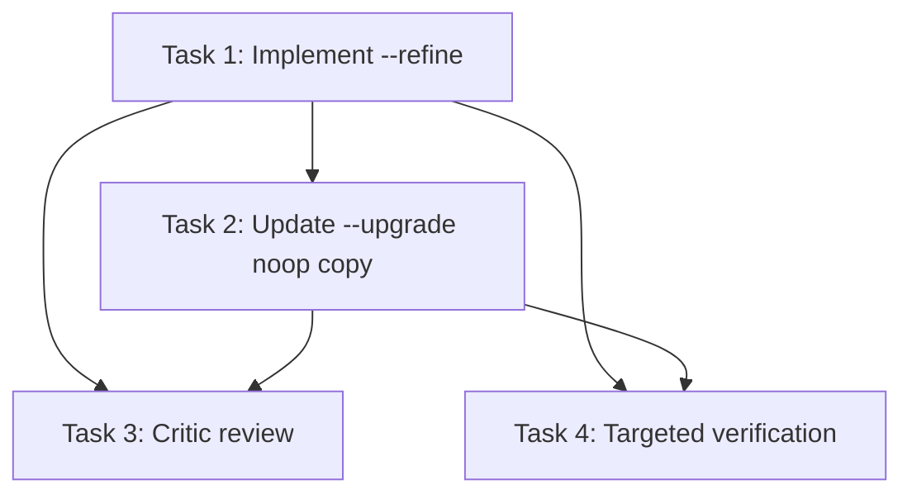

# Taste Refine / Upgrade Plan

## Chosen Approach

1. Add `taste --refine` as a dedicated mode with its own handler and prompt helper.
2. Keep `taste --upgrade` version-gated and non-interactive when the taste file is already current.
3. Update the current-version `--upgrade` noop message to point users at `taste --refine`.

## Task Breakdown

1. `[Artisan]` Implement `--refine`.
   Files:
   - `src/continuous_refactoring/cli.py`
   - `src/continuous_refactoring/prompts.py`
   - `tests/test_taste_refine.py`
   - `tests/test_taste_interview.py`
   Requirements:
   - Add `--refine` to the mutually exclusive `taste` mode group.
   - Route `--refine` through a dedicated `_handle_taste_refine()`.
   - Add a dedicated refine prompt that keeps the session open until the user says to write the file, then warns that the host will automatically end the session after the settled write.
   - Reuse `_run_taste_agent(...)`.
   - If the taste file exists, treat it as the working draft.
   - If it does not exist, use `default_taste_text()` as the starting draft without pre-writing the file.
   - Do not change interview overwrite semantics or upgrade version semantics.

2. `[Artisan]` Implement the `--upgrade` noop copy change.
   Files:
   - `src/continuous_refactoring/cli.py`
   - `tests/test_taste_upgrade.py`
   Requirements:
   - When the stored taste version is current, print an actionable noop message.
   - The message must tell the user to use `taste --refine` if they want to be re-interviewed.
   - Keep the noop before agent flag validation.
   - Do not alter stale upgrade behavior.

3. `[Critic]` Review the combined change.
   Focus:
   - CLI behavior regressions
   - Prompt honesty and settle semantics
   - Test coverage gaps

4. `[Test Maven]` Verify behavior with targeted automated tests.
   Commands:
   - `uv run pytest tests/test_taste_refine.py tests/test_taste_interview.py tests/test_taste_upgrade.py tests/test_prompts.py`

## Blocking Dependencies

1. Task 1 blocks Task 2 because `--upgrade` should not point at a nonexistent flag.
2. Tasks 1 and 2 block Task 3 because review should cover the integrated CLI surface.
3. Tasks 1 and 2 block Task 4 because verification should run on the final combined behavior.

## Dependency Visualization

