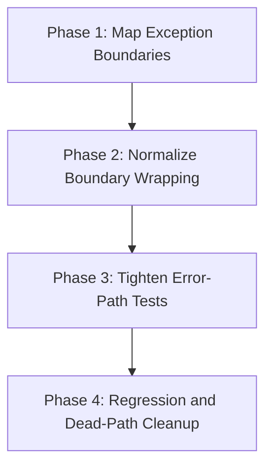

# Migration Plan: random-files-20260512T161021

## Objective
Harden module-boundary exception translation in `git.py`, `phases.py`, and `planning_publish.py` so boundary errors are consistent, preserve `__cause__`, and avoid unnecessary intra-module re-wrapping, then align tests to verify those guarantees.

## Phase Breakdown
1. `phase-1-map-exception-boundaries.md`
2. `phase-2-normalize-boundary-wrapping.md`
3. `phase-3-tighten-error-path-tests.md`
4. `phase-4-regression-and-dead-path-cleanup.md`

## Dependencies
1. Phase 1 has no migration-phase blockers.
2. Phase 2 depends on Phase 1 completion.
3. Phase 3 depends on Phase 2 completion.
4. Phase 4 depends on Phase 3 completion.

## Dependency Visualization

## Validation Strategy
1. Phase-level validation uses focused `uv run pytest` selections for files directly touched in the phase.
2. Every phase includes explicit assertions that boundary-translated errors retain nested causes where expected.
3. Full configured validation command `uv run pytest` is required before a phase is marked complete.
4. Keep CLI/XDG/manifest behavior unchanged; if any change appears necessary, stop and surface for human review instead of silently changing contracts.

## Risk Controls
1. Preserve message anchors already used as behavior contracts in tests; improve consistency without broad wording churn.
2. Translate at module boundaries only; avoid wrapping and re-wrapping inside the same module.
3. Keep diffs narrow and domain-focused; remove dead branches only when proven unused by current code and tests.
