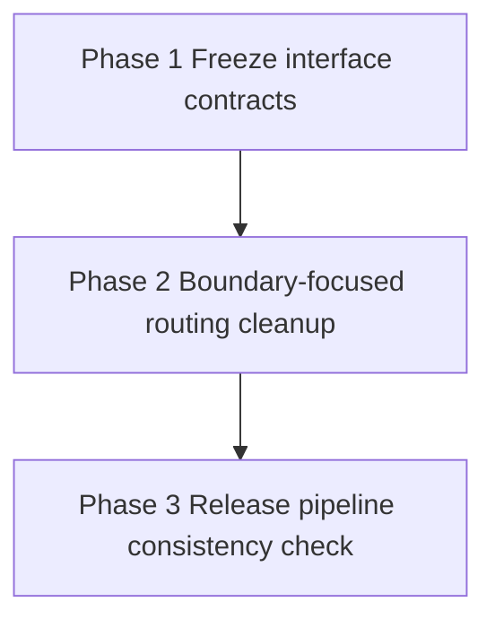

# Migration Plan — random-files-20260514T002058

## Goal
Tighten and protect shipped CLI/module-entry interfaces first, then perform bounded internal routing cleanup, then verify release-workflow assumptions still match those contracts.

## Phase Order
1. [phase-1-freeze-interface-contracts.md](phase-1-freeze-interface-contracts.md)
2. [phase-2-boundary-focused-routing-cleanup.md](phase-2-boundary-focused-routing-cleanup.md)
3. [phase-3-release-pipeline-consistency-check.md](phase-3-release-pipeline-consistency-check.md)

## Dependency Graph
- Phase 1: no migration-phase dependency.
- Phase 2: depends on Phase 1 completion.
- Phase 3: depends on Phase 2 completion.

## Validation Strategy
- Baseline is harness-owned and enforced outside phase content.
- Per phase, execute the configured validation command as the final completion gate.
- Keep each phase independently verifiable with scoped checks first, then full configured validation command before marking complete.
- If any phase discovers intentional user-visible CLI behavior change, document that in phase artifacts for explicit human review.

## Risk Reduction Rationale
- Phase 1 locks external behavior early to prevent accidental drift.
- Phase 2 is limited to internal readability/flow improvements at the routing boundary with preserved exception semantics.
- Phase 3 runs last because workflow edits carry disproportionate blast radius and should only happen after contracts are stable.

## Shippability Rule Per Phase
- Every phase must leave repository behavior coherent and releasable, with no partial contract shifts.
