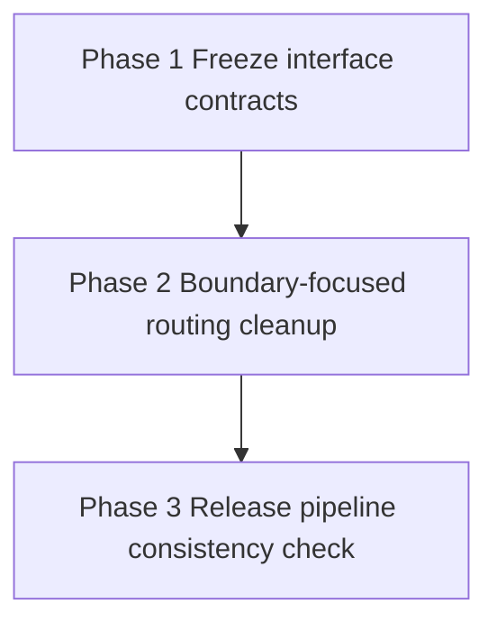

# Migration Plan — random-files-20260514T002058

## Goal
Lock externally visible CLI/module-entry contracts first, then perform bounded internal routing cleanup, then verify release workflow smoke assumptions still match those locked contracts.

## Phase Order
1. [phase-1-freeze-interface-contracts.md](phase-1-freeze-interface-contracts.md)
2. [phase-2-boundary-focused-routing-cleanup.md](phase-2-boundary-focused-routing-cleanup.md)
3. [phase-3-release-pipeline-consistency-check.md](phase-3-release-pipeline-consistency-check.md)

## Dependency Graph
- Phase 1: no migration-phase dependency.
- Phase 2: depends on Phase 1 completion.
- Phase 3: depends on Phase 2 completion.

## Validation Strategy
- The harness enforces baseline validation before refactoring and after each completed phase.
- Each phase runs scoped checks first (targeted tests or file-level consistency checks), then the configured full validation command as the final completion gate.
- Each phase has objective completion criteria tied to specific files and observable outcomes.
- If a phase intentionally changes user-visible interface behavior, phase notes must explicitly name the behavior change for human review.

## Risk Reduction Rationale
- Phase 1 pins observable contract behavior before internals change.
- Phase 2 is constrained to `routing.py` and directly covering routing tests, with explicit criteria for duplication reduction and unchanged outcomes.
- Phase 3 is last because workflow edits are high-blast-radius and should happen only after contracts are locked.

## Shippability Rule Per Phase
- Every completed phase must leave the repository in a releasable state with coherent behavior and passing configured full validation.
