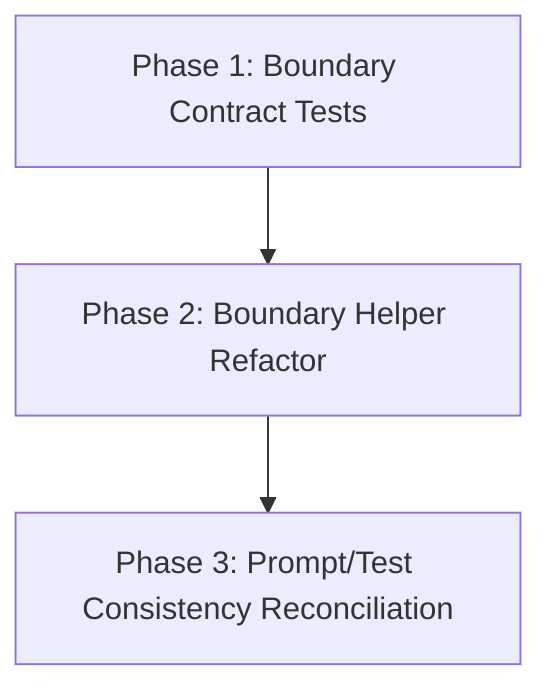

# Migration Plan: interface-first-boundary-hardening

## Objective
Refactor migration boundary logic in a compatibility-first sequence: lock externally observable behavior first, then simplify internals behind those guardrails, while preserving shipped interfaces (CLI behavior, migration file semantics, and XDG-backed state interactions).

## Phase Order
1. **Phase 1 — Boundary Contract Tests**
2. **Phase 2 — Boundary Helper Refactor**
3. **Phase 3 — Prompt/Test Consistency Reconciliation**

This order is intentional: Phase 1 reduces regression risk for scheduler/eligibility behavior; Phase 2 performs structural cleanup behind explicit contracts; Phase 3 ensures contract artifacts (prompt/test invariants) still accurately describe the refactored behavior.

## Dependency Graph

## Detailed Phase Breakdown
1. **Phase 1: Boundary Contract Tests (`phase-1-boundary-contract-tests.md`)**
   - Add or tighten tests around boundary behavior in `migrations.py` and `migration_tick.py`.
   - Focus on outcome contracts: visibility filtering, eligibility/candidate handling, and boundary-level error translation paths.
   - Avoid broad production rewrites; this phase is test-first hardening.

2. **Phase 2: Boundary Helper Refactor (`phase-2-boundary-helper-refactor.md`)**
   - Refactor helper decomposition and call flow in boundary modules without altering exposed behavior.
   - Remove redundant branches and tighten sequencing where tests prove equivalence.
   - Keep CLI wiring and persisted file formats unchanged.

3. **Phase 3: Prompt/Test Consistency Reconciliation (`phase-3-prompt-test-consistency-reconciliation.md`)**
   - Ensure test and prompt contracts continue to match migration semantics after refactor.
   - Update only impacted assertions/fixtures and related invariants.
   - Confirm no drift in required taste injection and migration contract expectations.

## Validation Strategy
- **Per-phase validation:**
  - Run focused tests first for the files/surfaces changed in the phase.
  - Then run the configured full validation command (`uv run pytest`) before marking the phase complete.
- **Behavioral guardrails:**
  - Prefer assertions on observable outcomes and filesystem-visible effects over implementation-coupled assertions.
  - Preserve boundary error semantics (translation at module edges; no hidden deep translation changes).
- **Risk controls:**
  - If Phase 2 uncovers behavior ambiguity, add/adjust contract tests before further refactor.
  - Keep each phase independently shippable; do not batch incomplete cross-phase changes.

## Shippability Criteria (All Phases)
- The repository remains releasable after each phase with no required follow-up edits from later phases.
- No unreviewed interface-contract changes are introduced in CLI behavior, migration manifest structure, or on-disk state conventions.
- Full validation command passes at phase completion.
