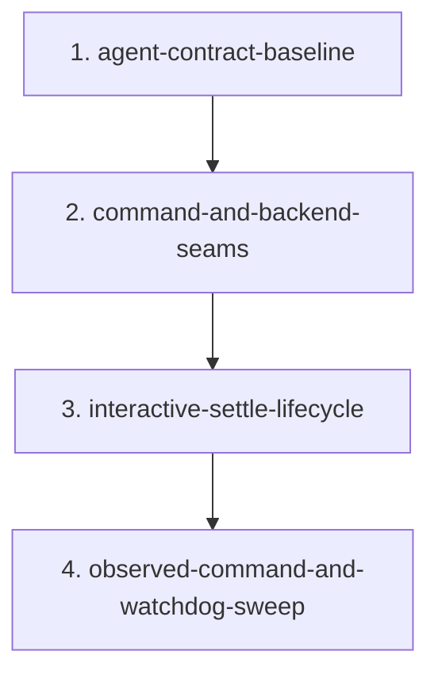

# Migration: src-continuous-refactoring-agent-py-20260428T041549

## Goal
Refactor `src/continuous_refactoring/agent.py` in place around its real seams so command construction, interactive settle lifecycle, and observed subprocess execution become easier to read and change without altering public behavior, imports, or package surface.

## Chosen approach
Source: `approaches/agent-inplace-seams.md`

Why this one:
- Lowest-risk path for a load-bearing module with tty recovery, settle handshake, and watchdog behavior.
- Keeps all imports and package exports stable while still improving local structure.
- Matches the current migration scope instead of smuggling in a module split.

Short runners-up:
- `approaches/agent-backend-boundary-split.md`: cleaner future architecture, higher churn now.
- `approaches/agent-execution-domain-split.md`: sharper domain boundaries, but riskier import and ownership changes for a first pass.

## Scope
- `src/continuous_refactoring/agent.py`
- `tests/test_continuous_refactoring.py`
- `tests/test_claude_stream_json.py`
- `tests/test_taste_interview.py` when a phase changes the settle-path call contract exercised through CLI taste commands
- `tests/test_taste_refine.py` when a phase changes the settle-path call contract exercised through CLI taste commands
- `tests/test_taste_upgrade.py` when a phase changes the settle-path call contract exercised through CLI taste commands
- `AGENTS.md` only if a phase makes the `agent.py` load-bearing subtlety notes stale

## Non-goals
- Do not split `agent.py` into new modules.
- Do not change package exports or package-root uniqueness behavior.
- Do not change supported agent backends, command-line flags, settle handshake semantics, Codex terminal reset behavior, Claude NDJSON extraction rules, timeout behavior, or watchdog behavior.
- Do not add runtime dependencies, compatibility shims, speculative interfaces, or comment-heavy scaffolding.
- Do not pull unrelated loop, planning, or taste-feature work into this migration.

## Phase order
1. `phase-1-agent-contract-baseline.md`
2. `phase-2-command-and-backend-seams.md`
3. `phase-3-interactive-settle-lifecycle.md`
4. `phase-4-observed-command-and-watchdog-sweep.md`

## Dependencies
1. Phase 1 blocks every later phase.
Why: helper cleanup is unsafe until the current contracts are pinned with concrete tests.
2. Phase 2 depends on Phase 1.
Why: command/backend cleanup should happen before touching the sharper interactive settle path that consumes those commands.
3. Phase 3 depends on Phase 2.
Why: settle lifecycle cleanup is narrower and riskier than command cleanup; it should land after the command path is stable.
4. Phase 4 depends on Phase 3.
Why: watchdog and observed-command cleanup is the last local sweep after command and settle seams are already stable.

## Validation strategy
Each phase uses the narrowest test slice that proves the behavior it is allowed to touch. Full `pytest` is deferred to the final phase so earlier phases stay cheap and focused while still shippable.

1. Phase 1 validation
- `uv run pytest tests/test_claude_stream_json.py`
- `uv run pytest tests/test_continuous_refactoring.py -k "test_build_command_claude_streams_json_so_watchdog_sees_progress or test_build_command_rejects_unknown_agent or test_maybe_run_agent_rejects_unknown_agent_before_path_lookup or test_run_agent_interactive_rejects_unknown_agent_before_path_lookup or test_interactive_settle_rejects_unknown_agent_before_settle_path_checks or test_run_agent_interactive_until_settled_requests_graceful_exit_after_settle or test_run_agent_interactive_until_settled_ignores_stale_settle_file or test_run_agent_interactive_until_settled_restores_terminal_state_and_codex_modes or test_run_agent_interactive_until_settled_skips_codex_reset_on_clean_exit or test_restore_codex_terminal_modes_writes_expected_escape_sequence or test_run_observed_command_writes_timestamped_logs or test_run_observed_command_timeout_hides_full_command_text or test_run_observed_command_stuck_hides_full_command_text"`
2. Phase 2 validation
- `uv run pytest tests/test_continuous_refactoring.py -k "test_build_command_claude_streams_json_so_watchdog_sees_progress or test_build_command_rejects_unknown_agent or test_maybe_run_agent_rejects_unknown_agent_before_path_lookup or test_run_agent_interactive_rejects_unknown_agent_before_path_lookup or test_interactive_settle_rejects_unknown_agent_before_settle_path_checks"`
- `uv run pytest tests/test_claude_stream_json.py`
3. Phase 3 validation
- `uv run pytest tests/test_continuous_refactoring.py -k "test_gracefully_stop_interactive_process_skips_finished_process or test_gracefully_stop_interactive_process_stops_after_sigint_exit or test_gracefully_stop_interactive_process_escalates_to_sigterm or test_gracefully_stop_interactive_process_kills_after_signal_timeouts or test_run_agent_interactive_until_settled_requests_graceful_exit_after_settle or test_run_agent_interactive_until_settled_ignores_stale_settle_file or test_run_agent_interactive_until_settled_restores_terminal_state_and_codex_modes or test_run_agent_interactive_until_settled_skips_codex_reset_on_clean_exit or test_restore_codex_terminal_modes_writes_expected_escape_sequence"`
- `uv run pytest tests/test_taste_interview.py tests/test_taste_refine.py tests/test_taste_upgrade.py`
4. Phase 4 validation
- `uv run pytest tests/test_continuous_refactoring.py -k "test_run_observed_command_writes_timestamped_logs or test_run_observed_command_timeout_hides_full_command_text or test_run_observed_command_stuck_hides_full_command_text or test_package_exports_are_stable or test_package_exports_contain_known_public_symbols"`
- `uv run pytest tests/test_claude_stream_json.py tests/test_taste_interview.py tests/test_taste_refine.py tests/test_taste_upgrade.py`
- `uv run pytest`

## Must be true at every phase gate
- The repository is shippable after the phase commit.
- `src/continuous_refactoring/agent.py` remains a single module with the same public exports.
- Unsupported backend rejection still happens before agent path lookup or settle-path setup.
- Claude stream parsing still prefers the last valid non-error `result`, then assistant text, then raw output.
- Settle confirmation still requires a matching `sha256:` digest in the `.done` file to remain stable for the settle window.
- Forced Codex stop still performs the existing recovery path; clean exit still skips the Codex-only reset.
- Observed-command timeout and stuck-process failures remain distinct and continue to avoid leaking full prompt text.

## Phase assignments
1. Phase 1
Scout maps the live contracts; Test Maven tightens characterization coverage without changing semantics.
2. Phase 2
Artisan cleans up command/backend flow in place; Critic checks that helper movement did not broaden scope or blur backend differences.
3. Phase 3
Artisan tightens the settle lifecycle flow; Critic verifies the stop sequence, digest contract, and Codex recovery path stay exact.
4. Phase 4
Artisan finishes the observed-command/watchdog cleanup and removes dead local paths only when proven safe; Test Maven runs the full regression sweep; Critic checks for `AGENTS.md` drift.

## Risks
- The highest-risk behaviors are the settle handshake, forced-stop sequence, Codex terminal reset, and watchdog failure handling. Cleanup is allowed only after those contracts are pinned.
- `tests/test_continuous_refactoring.py` is the real regression surface for this module. The plan uses actual test names instead of invented boundaries.
- If helper movement changes where `AGENTS.md` points for a load-bearing subtlety, the same phase must update the contract.
