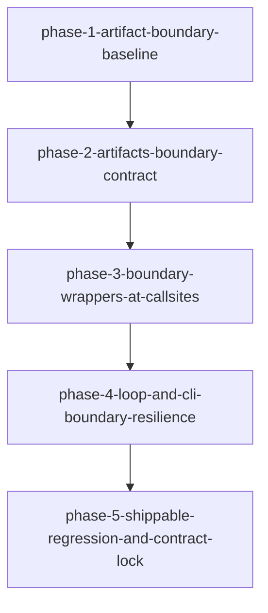

# Migration: src-continuous-refactoring-artifacts-py-20260427T215942

## Goal
Harden artifact persistence and adjacent command-boundary behavior around `continuous_refactoring.artifacts` in place so that failures at module boundaries preserve root-cause context, callsites remain stable, and execution behavior stays shippable between phases.

## Chosen approach
[`inplace-artifact-boundary-hardening`](approaches/inplace-artifact-boundary-hardening.md)

## Scope
- `src/continuous_refactoring/artifacts.py`
- `src/continuous_refactoring/agent.py`
- `src/continuous_refactoring/loop.py`
- `src/continuous_refactoring/migration_tick.py`
- `src/continuous_refactoring/phases.py`
- `src/continuous_refactoring/cli.py`
- `src/continuous_refactoring/config.py`
- `src/continuous_refactoring/git.py`
- `src/continuous_refactoring/__init__.py`
- `tests/test_continuous_refactoring.py`
- `tests/test_loop_migration_tick.py`
- `tests/test_phases.py`
- `tests/test_run.py`
- `tests/test_routing.py`
- `tests/test_cli_init_taste.py`
- `tests/test_cli_taste_warning.py`
- `tests/test_run_once.py`
- `tests/test_run_once_regression.py`
- `tests/test_config.py`

## Non-goals
- No module splitting or package-boundary redesign.
- No rollout flags or canary mechanics in this migration.
- No API-level renames.
- No deliberate changes to prompt text where tests assert exact output, except where required to preserve boundary context.

## Scope policy
Only files listed above and existing migration documents in this directory may be edited for this migration.

## Phases
1. `phase-1-artifact-boundary-baseline`
2. `phase-2-artifacts-boundary-contract`
3. `phase-3-boundary-wrappers-at-callsites`
4. `phase-4-loop-and-cli-boundary-resilience`
5. `phase-5-shippable-regression-and-contract-lock`

## Dependency summary
- Phase 1 creates a test baseline and verifies current behavior before production edits.
- Phase 2 introduces helper contracts in `artifacts.py` for summary/event persistence; all other production modules consume these contracts later.
- Phase 3 applies direct boundary wrappers in adjacent modules and migration-tick reporting seams, and must run only after Phase 2 is green.
- Phase 4 applies boundary resilience in orchestration and CLI surfaces and must run only after callsite behavior in Phase 3 is locked.
- Phase 5 performs final contract lock validation across the scope and must run only after Phase 4 is green.

## Validation strategy
Taste version: `taste-scoping-version: 1`

Phase gates must remain independently verifiable and each phase must leave a shippable tree (at least targeted tests green and no behavioral break outside migration intent).

### Phase gates
- `phase-1-artifact-boundary-baseline.md`: `uv run pytest tests/test_continuous_refactoring.py tests/test_phases.py tests/test_loop_migration_tick.py`
- `phase-2-artifacts-boundary-contract.md`: `uv run pytest tests/test_continuous_refactoring.py`
- `phase-3-boundary-wrappers-at-callsites.md`: `uv run pytest tests/test_run.py tests/test_routing.py tests/test_loop_migration_tick.py tests/test_phases.py`
- `phase-4-loop-and-cli-boundary-resilience.md`: `uv run pytest tests/test_cli_init_taste.py tests/test_cli_taste_warning.py tests/test_run_once.py tests/test_run_once_regression.py tests/test_config.py`
- `phase-5-shippable-regression-and-contract-lock.md`: `uv run pytest`

## Verification rule
Each phase must satisfy its local Definition of Done, including full boundary error-cause visibility for behavior changes it introduces, and pass its gate before the next phase starts.
