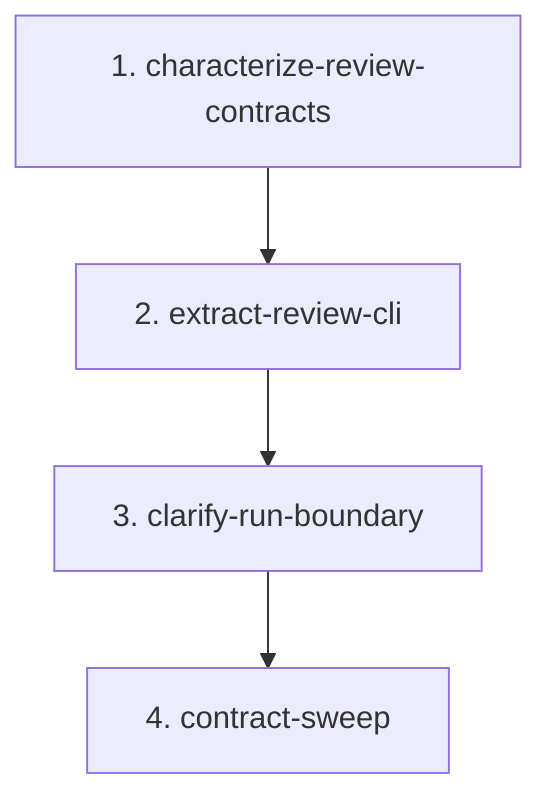

# CLI Review Boundary Migration

## Goal

Extract migration review command behavior out of `src/continuous_refactoring/cli.py` into a focused review boundary, then make the remaining run dispatch guards in `cli.py` easier to read without changing shipped CLI behavior.

The chosen boundary is intentionally narrow:

- `review_cli.py` owns `continuous-refactoring review ...` command execution.
- `cli.py` still owns parser construction, taste/init/upgrade command handling, command dispatch, and run/run-once guard behavior.
- `loop.py` still owns actual run execution, targeting resolution, retries, validation, commits, and artifacts.

## Non-Goals

- Do not split all commands into command modules.
- Do not move taste, init, or upgrade command handling.
- Do not move targeting resolution out of `loop.py` or targeting modules.
- Do not change targeting precedence or `--max-attempts 0` semantics.
- Do not change review prompt text except where imports or file paths naturally update.
- Do not add runtime dependencies.
- Do not add compatibility shims for old private review helper names.
- Do not add the new review module to package-root re-exports during this migration.

## Scope Notes

Expected production files:

- `src/continuous_refactoring/cli.py`
- `src/continuous_refactoring/review_cli.py`

Expected test files:

- `tests/test_cli_review.py`
- `tests/test_focus_on_live_migrations.py`
- `tests/test_run.py`
- `tests/test_cli_taste_warning.py` only for stale-taste dispatch coverage
- `tests/test_continuous_refactoring.py` only to verify package imports and root exports stay unchanged

Context-only files:

- `src/continuous_refactoring/loop.py`
- `src/continuous_refactoring/migrations.py`
- `src/continuous_refactoring/prompts.py`
- `src/continuous_refactoring/artifacts.py`
- `src/continuous_refactoring/agent.py`
- `src/continuous_refactoring/__init__.py`
- `src/continuous_refactoring/__main__.py`

`AGENTS.md` should be touched only if the extraction makes a repo-contract statement stale or creates a durable invariant worth preserving.

## Export Contract Decision

`src/continuous_refactoring/review_cli.py` is an internal command boundary.

It should define a module-local `__all__`, likely `("handle_review", "handle_review_list", "handle_review_perform")` if tests call the focused helpers directly. It must not be added to `src/continuous_refactoring/__init__.py` `_SUBMODULES` during this migration. In this codebase, `_SUBMODULES` controls package-root re-exports and duplicate-symbol checks. Adding review command helpers there would widen the root API by accident.

`cli.py` should import `handle_review` directly for `_COMMAND_HANDLERS`. Existing private names such as `_handle_review_perform` do not need wrappers after tests are retargeted.

## Phases

1. `characterize-review-contracts` - Pin review parser, list, perform, error-code, prompt, and manifest side-effect behavior before moving code.
2. `extract-review-cli` - Create `review_cli.py`, move review command execution, and retarget tests to the new boundary.
3. `clarify-run-boundary` - Keep run handling in `cli.py` but make targeting guards and loop error translation read as one explicit boundary.
4. `contract-sweep` - Remove stale imports/tests, verify package exports, update guidance only where the new boundary creates a durable invariant, and run the full gate.

## Dependencies

Phase 1 blocks all code movement. It proves the review contract before changing module ownership.

Phase 2 depends on Phase 1. The extraction should be mechanical once tests describe the review boundary.

Phase 3 depends on Phase 2. Run dispatch cleanup is safer after migration-specific review behavior is out of `cli.py`.

Phase 4 depends on Phase 3. Contract cleanup should happen after both the new review boundary and the clarified run boundary are stable.



## Agent Assignments

- Phase 1: Test Maven owns behavior characterization. Critic checks that tests assert CLI output, exit codes, prompts, and manifest outcomes instead of implementation calls.
- Phase 2: Artisan owns the extraction. Critic reviews import direction, private API removal, prompt behavior, manifest writes, and agent invocation.
- Phase 3: Artisan owns run-boundary cleanup. Critic reviews guard ordering and confirms no targeting or retry semantics moved.
- Phase 4: Critic owns the contract sweep. Test Maven runs focused tests and the full gate.

## Validation Strategy

Every phase must run the focused review tests:

```sh
uv run pytest tests/test_cli_review.py
```

Any phase touching run dispatch must also run:

```sh
uv run pytest tests/test_focus_on_live_migrations.py tests/test_run.py
```

Any phase touching command dispatch, stale taste warnings, or parser wiring should also run:

```sh
uv run pytest tests/test_cli_taste_warning.py tests/test_main_entrypoint.py
```

Phase 4 must verify package-root exports remain unchanged by running:

```sh
uv run pytest tests/test_continuous_refactoring.py
```

Any need to add `review_cli` to package-root `_SUBMODULES` blocks this migration and should become a separate public-API decision.

The final phase must run the full gate:

```sh
uv run pytest
```

## Must Preserve

- `continuous-refactoring review` without a subcommand exits 2 and prints `Usage: continuous-refactoring review {list,perform}` to stderr.
- Parser behavior for `review`, `review list`, and `review perform <migration> --with ... --model ... --effort ...` remains stable.
- `review list` exits 1 for missing project or missing `live-migrations-dir`.
- `review perform` exits 2 for missing project, missing `live-migrations-dir`, missing migration, or migrations not flagged for review.
- `review list` only prints migrations with `awaiting_human_review=True`.
- `review list` output remains tab-separated: migration name, status, current phase file, current phase name, last touch, human review reason.
- Missing review reason prints `(no reason recorded)`.
- Missing current phase prints `(none)` for phase file and phase name.
- `review perform` invokes `run_agent_interactive()` from the repository root.
- `review perform` composes prompts with the migration name, manifest path, plan path, current phase, manifest content, and human review reason.
- `review perform` exits with the agent return code when the review agent fails.
- `review perform` exits 1 if the review agent returns success but `awaiting_human_review` remains set.
- `review perform` clears stale `human_review_reason` after the agent clears `awaiting_human_review`.
- `run-once` still validates targeting before calling `run_once()`.
- `run --focus-on-live-migrations` still bypasses targeting and `--max-refactors` guards.
- Ordinary `run` still validates targeting and still requires `--max-refactors` when `--targets` is absent.
- Loop-level `ContinuousRefactorError` still becomes stderr plus `SystemExit(1)` at the CLI boundary.
- Parser construction stays in `cli.py`.

## Risk Notes

- Existing tests import private review helpers from `continuous_refactoring.cli` and patch `continuous_refactoring.cli.run_agent_interactive`. Phase 2 must retarget those paths deliberately to `continuous_refactoring.review_cli`.
- Do not leave private wrappers in `cli.py` just to satisfy old tests. Retarget tests to the new domain boundary.
- Keep `review_cli.py` free of taste/init/run concerns. It should depend on `agent`, `config`, `migrations`, `prompts`, and `artifacts`, not on `cli.py`.
- Avoid moving `run_loop`, `run_once`, or `run_migrations_focused_loop` imports into `review_cli.py`; review and run are separate command domains.
- The run cleanup phase is not permission to restructure `loop.py`. The fragile transaction, retry, and commit behavior belongs there.
