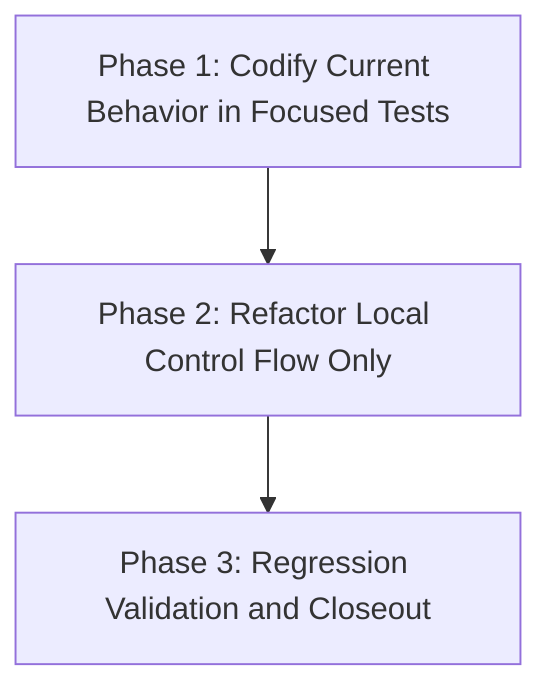

# Migration Plan: Minimal Rationale Hardening

## Goal
Refactor `src/continuous_refactoring/commit_messages.py` for clearer, deterministic rationale/message flow while preserving behavior and module ownership.

## Scope
- In scope: `src/continuous_refactoring/commit_messages.py`, `tests/test_commit_messages.py`.
- Out of scope: CLI behavior, XDG/project state, migration manifest structure, and cross-module ownership changes.

## Phase Breakdown
1. **Phase 1 — Codify Current Behavior in Focused Tests**
   - Extend `tests/test_commit_messages.py` with explicit examples for punctuation/casing variants, whitespace-only inputs, and trimming/normalization outcomes.
2. **Phase 2 — Refactor Local Control Flow Only**
   - Improve readability and determinism in `commit_messages.py` internals only, keeping signatures and external behavior unchanged.
3. **Phase 3 — Regression Validation and Closeout**
   - Re-run focused and full validation and apply only minimal fixes required to satisfy established phase contracts.

## Dependencies
- Phase 1 has no migration-internal blockers.
- Phase 2 depends on Phase 1 completion.
- Phase 3 depends on Phase 2 completion.

## Dependency Graph

## Validation Strategy
- Incremental checks by phase:
  - Focused: `uv run pytest tests/test_commit_messages.py`
  - Final full-suite: `uv run pytest`
- Preconditions remain phase-local and state-based.
- Definitions of Done carry verification outcomes, so each phase is independently verifiable and leaves the repository shippable.

## Risk Controls
- Test-first phase constrains behavior before refactor edits.
- Refactor phase is limited to one module to minimize blast radius.
- Final phase requires full-suite confirmation to catch non-local regressions.
