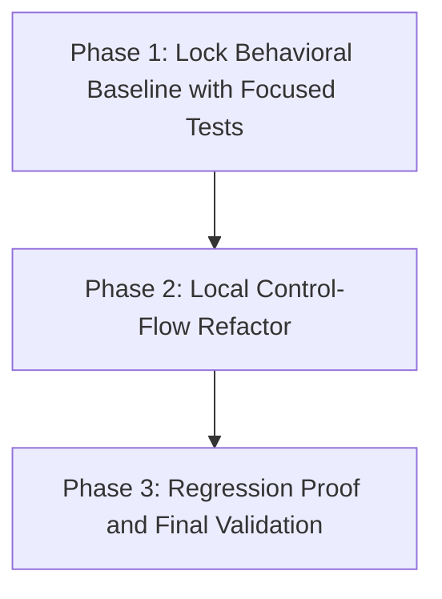

# Migration Plan: Minimal Rationale Hardening

## Goal
Refactor `src/continuous_refactoring/commit_messages.py` for clearer, deterministic rationale/message flow while preserving module boundaries and user-visible behavior.

## Scope
- In scope: `src/continuous_refactoring/commit_messages.py`, `tests/test_commit_messages.py`.
- Out of scope: CLI wiring, manifest/state formats, migration scheduling, and cross-module contract reshaping.

## Phase Breakdown
1. **Phase 1 — Lock Behavioral Baseline with Focused Tests**
   - Add/extend example-based tests that codify current behavior and edge-case expectations for commit rationale and message formatting.
2. **Phase 2 — Local Control-Flow Refactor in `commit_messages.py`**
   - Refactor internals for readability and deterministic branching only, without changing signatures or ownership boundaries.
3. **Phase 3 — Regression Proof and Final Validation**
   - Re-run focused and full validation, and confirm no unintended contract drift remains.

## Dependencies
- Phase 1 has no migration-internal blockers.
- Phase 2 depends on Phase 1 completion (tests define the behavioral contract).
- Phase 3 depends on Phase 2 completion.

## Dependency Graph

## Validation Strategy
- Phase-level validation is incremental:
  - During behavior lock-in and refactor: run `uv run pytest tests/test_commit_messages.py`.
  - At migration close: run `uv run pytest`.
- Each phase has explicit, outcome-based Definition of Done requirements and leaves the repository shippable.
- No phase precondition restates baseline-green invariants enforced by the harness.

## Risk Controls
- Test-first ordering reduces behavior-drift risk before control-flow edits.
- Refactor is constrained to a single module boundary, preserving sanitization and policy ownership in existing collaborators.
- Final phase requires full-suite confirmation to catch non-local regressions.
