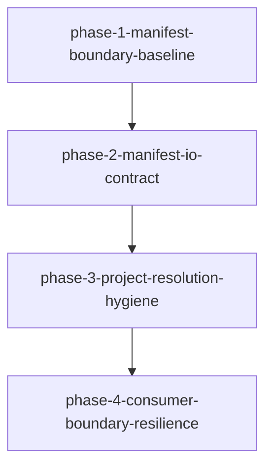

# Migration: src-continuous-refactoring-config-py-20260427T214508

## Goal
Harden `continuous_refactoring.config` in-place by making manifest/config IO and project-resolution boundaries explicit, safer, and easier to test while preserving existing CLI and loop semantics.

## Chosen approach
`in-place-config-hygiene`

## Scope
- `src/continuous_refactoring/config.py`
- `src/continuous_refactoring/loop.py`
- `src/continuous_refactoring/cli.py`
- `src/continuous_refactoring/prompts.py`
- `src/continuous_refactoring/agent.py`
- `src/continuous_refactoring/artifacts.py`
- `src/continuous_refactoring/git.py`
- `tests/test_config.py`
- `tests/test_cli_init_taste.py`
- `tests/test_cli_upgrade.py`
- `tests/test_run_once_regression.py`

## Non-goals
- No module splitting.
- No API-level renames across the config module boundary.
- No rollout flags or canary patterns.
- No behavior changes in planning, routing, or scoring logic outside config.

## Scope policy
Phase files may only edit assets listed above. Any new files must be justified by this migration and kept under `migrations/src-continuous-refactoring-config-py-20260427T214508/`.

## Phases
1. `phase-1-manifest-boundary-baseline.md`
2. `phase-2-manifest-io-contract.md`
3. `phase-3-project-resolution-hygiene.md`
4. `phase-4-consumer-boundary-resilience.md`

## Dependency summary
- `phase-1` is the safety gate and must pass before any production edits.
- `phase-2` depends on `phase-1` and is required before changing manifest parsing behavior.
- `phase-3` depends on `phase-2` and only modifies internal helper structure after IO contracts are fixed.
- `phase-4` depends on `phase-3` and hardens callsites and consumer behavior.
- Every phase must end in a shippable tree:
  - no import/API breakage in the migration scope,
  - targeted validation green for that phase,
  - backward-compatible CLI and loop behavior preserved by existing tests.

## Validation strategy
- `phase-1` gate: `uv run pytest tests/test_config.py`
- `phase-2` gate: `uv run pytest tests/test_config.py`
- `phase-3` gate: `uv run pytest tests/test_config.py`
- `phase-4` gate: `uv run pytest tests/test_config.py tests/test_cli_init_taste.py tests/test_cli_upgrade.py tests/test_run_once_regression.py`
- Post-merge gate: `uv run pytest`

## Verification rule
Each phase must pass its assigned validation before moving forward, and leave the tree in a runnable state with all executed tests green.
