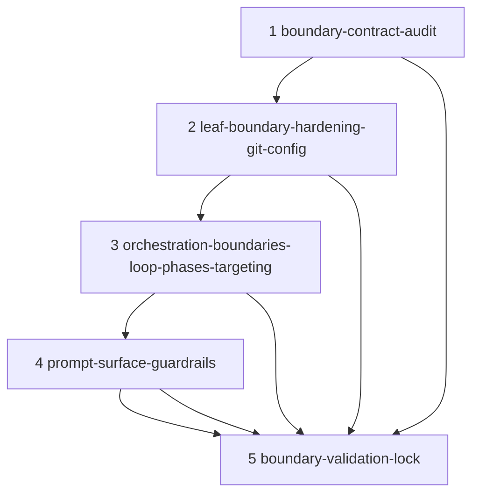

# Migration Plan: `src-continuous-refactoring-git-py-20260415T225733`

Migration target: `src/continuous_refactoring/git.py`

Chosen approach: `cluster-boundary-contract` from `approaches/cluster-boundary-contract.md`

## Chosen scope

`src/continuous_refactoring/*` local-cluster:

- `src/continuous_refactoring/git.py`
- `src/continuous_refactoring/loop.py`
- `src/continuous_refactoring/__init__.py`
- `src/continuous_refactoring/artifacts.py`
- `src/continuous_refactoring/config.py`
- `src/continuous_refactoring/prompts.py`
- `src/continuous_refactoring/targeting.py`
- `src/continuous_refactoring/phases.py`

## Migration objective

Make module-boundary contracts explicit and preserve failure semantics while tightening exception ownership:

1. Make `git.py` and `config.py` leaf boundaries translate with preserved causes.
2. Prevent duplicate wrapping of the same failure path in `loop.py` and `phases.py`.
3. Keep `targeting.py` command boundaries honest at the point where it executes subprocess calls.
4. Keep prompt/template phrasing aligned with the actual boundary contract.
5. Lock behavior with boundary-specific cause-chain tests.

The migration is non-behavior-changing outside failure signaling and must preserve status transitions: `completed`, `migration_failed`, `validation_failed`, `max_consecutive_failures`, `agent_failed`, `interrupted`, `failed`.

## Taste constraints applied

- Translate at module boundaries and preserve root cause where translation occurs.
- Keep module boundaries meaningful and aligned with domain.
- Keep comments near zero.
- Keep shippable output clean on every phase.
- Avoid speculative abstractions.

## Phase dependency graph

## Phase order rationale

- Phase 1 creates an auditable boundary map to remove guesswork in later edits.
- Phase 2 hardens low-level boundaries first (`git`, `config`) with low blast radius.
- Phase 3 normalizes orchestration behavior after leaves are stable.
- Phase 4 updates user-facing boundary wording only after core ownership is stable.
- Phase 5 adds deterministic assertions across all touched boundary layers.

Each phase is designed to be independently shippable: behavior-focused tests are required, and non-shippable states are blocked by explicit checks.

## Cross-phase validation strategy

1. Scope and artifact gates in each phase must pass before moving forward.
2. `git diff --name-only` checks limit file edits to the stated scope.
3. Targeted tests per phase must pass before editing the next phase.
4. `phase-5` adds/adjusts cause-chain and status-stability tests for all targeted boundary layers.

## Phase readiness policy

- If any phase ready_when check fails, stop at that phase boundary.
- Do not begin next phase edits when source-level files from previous phase have non-reviewed drift.
- Keep edits additive and reversible.
