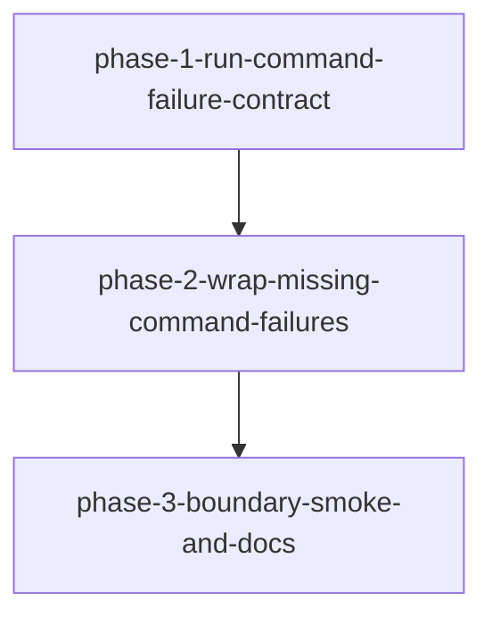

# Migration: src-continuous-refactoring-git-py-20260427T213756

## Goal
Harden the git subprocess boundary in `src/continuous_refactoring/git.py` by adding exception nesting at the module boundary while keeping all callsites and validation flow unchanged.

## Chosen approach
`in-place-error-contract`

## Scope
- `src/continuous_refactoring/git.py`
- `tests/test_git.py`
- `src/continuous_refactoring/__init__.py`
- `src/continuous_refactoring/artifacts.py`
- `src/continuous_refactoring/config.py`
- `src/continuous_refactoring/loop.py`
- `src/continuous_refactoring/phases.py`
- `src/continuous_refactoring/prompts.py`

## Non-goals
- No restructuring of `loop.py`, `phases.py`, or routing orchestration.
- No new modules or compatibility abstractions.
- No behavior changes when `run_command(..., check=False)` is used.
- No speculative interfaces or new rollout patterns.

## Phases

1. `phase-1-run-command-failure-contract`
2. `phase-2-wrap-missing-command-failures`
3. `phase-3-boundary-smoke-and-docs`

## Dependencies
- `phase-1-run-command-failure-contract` is prerequisite for `phase-2-wrap-missing-command-failures` because phase 2 extends the same boundary contract.
- `phase-2-wrap-missing-command-failures` is prerequisite for `phase-3-boundary-smoke-and-docs` because the boundary must be in place before broad validation.

## Validation strategy
Each phase must run its own focused validation before any broader check.

Phase 1 validation:
- `uv run pytest tests/test_git.py`

Phase 2 validation:
- `uv run pytest tests/test_git.py`

Phase 3 validation:
- `uv run pytest tests/test_scope_loop_integration.py tests/test_loop_migration_tick.py`
- `uv run pytest`

Each phase must leave the repository shippable and pass all tests it executes.
