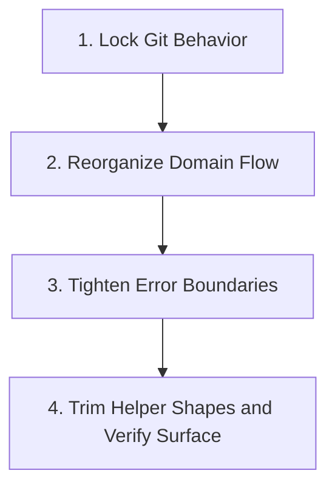

# Migration Plan: `inplace-domain-seams`

## Goal
Refactor `src/continuous_refactoring/git.py` in place so the file reads as one
coherent git boundary with three explicit seams:
- subprocess execution and failure translation,
- read-only repository state queries,
- destructive worktree and history mutations.

The migration preserves the shipped package surface and caller-facing git
behavior while making later edits safer and easier to review.

## Chosen Approach
- Keep `src/continuous_refactoring/git.py` as the only module boundary.
- Lock behavior first with characterization tests.
- Reshape file order and private helper flow before touching error-boundary
  rules.
- Reserve the last phase for explicit surface verification and deletion of any
  phase-local transitional helpers that earlier phases intentionally left
  behind.

## Why This Shape
- `git.py` is already the shared git boundary for `loop.py`,
  `refactor_attempts.py`, `phases.py`, `migration_tick.py`,
  `routing_pipeline.py`, and `targeting.py`. In-place cleanup keeps blast
  radius low.
- The main risk is behavioral drift, not module architecture. The existing
  public helpers, package-root exports, and destructive git flows are already
  load-bearing.
- The review findings are best addressed by making each phase gate factual:
  previous phase marked complete, named characterization coverage exists, and
  the structural artifact needed by the next phase still exists.

## Target Surface
- Primary edit surface:
  - `src/continuous_refactoring/git.py`
  - `tests/test_git.py`
- Verification-aware callers and package surface:
  - `src/continuous_refactoring/__init__.py`
  - `src/continuous_refactoring/loop.py`
  - `src/continuous_refactoring/phases.py`
  - `tests/test_continuous_refactoring.py`
  - `tests/test_refactor_attempts.py`
  - `tests/test_targeting.py`

## Phase Breakdown
1. `phase-1-lock-git-behavior.md`
   Add characterization coverage for the current `git.py` contract, especially
   command failure wrapping, workspace cleanliness checks, and destructive git
   flows.
2. `phase-2-reorganize-domain-flow.md`
   Reorder and simplify `git.py` so the file reads top-down by domain while
   preserving the existing public symbol set and behavior.
3. `phase-3-tighten-error-boundaries.md`
   Keep failure translation anchored at `run_command()` and remove redundant
   higher-level wrapping that does not add domain-owned context.
4. `phase-4-trim-helper-shapes-and-verify-surface.md`
   Remove only explicitly transitional private helpers left from phases 2 or 3
   and verify the `git.py` and package-root symbol surfaces are unchanged.

## Dependencies
1. Phase 1 has no prior migration-phase dependency.
2. Phase 2 depends on Phase 1.
3. Phase 3 depends on Phase 2.
4. Phase 4 depends on Phase 3.

## Dependency Visualization

## Validation Strategy
- The harness already enforces the broad validation baseline before work starts.
  Each completed phase must still end with `uv run pytest`.
- `uv run pytest tests/test_git.py` is the default focused gate for all phases.
- Phase 1 should make these behaviors explicit in `tests/test_git.py`:
  - `run_command()` checked failure wrapping and unchecked passthrough,
  - nested causes from startup failures and non-zero exits,
  - `workspace_status_lines()` and `require_clean_worktree()`,
  - destructive reset/clean flows through `discard_workspace_changes()` and
    `revert_to()`,
  - commit and undo behavior through `git_commit()` and `undo_last_commit()`.
- Use downstream suites only when a phase touches the behavior they consume:
  - package-root export checks: `uv run pytest tests/test_continuous_refactoring.py`
  - direct `GitCommandError` consumers: `uv run pytest tests/test_targeting.py tests/test_refactor_attempts.py`

## Risk Controls
- No package-surface churn. Public names exposed from `continuous_refactoring.git`
  and re-exported from `continuous_refactoring` stay stable through this
  migration.
- No call-site rewrites unless a test proves a real break and the migration is
  amended for human review.
- No structural `loop.py` refactor. Caller files are validation surfaces here,
  not primary edit targets.
- Phase 2 owns the structural end state. Phase 4 does not reopen structure; it
  only verifies surface stability and deletes named transitional leftovers.
