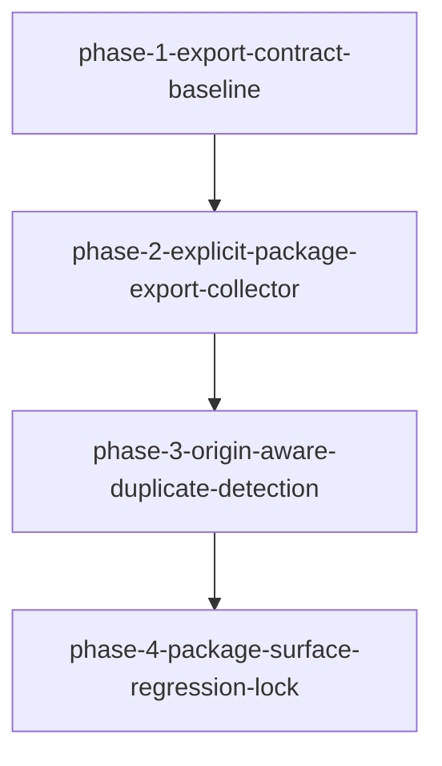

# Migration: src-continuous-refactoring-init-py-20260427T221026

## Goal
Make `src/continuous_refactoring/__init__.py` exports explicit and inspectable while preserving current eager-import behavior, public API contract, and package import stability.

## Chosen approach
`Surface-Clarity Refactor for __init__.py`
From: `approaches/init-init-export-surface.md`

## Scope
- Production: `src/continuous_refactoring/__init__.py`
- Validation/test surface: `tests/test_continuous_refactoring.py`

## Non-goals
- No lazy-loading and no `__getattr__` namespace behavior changes.
- No public API deletions or renames.
- No module splits or long-lived rollout mechanics.
- No production changes outside this migration’s scoped surface.

## Phases
1. `phase-1-export-contract-baseline.md`
2. `phase-2-explicit-package-export-collector.md`
3. `phase-3-origin-aware-duplicate-detection.md`
4. `phase-4-package-surface-regression-lock.md`



## Dependencies
1. `phase-1` must pin package-surface expectations before changing `__init__.py`.
2. `phase-2` depends on `phase-1` because export extraction is done only after explicit baseline contracts.
3. `phase-3` depends on `phase-2` because duplicate provenance logic is implemented in the collector.
4. `phase-4` depends on `phase-3` so final lock-down covers both extraction and diagnostics.

## Dependency summary
- `phase-1` establishes the explicit contract checks.
- `phase-2` owns refactoring of package export wiring.
- `phase-3` upgrades duplicate reporting in that wiring.
- `phase-4` freezes the contract after 1->3 are verified.

## Reusable shippability check
Run this command set after each phase:

1. `uv run pytest tests/test_continuous_refactoring.py`
2. `uv run python -m continuous_refactoring --help`
3. 
   ```python
   import importlib
   import continuous_refactoring

   for module in (
       "continuous_refactoring.loop",
       "continuous_refactoring.prompts",
       "continuous_refactoring.routing_pipeline",
       "continuous_refactoring.migrations",
       "continuous_refactoring.planning",
       "continuous_refactoring.scope_expansion",
       "continuous_refactoring.agent",
   ):
       importlib.import_module(module)

   assert isinstance(continuous_refactoring.__all__, tuple)
   assert continuous_refactoring.__all__
   print("package-smoke-ok", len(continuous_refactoring.__all__))
   ```

## Validation strategy
Each phase must pass its phase-specific regression assertions plus the reusable shippability check.

- `phase-1` gate: `phase-1-export-contract-baseline.md` validation block.
- `phase-2` gate: `phase-2-explicit-package-export-collector.md` validation block.
- `phase-3` gate: `phase-3-origin-aware-duplicate-detection.md` validation block.
- `phase-4` gate: `phase-4-package-surface-regression-lock.md` validation block, then `uv run pytest`.
