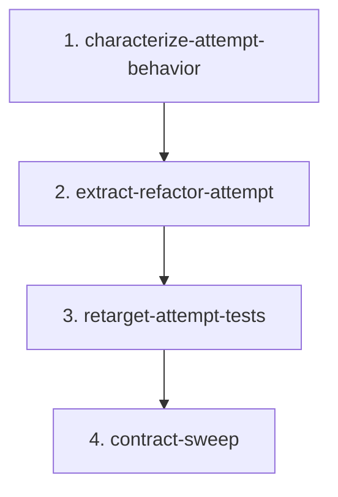

# Refactor Attempt Extraction Migration

## Goal

Move the retryable ordinary refactor attempt out of `src/continuous_refactoring/loop.py` into a focused domain module, while preserving `run_loop()` behavior and keeping the repository shippable after every phase.

The new boundary should own one thing: run one refactor attempt for one target, validate it, roll back or finalize it, and return a `DecisionRecord`.

`loop.py` should continue to own target selection, baseline checks, migration routing, retry orchestration, consecutive-failure policy, sleep behavior, and run artifact lifecycle.

## Non-Goals

- Do not split `run_once()` or `run_migrations_focused_loop()` in this migration.
- Do not move CLI argument handling.
- Do not introduce a transaction abstraction yet.
- Do not add runtime dependencies.
- Do not add re-export shims or widen the package root API for extracted attempt plumbing.
- Do not change prompt text, artifact file names, retry numbering, commit messages, or status block semantics.

## Scope Notes

Expected production files:

- `src/continuous_refactoring/loop.py`
- `src/continuous_refactoring/refactor_attempt.py`
- `src/continuous_refactoring/__init__.py` only if the package export contract itself changes
- `AGENTS.md` to mark this migration live and clarify the root export contract

Expected test files:

- `tests/test_run.py`
- `tests/test_e2e.py`
- `tests/test_run_once.py` only for preserving `run_once()` monkeypatch expectations
- `tests/test_scope_loop_integration.py` only if commit finalization import paths become stale
- `tests/test_continuous_refactoring.py` only for direct import and root export assertions

Context-only files unless a real contract changes:

- `src/continuous_refactoring/git.py`
- `src/continuous_refactoring/migrations.py`
- `src/continuous_refactoring/prompts.py`
- `src/continuous_refactoring/config.py`
- `src/continuous_refactoring/decisions.py`

## Export Contract Decision

`src/continuous_refactoring/refactor_attempt.py` is an internal module for ordinary retryable attempts.

It may define module-local `__all__ = ("retry_context", "run_refactor_attempt")` so its own public-within-module surface is explicit, but it must not be added to `src/continuous_refactoring/__init__.py` `_SUBMODULES` during this migration. In the current package design, `_SUBMODULES` is both the root re-export list and the duplicate-symbol check input. Adding the new module there would make `run_refactor_attempt` a package-root API by accident.

Phase 1 updates `AGENTS.md` to say the package uniqueness rule applies to modules listed in `_SUBMODULES`, and internal modules with `__all__` are excluded unless deliberately promoted to root API. Phase 2 should then create `refactor_attempt.py` without touching `_SUBMODULES`.

## Phases

1. `characterize-attempt-behavior` - Make repo guidance truthful, then add focused tests for the attempt transaction before moving code.
2. `extract-refactor-attempt` - Create `refactor_attempt.py`, move attempt execution, and keep the existing test gate green.
3. `retarget-attempt-tests` - Make test monkeypatch paths and helpers match the new domain boundary.
4. `contract-sweep` - Remove stale imports/comments, verify public surface, and update repo guidance if needed.

## Dependencies

Phase 1 blocks all code movement. It first removes known documentation drift, then proves rollback, retry, artifact, and driver-owned commit behavior before extraction.

Phase 2 depends on Phase 1. Extraction should be mostly mechanical once behavior is pinned.

Phase 3 depends on Phase 2. Test cleanup only makes sense after the new module exists.

Phase 4 depends on Phase 3. Contract cleanup should happen after call sites and tests already name the new boundary truthfully.



## Agent Assignments

- Phase 1: Test Maven owns failure-mode coverage. Critic reviews whether tests assert outcomes instead of call choreography and whether `AGENTS.md` now matches the live migration and export contract.
- Phase 2: Artisan owns the extraction. Critic reviews retry, rollback, artifact paths, and driver-owned commit behavior.
- Phase 3: Test Maven owns monkeypatch retargeting and helper cleanup. Artisan may adjust small production names only where tests expose misleading boundaries.
- Phase 4: Critic owns the contract sweep. Artisan applies small cleanup. Test Maven runs the full gate.

## Validation Strategy

Every phase must run the focused loop tests:

```sh
uv run pytest tests/test_run.py tests/test_e2e.py
```

Any phase touching `run_once()` imports or shared agent/test monkeypatch paths must also run:

```sh
uv run pytest tests/test_run_once.py
```

Any phase touching package imports or exports must run:

```sh
uv run pytest tests/test_continuous_refactoring.py
```

Any phase touching `AGENTS.md` should also run the focused tests required by the same phase; there is no separate documentation test gate.

The final phase must run the full gate:

```sh
uv run pytest
```

## Must Preserve

- `discard_workspace_changes(repo_root)` runs at the start of every retryable refactor attempt before capturing `head_before`.
- Failed attempts roll back all workspace changes and agent-created commits before the next retry starts.
- Artifact paths remain stable:
  - `attempt-XXX/refactor/agent.stdout.log`
  - `attempt-XXX/refactor/agent.stderr.log`
  - `attempt-XXX/refactor/tests.stdout.log`
  - `attempt-XXX/refactor/tests.stderr.log`
  - `attempt-XXX/refactor/agent-last-message.md` for Codex
  - retry attempts under `attempt-XXX/retry-YY/refactor/`
- Agent nonzero exits do not run validation.
- Validation failures and validation infrastructure failures return retryable `DecisionRecord`s with the existing `call_role`, `failure_kind`, and sanitized summary behavior.
- Agent-requested `retry`, `abandon`, and `blocked` transitions roll back validated workspace changes instead of committing them.
- The driver-owned commit invariant remains: if the agent commits, the driver soft-resets to `head_before` and creates one final driver commit.
- `run_loop()`, `run_once()`, and `run_migrations_focused_loop()` remain importable from `continuous_refactoring.loop` and the package root.
- `continuous_refactoring.refactor_attempt` is importable as a direct module after Phase 2, but `run_refactor_attempt` and `retry_context` are not root exports unless a later migration deliberately promotes them.

## Risk Notes

- Existing tests patch `continuous_refactoring.loop.maybe_run_agent` and `continuous_refactoring.loop.run_tests`. After extraction, ordinary `run_loop()` attempt tests should patch `continuous_refactoring.refactor_attempt.*`; `run_once()` tests should keep patching `continuous_refactoring.loop.*`.
- Keep `_finalize_commit()` in `loop.py` for this migration and pass it into the extracted attempt function. Moving commit finalization is the runner-up `transaction-boundary` work, not this migration.
- Avoid adding a broad context object unless the call signature becomes unreadable after extraction. A direct keyword-only function is acceptable for the first cut.
- Do not conflate module-local `__all__` with package-root export. The root API is controlled by `_SUBMODULES`; keep `refactor_attempt` out of `_SUBMODULES`.
