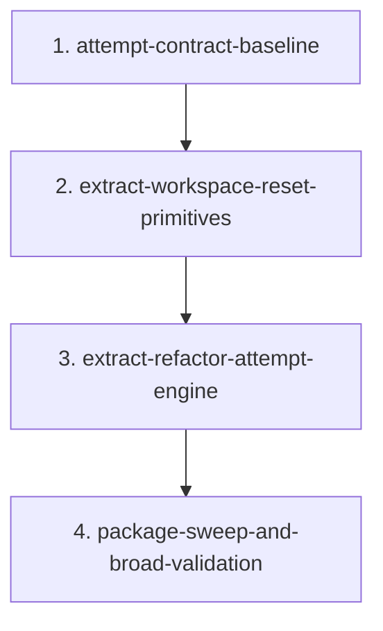

# Migration: src-continuous-refactoring-loop-py-20260428T032118

## Goal
Extract the retrying source-refactor attempt engine out of `src/continuous_refactoring/loop.py` into a domain-focused internal module while preserving rollback, validation, artifact, retry, and commit-ownership behavior.

## Chosen approach
`attempt-engine-extraction`

## Scope
- `src/continuous_refactoring/loop.py`
- `src/continuous_refactoring/refactor_attempts.py`
- `tests/test_run.py`
- `tests/test_run_once.py`
- `tests/test_run_once_regression.py`
- `tests/test_loop_migration_tick.py` when preserved migration workspace coverage needs adjustment
- `src/continuous_refactoring/__init__.py` only in the package-sweep phase if package import wiring must acknowledge the new internal module
- `tests/test_continuous_refactoring.py` only in the package-sweep phase if package-surface expectations change
- `AGENTS.md` only if the added module makes the repo contract stale

## Non-goals
- Do not structurally split `run_loop()` into separate mode runners.
- Do not unify `run_once()` onto the new engine unless a later migration explicitly scopes that work.
- Do not change retry semantics, artifact paths, decision records, commit-message behavior, or migration cooldown behavior.
- Do not add runtime dependencies, compatibility shims, speculative interfaces, or package-root re-exports for the new internal helpers.
- Do not refactor unrelated migration execution, routing, prompt composition, or git behavior.

## Phases
1. `phase-1-attempt-contract-baseline`
2. `phase-2-extract-workspace-reset-primitives`
3. `phase-3-extract-refactor-attempt-engine`
4. `phase-4-package-sweep-and-broad-validation`

## Dependencies
- `phase-1-attempt-contract-baseline` is prerequisite for every later phase because rollback, retry, and preserved-workspace behavior must be locked before code motion.
- `phase-2-extract-workspace-reset-primitives` is prerequisite for `phase-3-extract-refactor-attempt-engine` because preserved-workspace snapshot/restore and baseline reset are the sharpest side effects in the seam.
- `phase-3-extract-refactor-attempt-engine` is prerequisite for `phase-4-package-sweep-and-broad-validation` because package and repo-contract cleanup only make sense after `refactor_attempts.py` is the active implementation.

## Agent assignments
1. Phase 1
   Scout maps the existing retry/rollback contract; Test Maven adds or tightens characterization coverage with outcome assertions.
2. Phase 2
   Artisan extracts preserved-workspace helpers into `refactor_attempts.py`; Critic verifies this stays an internal boundary and not package-surface churn.
3. Phase 3
   Artisan moves the retryable attempt engine, including `_retry_context()`, into `refactor_attempts.py`; Critic checks retry, rollback, artifact, and commit invariants.
4. Phase 4
   Test Maven runs targeted and broad validation; Critic checks package-surface expectations and `AGENTS.md` drift.

## Validation strategy
Each phase must run its focused validation first. Full-suite validation is reserved for the final sweep after the structural moves are complete.

1. Phase 1 validation
- `uv run pytest tests/test_run.py -k "retry or validation or commit or preserve"`
- `uv run pytest tests/test_run_once.py tests/test_run_once_regression.py`
- `uv run pytest tests/test_loop_migration_tick.py` only if migration-state assertions changed

2. Phase 2 validation
- `uv run pytest tests/test_run.py -k "preserve or retry or validation or commit"`
- `uv run pytest tests/test_loop_migration_tick.py`

3. Phase 3 validation
- `uv run pytest tests/test_run.py`
- `uv run pytest tests/test_run_once.py tests/test_run_once_regression.py tests/test_loop_migration_tick.py`

4. Phase 4 validation
- `uv run pytest tests/test_continuous_refactoring.py tests/test_run.py tests/test_run_once.py tests/test_run_once_regression.py tests/test_loop_migration_tick.py`
- `uv run pytest`

## Must-be-true at every phase gate
- The repository is shippable after the phase commit.
- Retry and rollback behavior stays locked to Phase 1 coverage.
- Preserved live-migration workspace files still survive source-target retries.
- Driver-owned commit behavior stays intact.
- The new module remains internal unless Phase 4 explicitly proves package-surface work is necessary.

## Risk notes
- `_run_refactor_attempt()` currently owns several contracts at once: workspace reset, agent failure handling, validation failure handling, agent-status routing, artifact logging, and final commit handoff. Phase 3 must move that whole behavior seam truthfully rather than fragmenting it behind thin wrappers.
- `_retry_context()` is retry-engine-specific in the current code path. Move it with the attempt engine in Phase 3; do not leave a split-brain prompt-detail helper behind in `loop.py`.
- Example-based tests are the right fit for Phase 1 because this seam is integration-heavy: git state, worktree cleanup, preserved migration files, artifacts, and decision persistence. Property-style tests would add little signal here.
- Adding `src/continuous_refactoring/refactor_attempts.py` may change package import wiring or repo-contract statements. Keep that fallout isolated to Phase 4 unless an earlier phase proves otherwise.
