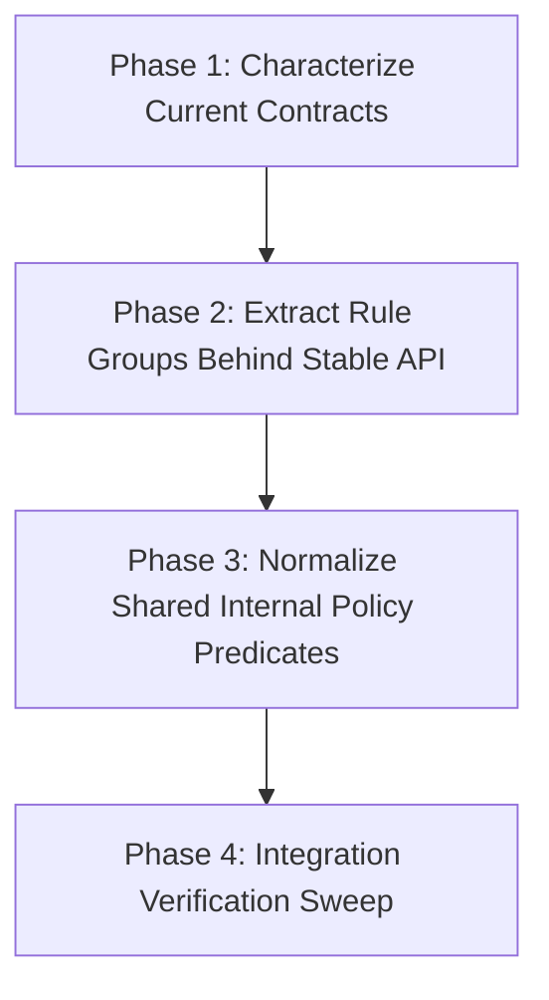

# Migration Plan: Incremental Validator Extraction

## Goal
Refactor `src/continuous_refactoring/migration_consistency.py` into smaller, domain-focused validator rule groups while preserving all current public behavior and interfaces.

## Constraints and Safety Model
- Preserve exported API and behavior of:
  - `check_migration_consistency()`
  - `has_blocking_consistency_findings()`
  - `iter_visible_migration_dirs()`
- Preserve consistency-finding contracts (severity, mode, code, and path semantics) consumed by migration scheduling, review, doctor, and CLI flows.
- Keep each phase independently verifiable and shippable.
- No phase may introduce public interface changes.

## Numbered Phases
1. **Phase 1 — Characterize Current Contracts** (`phase-1-characterize-current-contracts.md`)
- Lock in current behavior with focused tests for mode gating, visible-directory filtering, phase-doc contract checks, and duplicate-doc detection.

2. **Phase 2 — Extract Rule Groups Behind Stable API** (`phase-2-extract-rule-groups-behind-stable-api.md`)
- Reorganize `check_migration_consistency()` internals into small rule-group helpers with unchanged outputs and signatures.

3. **Phase 3 — Normalize Shared Internal Policy Predicates** (`phase-3-normalize-shared-internal-policy-predicates.md`)
- Consolidate duplicated internal policy predicates and simplify control flow using explicit, domain-meaningful helpers.

4. **Phase 4 — Integration Verification Sweep** (`phase-4-integration-verification-sweep.md`)
- Verify integration behavior across consistency consumers and add narrow coverage only where cross-module guarantees are still implicit.

## Dependencies

## Why This Order Reduces Risk
- Phase 1 creates a behavior safety net before production refactoring.
- Phase 2 performs structural extraction with behavior locked.
- Phase 3 removes duplication only after rule-group seams exist.
- Phase 4 confirms cross-module behavior after internals settle.

## Validation Strategy
- For every phase:
  1. Run targeted suites for touched scope first.
  2. Run the full configured validation command as completion gate.
- Expected targeted suites by phase:
  - Phase 1–3: `uv run pytest tests/test_migration_consistency.py` plus directly affected consumers when touched.
  - Phase 4: `uv run pytest tests/test_migration_tick.py tests/test_migration_cli.py tests/test_review_cli.py tests/test_planning_publish.py` (or the subset actually touched).

## Shippability Contract
- Every phase leaves the repo in a releasable state.
- No temporary compatibility shims that persist beyond phase completion.
- No changes to CLI behavior, XDG state shape, migration manifest structure, or other public interfaces in this migration.
