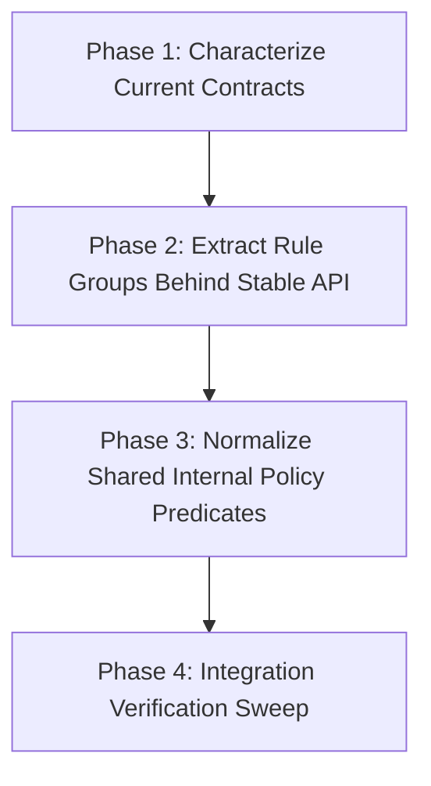

# Migration Plan: Incremental Validator Extraction

## Goal
Refactor `src/continuous_refactoring/migration_consistency.py` into clearer, smaller validator rule groups while preserving current external behavior, finding contracts, and call-site interfaces.

## Constraints and Safety Model
- Preserve exported API and behavior of:
  - `check_migration_consistency()`
  - `has_blocking_consistency_findings()`
  - `iter_visible_migration_dirs()`
- Preserve existing finding structure expectations (code/severity/mode/path semantics) unless a phase explicitly documents a reviewed interface change.
- Keep each phase shippable with repository-level validation passing.

## Phase Breakdown
1. **Phase 1 — Characterize Current Contracts** (`phase-1-characterize-current-contracts.md`)
- Expand focused tests for current behavior in `tests/test_migration_consistency.py`.
- Lock down mode gating, visibility/symlink filtering, phase doc section checks, and duplicate-doc detection semantics.

2. **Phase 2 — Extract Rule Groups Behind Stable API** (`phase-2-extract-rule-groups-behind-stable-api.md`)
- Refactor `check_migration_consistency()` internals into small helpers grouped by concern.
- Keep public function signatures and outputs unchanged.

3. **Phase 3 — Normalize Shared Internal Policy Predicates** (`phase-3-normalize-shared-internal-policy-predicates.md`)
- Consolidate duplicated mode/status policy checks into explicit internal helpers.
- Tighten naming and remove dead/duplicated branches while preserving behavior.

4. **Phase 4 — Integration Verification Sweep** (`phase-4-integration-verification-sweep.md`)
- Add/adjust integration-focused tests across caller paths (`migration_tick`, migration CLI doctor/list flows, planning publish/readiness gates) where needed.
- Confirm refactor does not alter user-visible behavior.

## Dependency Graph

## Why This Order
- Phase 1 reduces regression risk by locking expected behavior before structural change.
- Phase 2 performs the core extraction with strong contract safety.
- Phase 3 cleans duplicated policy internals once structure is clearer.
- Phase 4 validates cross-module behavior after all internals are stabilized.

## Validation Strategy
- Per phase:
  - Run targeted tests for changed behavior first.
  - Run full configured validation command before phase completion.
- Suggested targeted progression:
  - `uv run pytest tests/test_migration_consistency.py`
  - Additional targeted suites per touched call path (for example `tests/test_migration_tick.py`, `tests/test_migration_cli.py`, `tests/test_planning_publish.py`) when changes affect those areas.
- Completion gate for every phase:
  - Full configured validation command passes.

## Shippability Contract Per Phase
- No phase leaves partially migrated interfaces.
- No phase introduces temporary compatibility shims that outlive the phase.
- Every phase preserves a coherent, releasable repository state.
