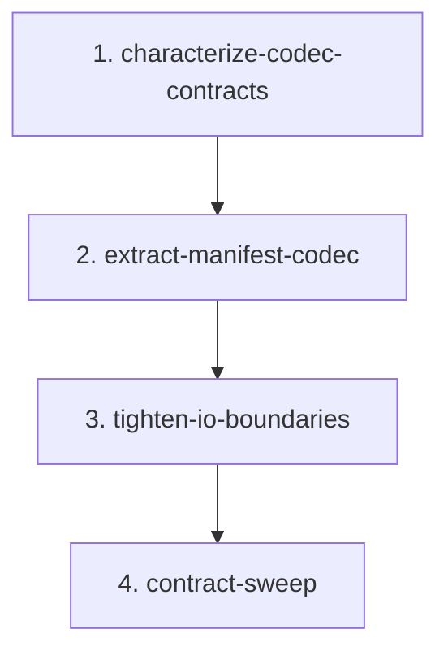

# Manifest Codec Boundary Migration

## Goal

Extract manifest JSON decoding and encoding from `src/continuous_refactoring/migrations.py` into a focused internal codec module while preserving the public migration API and shipped manifest compatibility.

`migrations.py` should keep the migration domain surface callers already use:

- `MigrationManifest`
- `PhaseSpec`
- `load_manifest()`
- `save_manifest()`
- path helpers
- phase cursor and completion helpers
- wake-up eligibility helpers

The new `src/continuous_refactoring/migration_manifest_codec.py` should own the manifest wire format:

- raw JSON payload validation
- legacy `ready_when` to `precondition`
- legacy integer `current_phase` to phase name
- duplicate phase-name rejection during decode and encode
- exact JSON output formatting

## Non-Goals

- Do not move `MigrationManifest` or `PhaseSpec` out of `migrations.py`.
- Do not change public imports from `continuous_refactoring.migrations`.
- Do not add re-export shims.
- Do not add `migration_manifest_codec` to `src/continuous_refactoring/__init__.py` `_SUBMODULES`.
- Do not change migration scheduling, phase execution, planning, prompts, CLI behavior, or artifact paths.
- Do not drop legacy `ready_when`, legacy integer `current_phase`, or `current_phase=""` support.
- Do not introduce runtime dependencies.

## Scope Notes

Expected production files:

- `src/continuous_refactoring/migrations.py`
- `src/continuous_refactoring/migration_manifest_codec.py`

Expected test files:

- `tests/test_migrations.py`
- `tests/test_continuous_refactoring.py` only if package import/export coverage is missing or stale

Context-only files unless a contract actually changes:

- `src/continuous_refactoring/phases.py`
- `src/continuous_refactoring/planning.py`
- `src/continuous_refactoring/loop.py`
- `src/continuous_refactoring/prompts.py`
- `src/continuous_refactoring/cli.py`
- `src/continuous_refactoring/__init__.py`

`AGENTS.md` should be touched only if the extraction makes a repo-contract statement stale or exposes a new load-bearing subtlety worth preserving.

## Export Contract Decision

`migration_manifest_codec.py` is an internal direct-import module.

It may have a module-local `__all__`, likely `("decode_manifest_payload", "encode_manifest_payload")`, because every source module keeps its own explicit surface. It must not be added to `_SUBMODULES`, because `_SUBMODULES` is the package-root re-export list and duplicate-symbol check input. Adding the codec there would accidentally widen the root API and risk duplicate exports.

Because `MigrationManifest` and `PhaseSpec` stay in `migrations.py`, the codec extraction must avoid an import cycle trap. The expected shape is:

- Define manifest dataclasses and status constants in `migrations.py` first.
- Import codec functions in `migrations.py` only after those definitions.
- Let the codec import the manifest dataclasses from `continuous_refactoring.migrations`.

## Phases

1. `characterize-codec-contracts` - Add focused tests for manifest compatibility, schema validation, formatting, and atomic write cleanup before moving code.
2. `extract-manifest-codec` - Create `migration_manifest_codec.py`, move pure decode/encode logic, and keep public load/save behavior stable.
3. `tighten-io-boundaries` - Wrap low-level JSON and filesystem failures at `load_manifest()` / `save_manifest()` while preserving pure codec errors.
4. `contract-sweep` - Remove stale helpers/imports, verify package exports, and update repo guidance only where the new boundary creates a durable invariant.

## Dependencies

Phase 1 blocks all code movement. It pins compatibility and formatting before extraction.

Phase 2 depends on Phase 1. The extraction should be mostly mechanical once the manifest wire-format behavior is characterized.

Phase 3 depends on Phase 2. Boundary error wrapping is easier to reason about after pure codec failures and file I/O are separated.

Phase 4 depends on Phase 3. Contract cleanup should happen after the new boundary and boundary errors are stable.



## Agent Assignments

- Phase 1: Test Maven owns behavior characterization. Critic checks that tests assert manifest outcomes and persisted bytes, not implementation calls.
- Phase 2: Artisan owns the extraction. Critic reviews import cycles, public API stability, exact JSON output, and compatibility paths.
- Phase 3: Artisan owns boundary wrapping. Test Maven verifies causes, cleanup, and that schema failures are not double wrapped.
- Phase 4: Critic owns the contract sweep. Artisan applies small cleanup. Test Maven runs the full gate.

## Validation Strategy

Every phase must run the focused manifest tests:

```sh
uv run pytest tests/test_migrations.py
```

Any phase touching package imports or export expectations must also run:

```sh
uv run pytest tests/test_continuous_refactoring.py
```

Any phase touching planning, phase execution, prompts, or CLI call sites must also run the affected focused tests:

```sh
uv run pytest tests/test_planning.py tests/test_phases.py tests/test_loop_migration_tick.py tests/test_prompts.py tests/test_cli_review.py
```

The final phase must run the full gate:

```sh
uv run pytest
```

## Must Preserve

- Public imports from `continuous_refactoring.migrations` remain stable.
- `MigrationManifest` and `PhaseSpec` remain dataclasses defined in `migrations.py`.
- Legacy phase `ready_when` is still accepted as `precondition` input when `precondition` is absent.
- When both `precondition` and legacy `ready_when` exist, `precondition` remains authoritative.
- Legacy integer `current_phase` still maps in-range indexes to phase names.
- Legacy integer `current_phase` still maps out-of-range indexes and empty phase lists to `""`.
- String `current_phase=""` remains valid and means no current executable phase.
- Unknown string `current_phase` remains invalid at load/save boundaries.
- Duplicate phase names remain invalid at load/save boundaries.
- Saved JSON remains `json.dumps(..., indent=2, sort_keys=True) + "\n"`.
- Saved JSON writes `precondition`, not legacy `ready_when`.
- Failed atomic replace removes the temporary file.
- Invalid manifest data rejected before encoding does not create the output directory.
- `migration_manifest_codec` is importable directly after Phase 2 but is not a package-root re-export.

## Risk Notes

- The extraction has a circular-import risk because the codec uses dataclasses that stay in `migrations.py`. Place imports deliberately and do not move the dataclasses just to avoid the cycle.
- `load_manifest()` and `save_manifest()` are boundary functions. They may translate low-level JSON and filesystem failures, preserving `__cause__`, but pure schema failures from the codec should bubble as `ContinuousRefactorError` without a second wrapper.
- Keep atomic write validation order: encode and validate first, then create the destination directory, then write a temp file, then replace.
- Avoid broad call-site churn. Most files in the selected cluster are validation context, not expected edit targets.
