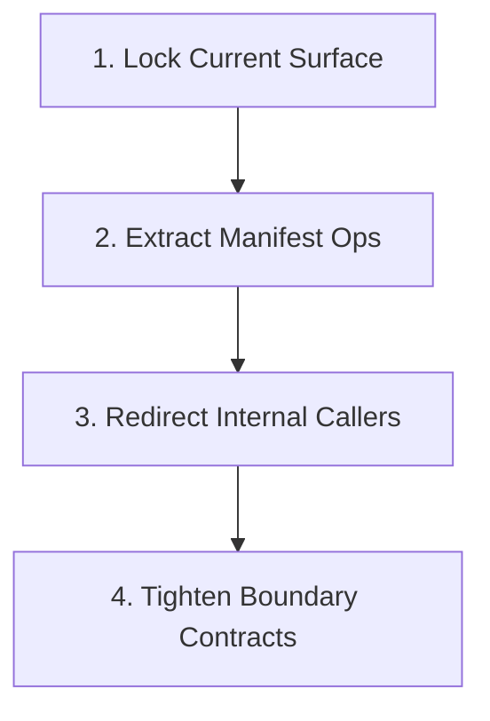

# Migration Plan: `manifest-ops-module-split`

## Goal
Split manifest operational logic out of
`src/continuous_refactoring/migrations.py` into a dedicated internal module
while keeping `continuous_refactoring.migrations` as the stable public home for
manifest types, manifest I/O helpers, and compatibility exports.

## Why This Shape
- `migrations.py` currently mixes value types, manifest operations, path
  helpers, eligibility rules, and persistence boundaries.
- `migration_manifest_codec.py` already owns manifest payload decoding and
  encoding, so the next useful seam is operational manifest logic rather than a
  bigger architecture rewrite.
- The package already exposes a broad `continuous_refactoring.migrations`
  surface. The migration should preserve that facade while reducing the amount
  of real logic that lives behind it.

## Target Surface
- `src/continuous_refactoring/migrations.py`
- `src/continuous_refactoring/migration_manifest_codec.py`
- `src/continuous_refactoring/phases.py`
- `src/continuous_refactoring/planning.py`
- `src/continuous_refactoring/loop.py`
- `src/continuous_refactoring/prompts.py`
- `src/continuous_refactoring/cli.py`
- `tests/test_migrations.py`
- Likely adjacent validation surfaces:
  `tests/test_phases.py`, `tests/test_planning.py`,
  `tests/test_loop_migration_tick.py`, `tests/test_focus_on_live_migrations.py`,
  `tests/test_prompts.py`, `tests/test_run.py`, `tests/test_cli_review.py`,
  `tests/test_no_driver_branching.py`, `tests/test_continuous_refactoring.py`

## Phase Breakdown
1. `phase-1-lock-current-surface.md`
   Add explicit regression coverage for the shipped
   `continuous_refactoring.migrations` export set and for behavior that later
   extraction phases must preserve.
2. `phase-2-extract-manifest-ops.md`
   Introduce `migration_manifest_ops.py` and move manifest operational helpers
   there without changing the public facade or persistence behavior.
3. `phase-3-redirect-internal-callers.md`
   Redirect only the in-scope internal callers that currently use extracted
   operational helpers: `phases.py`, `loop.py`, and `prompts.py`.
4. `phase-4-tighten-boundary-contracts.md`
   Thin `migrations.py` down to the facade and true boundary helpers, preserving
   compatibility exports and keeping error translation only at the filesystem
   and JSON boundaries.

## Dependencies
- Phase 1 has no migration-phase dependency.
- Phase 2 depends on Phase 1.
- Phase 3 depends on Phase 2.
- Phase 4 depends on Phase 3.

## Dependency Visualization

## Validation Strategy
- Every phase must leave the repository shippable and finish with the
  configured broad validation command: `uv run pytest`.
- Phase 1 establishes the compatibility contract explicitly:
  `tests/test_migrations.py` should pin the exported-symbol set from
  `continuous_refactoring.migrations`, alongside behavioral coverage for phase
  lookup, phase advancement, completion/reset behavior, eligibility, and
  manifest load/save error wrapping.
- Later phases should run narrow checks first so failures localize quickly:
  `tests/test_migrations.py` remains the primary compatibility safety net, with
  focused downstream suites added only for the touched callers.
- Import rewrites stay within the selected scope candidate. This migration does
  not authorize edits to `migration_tick.py` or `review_cli.py`.
- Error behavior is part of the contract: filesystem and JSON failures must
  stay wrapped at the actual boundary with preserved nested causes.

## Risk Controls
- Lock the compatibility export set before moving code.
- Move operational logic before redirecting callers.
- Redirect only the concrete in-scope callers that currently use extracted
  operational helpers. Do not turn Phase 3 into a general import cleanup.
- Treat import-cycle pressure as a stop sign. If the split starts forcing
  circular dependencies, keep the seam smaller rather than completing a
  mechanical move.
- Do not change manifest JSON structure, CLI behavior, XDG state handling, or
  migration scheduling semantics as part of this cleanup.
