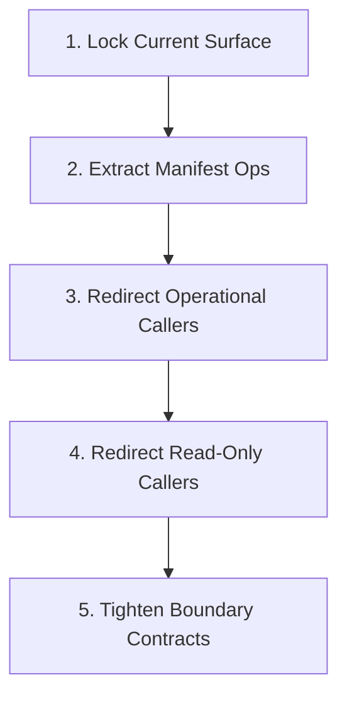

# Migration Plan: `manifest-ops-module-split`

## Goal
Split manifest operational logic out of
`src/continuous_refactoring/migrations.py` into a dedicated internal module
while keeping `continuous_refactoring.migrations` as the stable public home for
manifest types, manifest I/O helpers, path helpers, and compatibility exports.

## Why This Shape
- `migrations.py` currently mixes value types, operational helpers, path
  helpers, and persistence boundaries.
- `migration_manifest_codec.py` already owns manifest payload decoding and
  encoding, so the next useful seam is operational manifest logic rather than a
  larger architecture rewrite.
- The package already exposes a broad `continuous_refactoring.migrations`
  surface. This migration should preserve that facade while moving
  implementation to a more truthful internal home.

## Target Surface
- `src/continuous_refactoring/migrations.py`
- `src/continuous_refactoring/migration_manifest_ops.py`
- `src/continuous_refactoring/migration_manifest_codec.py`
- Operational callers that import extracted helpers today:
  `src/continuous_refactoring/phases.py`,
  `src/continuous_refactoring/loop.py`,
  `src/continuous_refactoring/prompts.py`,
  `src/continuous_refactoring/migration_tick.py`,
  `src/continuous_refactoring/review_cli.py`,
  `src/continuous_refactoring/migration_cli.py`
- Test surfaces expected to move with those callers:
  `tests/test_migrations.py`,
  `tests/test_phases.py`,
  `tests/test_loop_migration_tick.py`,
  `tests/test_focus_on_live_migrations.py`,
  `tests/test_prompts.py`,
  `tests/test_run.py`,
  `tests/test_cli_review.py`
- Read-only adjacencies only if a phase proves they are needed:
  `tests/test_continuous_refactoring.py`,
  `tests/test_planning.py`,
  `tests/test_wake_up.py`

## Phase Breakdown
1. `phase-1-lock-current-surface.md`
   Add explicit regression coverage for the shipped
   `continuous_refactoring.migrations` export set and for the operational and
   boundary behavior that later extraction phases must preserve.
2. `phase-2-extract-manifest-ops.md`
   Introduce `migration_manifest_ops.py` and move manifest operational helpers
   there without changing the public facade or persistence behavior.
3. `phase-3-redirect-operational-callers.md`
   Redirect the runtime and scheduling callers that use extracted helpers today:
   `phases.py`, `loop.py`, `prompts.py`, and `migration_tick.py`.
4. `phase-4-redirect-readonly-callers.md`
   Redirect the remaining read-only consumers of extracted helpers:
   `review_cli.py` and `migration_cli.py`, while keeping the public
   compatibility facade intact.
5. `phase-5-tighten-boundary-contracts.md`
   Thin `migrations.py` down to the facade and true boundary helpers, preserve
   compatibility exports, and delete transitional duplication that no longer
   earns its keep.

## Dependencies
- Phase 1 has no migration-phase dependency.
- Phase 2 depends on Phase 1.
- Phase 3 depends on Phase 2.
- Phase 4 depends on Phase 3.
- Phase 5 depends on Phase 4.

## Dependency Visualization

## Validation Strategy
- Every phase must leave the repository shippable and finish with the
  configured broad validation command: `uv run pytest`.
- Phase 1 establishes the compatibility contract explicitly:
  `tests/test_migrations.py` should pin the exported-symbol set from
  `continuous_refactoring.migrations`, alongside behavior for phase lookup,
  phase advancement, completion/reset behavior, eligibility, and manifest
  load/save error wrapping.
- Later phases should run narrow checks first so failures localize quickly.
  `tests/test_migrations.py` remains the primary compatibility safety net, then
  each redirect phase should run only the focused downstream suites for the
  callers it touched before broad validation.
- Phase 3 must cover runtime and scheduling behavior because `migration_tick.py`
  participates in the extracted helper graph today. Phase 4 should keep the
  blast radius smaller by limiting itself to the read-only CLI consumers.
- Error behavior is part of the contract: filesystem and JSON failures must
  stay wrapped at the actual boundary with preserved nested causes.

## Risk Controls
- Lock the compatibility export set before moving code.
- Move operational logic before redirecting any callers.
- Keep caller redirects honest to the actual dependency set. Do not claim a
  helper family is redirected if real consumers are still on the old import
  path.
- Split operational and read-only redirects into separate phases so the highest
  blast-radius runtime code moves first and can be verified independently.
- Treat import-cycle pressure as a stop sign. If the split starts forcing
  circular dependencies, keep the seam smaller rather than completing a
  mechanical move.
- Do not change manifest JSON structure, CLI behavior, XDG state handling, or
  migration scheduling semantics as part of this cleanup.
