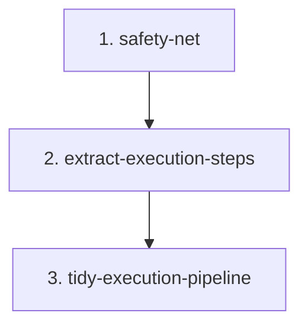

# Phase Execution Pipeline Migration

## Goal

Make `src/continuous_refactoring/phases.py` easier to audit by turning the long transactional `execute_phase()` body into a named in-place execution pipeline.

Preserve the public API and existing import/monkeypatch paths:

- `ReadyVerdict`
- `ExecutePhaseOutcome`
- `check_phase_ready()`
- `execute_phase()`

The module should remain the boundary that coordinates phase prompts, agent execution, validation, rollback, artifact logging, and manifest completion.

## Non-Goals

- Do not split readiness and execution into separate modules.
- Do not move public symbols or add re-export shims.
- Do not change prompt contracts, artifact path layout, event fields, retry numbering, or rollback ownership.
- Do not refactor unrelated routing, prompt, migration manifest, agent, or artifact behavior.
- Do not introduce runtime dependencies.

## Scope Notes

The selected local cluster includes:

- `src/continuous_refactoring/phases.py`
- `tests/test_phases.py`
- `src/continuous_refactoring/prompts.py`
- `src/continuous_refactoring/migrations.py`
- `src/continuous_refactoring/planning.py`
- `src/continuous_refactoring/__init__.py`
- `src/continuous_refactoring/agent.py`
- `src/continuous_refactoring/artifacts.py`

This migration should usually touch only `phases.py` and `tests/test_phases.py`. The other files are validation and contract context. Edit them only if the in-place refactor exposes a real stale contract, not to reshape module boundaries.

`AGENTS.md` is a repo-contract exception. Touch it only if a code change contradicts a statement there.

## Phases

1. `safety-net` - Add focused tests for under-covered `execute_phase()` failure and completion contracts.
2. `extract-execution-steps` - Extract private helpers from `execute_phase()` while preserving behavior and public imports.
3. `tidy-execution-pipeline` - Remove duplication exposed by extraction, tighten names, and verify package/contracts.

## Dependencies

Phase 1 blocks all later phases. It proves the important failure contracts before changing the control flow.

Phase 2 depends on Phase 1. Helper extraction should not start until agent, validation, rollback, retry, and manifest-completion edges are covered.

Phase 3 depends on Phase 2. Tidying is only useful after the pipeline shape exists.



## Agent Assignments

- Phase 1: Test Maven owns failure-mode coverage; Artisan may make test-helper cleanup only where it improves readability.
- Phase 2: Artisan owns the extraction; Critic reviews rollback/retry/artifact behavior for drift.
- Phase 3: Artisan owns cleanup; Test Maven verifies the full gate and import/package contracts.

## Validation Strategy

Every phase must run the focused phase tests first:

```sh
uv run pytest tests/test_phases.py
```

Phases that touch behavior around migration routing or package exports must also run:

```sh
uv run pytest tests/test_loop_migration_tick.py tests/test_focus_on_live_migrations.py tests/test_run.py::test_run_phase_execute_validation_failure_logs_phase_validation_role tests/test_run.py::test_run_phase_execute_validation_infra_failure_logs_phase_validation_role
uv run pytest tests/test_continuous_refactoring.py tests/test_prompts.py
```

The final phase must run the full gate:

```sh
uv run pytest
```

## Risk Notes

- `execute_phase()` owns rollback to `head_before`. Preserve rollback count and timing, including retries and terminal failures.
- Retry numbering is caller-visible through artifact paths and `ExecutePhaseOutcome.retry`; preserve the current semantics.
- Artifact paths under `phase-execute/` are debugging surfaces. Keep `agent.stdout.log`, `agent.stderr.log`, `agent-last-message.md`, `tests.stdout.log`, and `tests.stderr.log` in the same locations.
- `status_summary()` intentionally uses agent status as the summary source even when validation fails. Do not replace it with raw validation output.
- Completion must clear deferral fields: `wake_up_on`, `awaiting_human_review`, `human_review_reason`, and `cooldown_until`.
- Unknown phase completion must stay a hard `ContinuousRefactorError`, not a silent manifest rewrite.
