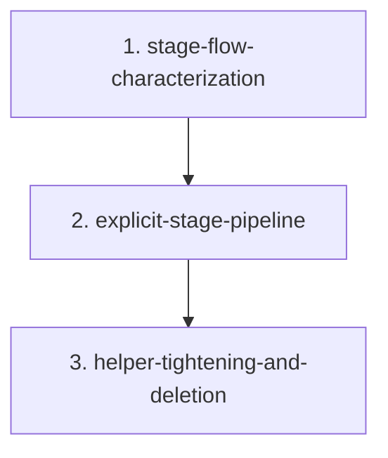

# Migration: src-continuous-refactoring-planning-py-20260428T045520

## Goal
Refactor `src/continuous_refactoring/planning.py` so the planning-stage orchestration is easier to read and change without altering stage order, prompt inputs, manifest updates, or the revise/review-2 behavior.

## Chosen approach
Source: `approaches/stage-pipeline-tightening.md`

Why this one:
- Best risk-to-payoff ratio for the actual smell in `run_planning()`: repeated stage orchestration with small but important differences.
- Keeps `planning.py` as the orchestration boundary instead of starting a premature module split.
- Lets the migration pin the load-bearing behavior first, then refactor the repeated path, then clean up names and dead glue.

Short runners-up:
- `approaches/parser-and-discovery-split.md`: plausible later cleanup, but bigger boundary churn than this migration needs.
- `approaches/manifest-first-reconciliation.md`: potentially higher payoff later, but too easy to turn into state-ownership redesign instead of local refactoring.

## Scope
- `src/continuous_refactoring/planning.py`
- `tests/test_planning.py`
- `src/continuous_refactoring/prompts.py` only if a phase must align prompt-stage terminology already used by `planning.py`
- `src/continuous_refactoring/migrations.py` only if a phase must clarify an existing planning/manifest contract already exercised by `planning.py`
- `AGENTS.md` only if a phase changes one of the planning-specific load-bearing subtleties described there

## Non-goals
- Do not split `planning.py` into new modules.
- Do not change planning prompt contracts, planning stage names, or artifact directory labels.
- Do not change manifest status transitions, skip-file behavior, or phase discovery semantics.
- Do not broaden the migration into parser cleanup, manifest codec redesign, or generic pipeline infrastructure.
- Do not change source files outside the scoped planning cluster unless the same phase proves a narrow contract update is required.

## Phase order
1. `phase-1-stage-flow-characterization.md`
2. `phase-2-explicit-stage-pipeline.md`
3. `phase-3-helper-tightening-and-deletion.md`

## Dependencies
1. Phase 1 blocks every later phase.
Why: the main regression risk is silent behavior drift in stage sequencing and context reload timing, so those contracts must be pinned first.
2. Phase 2 depends on Phase 1.
Why: the pipeline extraction is the structural change; it should land only after tests lock the current behavior.
3. Phase 3 depends on Phase 2.
Why: helper cleanup and deletion are only safe after the new control flow is in place and verified.

## Validation strategy
Every phase must pass the repo's only ship gate: `uv run pytest`. Planning-focused slices are still useful during development, but they are not sufficient to declare a phase complete or the repository shippable.

1. Phase 1 validation
- Optional focused checks while iterating: targeted `tests/test_planning.py` cases for stage order, revise-path behavior, and phase discovery refresh.
- Required phase gate: `uv run pytest`
2. Phase 2 validation
- Optional focused check while iterating: `uv run pytest tests/test_planning.py`
- Required phase gate: `uv run pytest`
3. Phase 3 validation
- Optional focused check while iterating: `uv run pytest tests/test_planning.py`
- Required phase gate: `uv run pytest`

## Must stay true at every phase gate
- `run_planning()` still executes the same ordered stage flow: `approaches -> pick-best -> expand -> review -> optional revise -> optional review-2 -> final-review`.
- `pick-best` still reads approaches from `approaches/*.md` on disk, not from cached stage stdout.
- `expand` still uses the selected-approach stdout as its chosen-approach context.
- `review`, `review-2`, and `final-review` still read `plan.md` from disk at the time they run; revised plan text must not be cached from earlier reads.
- Only file-writing planning stages refresh manifest phases from the migration directory; read-only review stages do not rediscover phases.
- `_touch_manifest(..., mig_root=...)` behavior remains intact: phase rediscovery, empty `current_phase` initialization, and invalid `current_phase` repair all still work.
- The revise branch remains explicit enough that `review-2` findings still abort before `final-review`.
- The repository stays shippable after each phase.

## Phase assignments
1. Phase 1
Scout/Test Maven style work: strengthen characterization coverage around stage order, prompt context sources, and manifest refresh timing without changing production behavior.
2. Phase 2
Artisan work: extract the repeated always-run planning path into a small explicit pipeline while keeping the revise/review-2 branch visibly special.
3. Phase 3
Artisan/Critic cleanup: tighten helper names, delete duplicated stage glue, and update `AGENTS.md` only if a planning subtlety statement becomes stale.

## Risks
- The easy screw-up is stale state: cached `plan.md`, cached approach listings, or moving manifest refreshes across stage boundaries.
- The revise path looks repetitive, but it is not truly generic. Over-abstracting it is how the code gets tidier and less truthful at the same time.
- Manifest refresh is more than a timestamp bump. Any cleanup that forgets phase rediscovery or `current_phase` repair will leave planning "working" while breaking migration execution later.
