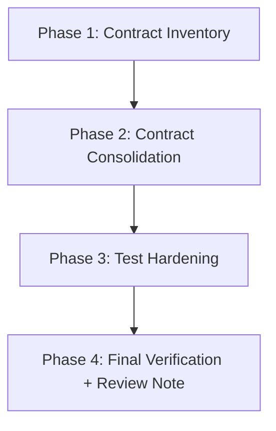

# Migration Plan: Prompt Surface Hardening (`src/continuous_refactoring/prompts.py`)

## Goal
Harden the prompt surface in `src/continuous_refactoring/prompts.py` by consolidating repeated contract clauses and strengthening invariant tests, while preserving runtime/CLI behavior and package interface expectations.

## Scope
- In scope:
  - `src/continuous_refactoring/prompts.py`
  - `tests/test_prompts.py`
  - Related tests only when needed to prove unchanged behavior
- Out of scope:
  - Splitting `prompts.py` into multiple modules
  - New runtime dependencies
  - Behavioral changes to CLI/system interfaces unless intentionally surfaced for review

## Phase Plan
1. [phase-1-contract-inventory.md](phase-1-contract-inventory.md)
2. [phase-2-contract-consolidation.md](phase-2-contract-consolidation.md)
3. [phase-3-test-hardening.md](phase-3-test-hardening.md)
4. [phase-4-final-verification-and-review-note.md](phase-4-final-verification-and-review-note.md)

## Dependency Graph

## Phase Dependencies
- Phase 1 has no migration-phase blockers.
- Phase 2 depends on completed Phase 1 inventory outputs.
- Phase 3 depends on consolidated prompt anchors/helpers from Phase 2.
- Phase 4 depends on completed Phase 3 tests and finalized text-shape verification.

## Validation Strategy
- Per-phase validation (independent checks):
  - Each phase specifies its own targeted validation commands and evidence.
  - Each phase must leave the repo in a shippable state.
- Global validation gates:
  - The configured validation command (`uv run pytest`) must pass for every completed phase.
- Contract-safety checks:
  - Preserve required prompt sections and status-block formatting semantics.
  - Preserve `## Taste` injection behavior across all prompt templates covered by `tests/test_prompts.py`.
  - Preserve package/API expectations (no unreviewed export/behavior changes).

## Risk Controls
- Keep changes incremental and small per phase.
- Prefer local helpers/constants over structural rewrites.
- Treat any intentional user-visible prompt wording change as human-review material and document it in Phase 4.
- If any contract cannot be preserved exactly, stop and surface the specific interface delta before proceeding.
