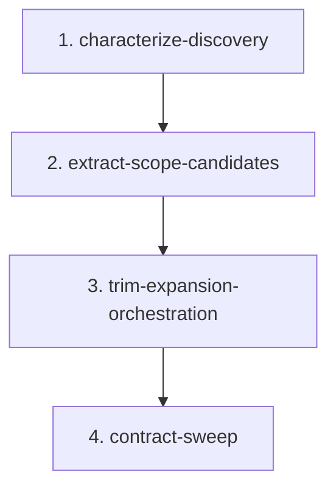

# Scope Expansion Candidate Discovery Migration

## Goal

Split `scope_expansion.py` along the real domain boundary:

- `scope_candidates.py` owns candidate data, discovery, evidence, scoring, ranking, and validation-surface inference.
- `scope_expansion.py` owns bypass decisions, selection-agent orchestration, target conversion, and artifact writing.
- Prompt formatting stays in `prompts.py` when it is presentation-oriented.

Do this in stages. Phase 1 proves and clarifies the boundary in place. Only after that should symbols move.

## Non-Goals

- Do not change the scope-selection artifact JSON contract unless a phase explicitly adds and verifies that contract change.
- Do not keep compatibility aliases or re-export shims from `scope_expansion.py`.
- Do not move selection-agent I/O into the candidate module.
- Do not introduce runtime dependencies.
- Do not refactor unrelated routing, agent, artifact, targeting, or git behavior.

## Scope Notes

The selected local cluster includes:

- `src/continuous_refactoring/scope_expansion.py`
- `tests/test_scope_expansion.py`
- `src/continuous_refactoring/prompts.py`
- `src/continuous_refactoring/__init__.py`
- `src/continuous_refactoring/targeting.py`
- `src/continuous_refactoring/agent.py`
- `src/continuous_refactoring/artifacts.py`
- `src/continuous_refactoring/git.py`

This plan also adds `src/continuous_refactoring/routing_pipeline.py` to the migration scope because it directly imports `build_scope_candidates`, `describe_scope_candidate`, and the scope expansion orchestration functions from `continuous_refactoring.scope_expansion`. Phase 2 and Phase 3 may update only those imports and directly related call sites in `routing_pipeline.py`; they must not refactor routing behavior.

`AGENTS.md` is a repo-contract exception, not fuzzy migration scope. The repo requires updating it in the same commit as code that contradicts its module-layout guidance, so Phase 2 or Phase 4 may touch `AGENTS.md` only to keep that contract true after adding `scope_candidates.py`.

## Review Decisions

Human review completed on `2026-04-27` against the live tree, not the original planning snapshot.

- Phase 1 is already satisfied in the current repo: the characterization tests exist, `build_scope_candidates()` already reads as a small orchestration over named helpers, and `uv run pytest` passed during review.
- Phase 2 should create `tests/test_scope_candidates.py` as the canonical home for pure discovery coverage. `tests/test_scope_expansion.py` should narrow to bypass, selection, target conversion, and artifact-writing behavior.
- Phase 3 should move `describe_scope_candidate()` to `prompts.py` and keep its text behavior stable.
- Keep the compatibility break: update callers directly and do not leave a re-export shim in `scope_expansion.py`.

## Phases

1. `characterize-discovery` - Baseline already established in the live tree; keep the in-place characterization intact without moving public imports.
2. `extract-scope-candidates` - Move the stable discovery core into `scope_candidates.py`, move pure discovery coverage into `tests/test_scope_candidates.py`, update all direct imports, and update package exports.
3. `trim-expansion-orchestration` - Finish the boundary by moving `describe_scope_candidate()` to `prompts.py` and removing leftover presentation helpers from `scope_expansion.py`.
4. `contract-sweep` - Lock down import, artifact, and prompt contracts after the split; update repo guidance if the new module layout requires it.

## Dependencies

Phase 1 is already complete in the reviewed live tree. Later phases build on that validated baseline rather than reopening characterization work.

Phase 2 depends on that baseline. It must preserve the characterized discovery behavior while relocating the module and test ownership.

Phase 3 depends on Phase 2. Presentation cleanup only makes sense after candidate ownership and discovery tests have moved.

Phase 4 depends on Phases 2 and 3. It verifies the final public surface and removes stale guidance after the structural work is complete.

## Agent Assignments

- Phase 1: Complete in the current tree; no further agent work unless the baseline regresses.
- Phase 2: Artisan performs the move; Critic reviews import surface and shim avoidance.
- Phase 3: Artisan trims orchestration; Critic reviews module boundaries and FQN clarity.
- Phase 4: Test Maven owns verification; Critic checks docs and public contracts.

## Validation Strategy

Every phase must run focused tests before full tests:

- Focused discovery and selection: `uv run pytest tests/test_scope_expansion.py tests/test_scope_selection.py tests/test_prompts_scope_selection.py tests/test_scope_loop_integration.py` before `tests/test_scope_candidates.py` exists, then `uv run pytest tests/test_scope_candidates.py tests/test_scope_expansion.py tests/test_scope_selection.py tests/test_prompts_scope_selection.py tests/test_scope_loop_integration.py`
- Import/package smoke: `uv run pytest tests/test_continuous_refactoring.py tests/test_prompts.py`
- Full gate: `uv run pytest`

Use broader validation whenever a phase updates package exports, prompt formatting, or routing imports.

## Risk Notes

- `src/continuous_refactoring/__init__.py` rejects duplicate exported symbols at import time. After Phase 2, moved symbols must live in exactly one module's `__all__`.
- `prompts.py` currently type-checks `ScopeCandidate` from `scope_expansion.py`. After extraction, that type should come from `scope_candidates.py`.
- `routing_pipeline.py` should import candidate discovery from `scope_candidates.py` and selection/orchestration behavior from `scope_expansion.py`.
- `tests/test_scope_candidates.py` should become the canonical discovery test file once Phase 2 lands; `tests/test_scope_expansion.py` should stop pretending to own the pure discovery contract after the split.
- `AGENTS.md` currently contains a stale `~13 modules` note. Update it in the same phase that adds `scope_candidates.py` so the repo contract is true again.
- Keep artifact payload keys and candidate field names stable: `target`, `bypass_reason`, `candidates`, `selection`, and the dataclass field names.
