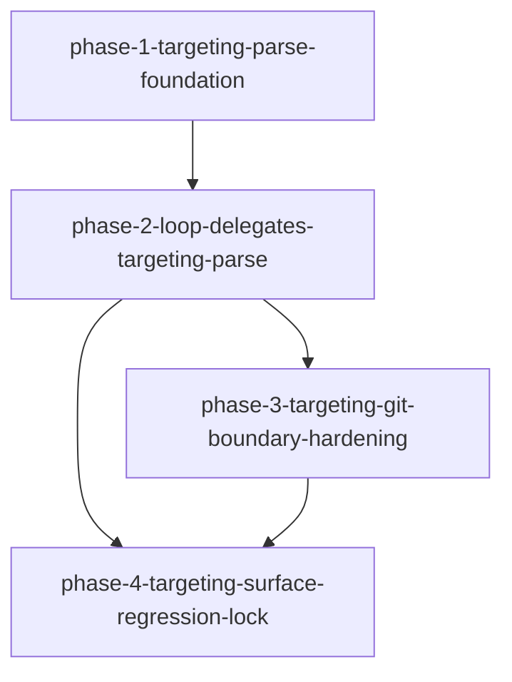

# Migration: src-continuous-refactoring-targeting-py-20260427T220624

## Goal
Refactor target resolution so CLI targeting semantics are owned by `src/continuous_refactoring/targeting.py`, while keeping all runtime behavior unchanged and preserving precedence order (`targets` > `globs` > `extensions` > `paths` > random fallback).

## Chosen approach
`in-place-target-resolution`

## Scope
- `src/continuous_refactoring/targeting.py`
- `tests/test_targeting.py`
- `src/continuous_refactoring/loop.py`
- `src/continuous_refactoring/prompts.py`
- `src/continuous_refactoring/cli.py`
- `src/continuous_refactoring/artifacts.py`
- `src/continuous_refactoring/git.py`
- `src/continuous_refactoring/scope_expansion.py`

## Non-goals
- No API or data-shape migration.
- No architectural split of `loop.py`/`scope_expansion.py`.
- No rollout/temporary naming or compatibility shims.
- No global project-wide behavior changes outside target resolution and tracking failure boundaries.

## Phases
1. `phase-1-targeting-parse-foundation.md`
2. `phase-2-loop-delegates-targeting-parse.md`
3. `phase-3-targeting-git-boundary-hardening.md`
4. `phase-4-targeting-surface-regression-lock.md`

## Dependencies
1. `phase-1` must establish parsing ownership in `targeting.py` before `loop.py` can delegate.
2. `phase-2` must complete before `phase-3` because error-hardening depends on the same argument flow.
3. `phase-4` must wait for both `phase-2` and `phase-3` so loop behavior and git-failure boundaries are stabilized.

## Dependency summary
- `phase-1` must establish parser/selector abstractions and coverage in `test_targeting.py` before `loop.py` and callers can shift responsibility.
- `phase-2` depends on phase-1 because all loop delegation points route through the new targeting helper signatures.
- `phase-3` depends on phase-2 so any git-tracking failure edge case is validated through the same call shape used by loop + tests.
- `phase-4` is integration + regression lock and must only run after all prior phase DoD are satisfied.

## Validation strategy
Each phase is independently verifiable and includes a narrow command that should be green before proceeding.

- `phase-1` gate: `uv run pytest tests/test_targeting.py`
- `phase-2` gate: `uv run pytest tests/test_targeting.py tests/test_run_once_regression.py tests/test_run.py`
- `phase-3` gate: `uv run pytest tests/test_targeting.py`
- `phase-4` gate: `uv run pytest tests/test_targeting.py tests/test_run_once_regression.py tests/test_run.py tests/test_scope_loop_integration.py tests/test_focus_on_live_migrations.py tests/test_prompts.py tests/test_prompts_scope_selection.py tests/test_e2e.py`

Final migration gate (after all phases):
- `uv run pytest`

## Validation notes
The migration stays shippable after every phase by enforcing behavior-specific gates that include the changed surface.
Phase order minimizes coupling: parsing is isolated first, delegation second, failure boundary hardening third, and only then full-surface verification.
