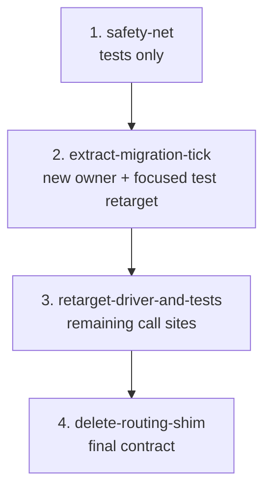

# Migration Tick Extraction

## Goal

Move migration tick orchestration out of `routing_pipeline.py` into a domain-focused `src/continuous_refactoring/migration_tick.py`.

The new module owns eligible manifest enumeration, ready-check handling, phase execution, deferral, human-review blocking, commit decisions, and decision records for migration ticks. `routing_pipeline.py` should keep owning target scope expansion, classification, and planning.

## Non-Goals

- Do not change migration scheduling semantics, cooldown timing, human-review behavior, commit message shape, artifact paths, or decision record fields.
- Do not broadly clean up `loop.py`.
- Do not refactor classifier, planning, scope expansion, phase execution, git, or prompt behavior.
- Do not introduce runtime dependencies.
- Do not keep a long-lived routing compatibility shim.

## Scope Notes

Expected production scope:

- `src/continuous_refactoring/migration_tick.py`
- `src/continuous_refactoring/routing_pipeline.py`
- `src/continuous_refactoring/loop.py`
- `src/continuous_refactoring/__init__.py`

Expected test scope:

- `tests/test_loop_migration_tick.py`
- `tests/test_focus_on_live_migrations.py`
- `tests/test_scope_loop_integration.py`
- `tests/test_continuous_refactoring.py`

Validation context only:

- `src/continuous_refactoring/migrations.py`
- `src/continuous_refactoring/phases.py`
- `src/continuous_refactoring/prompts.py`
- `src/continuous_refactoring/git.py`
- `tests/conftest.py`

`loop.py` is guarded by `AGENTS.md`. Before any phase edits it, confirm whether the active `loop.py` migration note is still true. If the referenced migration directory is absent or stale, fix `AGENTS.md` in the same phase before touching `loop.py`. The only allowed `loop.py` edits in this migration are import/call-site updates needed to point the focused migrations loop at `migration_tick`.

## Phases

1. `safety-net` - Tighten tests at the current `routing_pipeline` boundary. Tests only.
2. `extract-migration-tick` - Add `migration_tick.py`, move the real tick implementation, and retarget focused tick tests to the new owner module.
3. `retarget-driver-and-tests` - Move remaining production driver call sites and any remaining test patches off the routing shim.
4. `delete-routing-shim` - Remove routing compatibility exports and verify the final public contract.

## Dependencies

Phase 1 blocks all later phases. It characterizes behavior before code moves and must not mix in production fixes.

Phase 2 depends on Phase 1. It performs the extraction and immediately retargets monkeypatches for collaborators such as `check_phase_ready()` and `execute_phase()` because the moved body will no longer observe patches applied to `routing_pipeline`.

Phase 3 depends on Phase 2. Driver retargeting only makes sense once the new module exists and the focused tests already exercise it.

Phase 4 depends on Phase 3. The routing compatibility layer can be deleted only after all intended production callers and tests use `continuous_refactoring.migration_tick`.



## Agent Assignments

- Phase 1: Test Maven owns behavior coverage; Critic verifies the phase remains tests-only.
- Phase 2: Artisan owns extraction and focused test retargeting; Critic reviews public FQNs, exception translation, and shim lifespan.
- Phase 3: Artisan owns driver call-site updates; Test Maven verifies focused-loop behavior and routing fallthrough.
- Phase 4: Critic owns shim deletion and contract review; Test Maven owns the full gate.

## Validation Strategy

Every phase must run the focused migration tick tests:

```sh
uv run pytest tests/test_loop_migration_tick.py
```

Phases that touch focused loop behavior or `loop.py` must also run:

```sh
uv run pytest tests/test_focus_on_live_migrations.py tests/test_scope_loop_integration.py
```

Phases that add or remove exported symbols must also run:

```sh
uv run pytest tests/test_continuous_refactoring.py
```

The final phase must run the full gate:

```sh
uv run pytest
```

## Risk Notes

- `try_migration_tick()` currently returns `("not-routed", deferred_record)` when all eligible migrations are deferred. Preserve this so normal target routing can continue.
- Ready-check infrastructure failures must still produce an `abandon` `DecisionRecord` with `call_role == "phase.ready-check"`.
- `unverifiable` phases must persist `awaiting_human_review` and `human_review_reason`, return `blocked`, and stop routing.
- Successful phase execution must finalize a migration commit with `migration/<manifest>/<phase-file>` in the commit message.
- `src/continuous_refactoring/__init__.py` rejects duplicate `__all__` exports at import time. If `migration_tick.py` exports the tick symbols, any temporary routing compatibility attributes must stay out of `routing_pipeline.__all__`.
- The temporary routing delegation introduced in Phase 2 exists only to keep pre-retargeted callers shippable. It must not preserve collaborator monkeypatches; tests that patch `check_phase_ready()` or `execute_phase()` must move to `migration_tick` in Phase 2.
